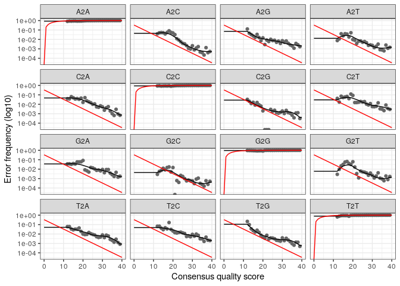
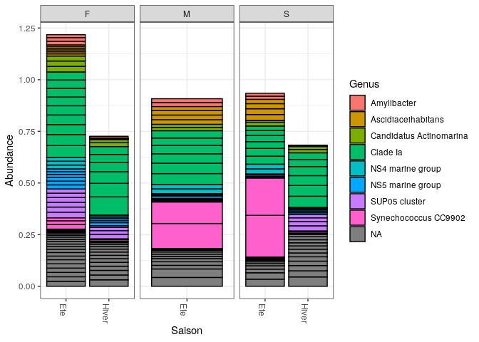

R Notebook
================

``` bash
#wget http://pagesperso.univ-brest.fr/~maignien/teaching/M1-MFA/UE-Ecogenomique2/EcoG2_data_cc2.tar.gz
#gunzip EcoG2_data_cc2.tar.gz
#tar xvf EcoG2_data_cc2.tar.gz
```

``` bash
#mkdir data 
#cp St_Stratif_10sept14/* data
#cp St_Stratif_11mars14/* data
```

``` r
library(rmarkdown)
library(knitr)
library(phyloseq)
library(dada2)
```

    ## Loading required package: Rcpp

``` r
library(DECIPHER)
```

    ## Loading required package: Biostrings

    ## Loading required package: BiocGenerics

    ## 
    ## Attaching package: 'BiocGenerics'

    ## The following objects are masked from 'package:stats':
    ## 
    ##     IQR, mad, sd, var, xtabs

    ## The following objects are masked from 'package:base':
    ## 
    ##     anyDuplicated, append, as.data.frame, basename, cbind, colnames,
    ##     dirname, do.call, duplicated, eval, evalq, Filter, Find, get, grep,
    ##     grepl, intersect, is.unsorted, lapply, Map, mapply, match, mget,
    ##     order, paste, pmax, pmax.int, pmin, pmin.int, Position, rank,
    ##     rbind, Reduce, rownames, sapply, setdiff, sort, table, tapply,
    ##     union, unique, unsplit, which.max, which.min

    ## Loading required package: S4Vectors

    ## Loading required package: stats4

    ## 
    ## Attaching package: 'S4Vectors'

    ## The following objects are masked from 'package:base':
    ## 
    ##     expand.grid, I, unname

    ## Loading required package: IRanges

    ## 
    ## Attaching package: 'IRanges'

    ## The following object is masked from 'package:phyloseq':
    ## 
    ##     distance

    ## Loading required package: XVector

    ## Loading required package: GenomeInfoDb

    ## 
    ## Attaching package: 'Biostrings'

    ## The following object is masked from 'package:base':
    ## 
    ##     strsplit

    ## Loading required package: RSQLite

    ## Loading required package: parallel

``` r
library(phangorn)
```

    ## Loading required package: ape

    ## 
    ## Attaching package: 'ape'

    ## The following object is masked from 'package:Biostrings':
    ## 
    ##     complement

``` r
library(ggplot2)
library(gridExtra)
```

    ## 
    ## Attaching package: 'gridExtra'

    ## The following object is masked from 'package:BiocGenerics':
    ## 
    ##     combine

``` r
library(shiny)
library(miniUI)
library(caret)
```

    ## Loading required package: lattice

``` r
library(pls)
```

    ## 
    ## Attaching package: 'pls'

    ## The following object is masked from 'package:caret':
    ## 
    ##     R2

    ## The following object is masked from 'package:ape':
    ## 
    ##     mvr

    ## The following object is masked from 'package:stats':
    ## 
    ##     loadings

``` r
library(e1071)
library(ggplot2)
library(randomForest)
```

    ## randomForest 4.7-1.1

    ## Type rfNews() to see new features/changes/bug fixes.

    ## 
    ## Attaching package: 'randomForest'

    ## The following object is masked from 'package:gridExtra':
    ## 
    ##     combine

    ## The following object is masked from 'package:ggplot2':
    ## 
    ##     margin

    ## The following object is masked from 'package:BiocGenerics':
    ## 
    ##     combine

``` r
library("plyr"); packageVersion("plyr")
```

    ## 
    ## Attaching package: 'plyr'

    ## The following object is masked from 'package:XVector':
    ## 
    ##     compact

    ## The following object is masked from 'package:IRanges':
    ## 
    ##     desc

    ## The following object is masked from 'package:S4Vectors':
    ## 
    ##     rename

    ## [1] '1.8.7'

``` r
library(dplyr)
```

    ## 
    ## Attaching package: 'dplyr'

    ## The following objects are masked from 'package:plyr':
    ## 
    ##     arrange, count, desc, failwith, id, mutate, rename, summarise,
    ##     summarize

    ## The following object is masked from 'package:randomForest':
    ## 
    ##     combine

    ## The following object is masked from 'package:gridExtra':
    ## 
    ##     combine

    ## The following objects are masked from 'package:Biostrings':
    ## 
    ##     collapse, intersect, setdiff, setequal, union

    ## The following object is masked from 'package:GenomeInfoDb':
    ## 
    ##     intersect

    ## The following object is masked from 'package:XVector':
    ## 
    ##     slice

    ## The following objects are masked from 'package:IRanges':
    ## 
    ##     collapse, desc, intersect, setdiff, slice, union

    ## The following objects are masked from 'package:S4Vectors':
    ## 
    ##     first, intersect, rename, setdiff, setequal, union

    ## The following objects are masked from 'package:BiocGenerics':
    ## 
    ##     combine, intersect, setdiff, union

    ## The following objects are masked from 'package:stats':
    ## 
    ##     filter, lag

    ## The following objects are masked from 'package:base':
    ## 
    ##     intersect, setdiff, setequal, union

``` r
library(ggrepel)
library(devtools)
```

    ## Loading required package: usethis

``` r
library(reshape2)
library(PMA)
library(ade4)
```

    ## 
    ## Attaching package: 'ade4'

    ## The following object is masked from 'package:Biostrings':
    ## 
    ##     score

    ## The following object is masked from 'package:BiocGenerics':
    ## 
    ##     score

``` r
library(ggnetwork)
library(intergraph)
library(scales)
library(genefilter)
library(impute)
library(phyloseqGraphTest)
library(Biostrings)
library(dada2); packageVersion("dada2")
```

    ## [1] '1.24.0'

``` r
path <- "~/EcoG2CC2/data" 
list.files(path)
```

    ##  [1] "filtered"                            "Station5_Fond1_10sept14_R1.fastq"   
    ##  [3] "Station5_Fond1_10sept14_R2.fastq"    "Station5_Fond1_11mars15_R1.fastq"   
    ##  [5] "Station5_Fond1_11mars15_R2.fastq"    "Station5_Fond2_10sept14_R1.fastq"   
    ##  [7] "Station5_Fond2_10sept14_R2.fastq"    "Station5_Fond2_11mars15_R1.fastq"   
    ##  [9] "Station5_Fond2_11mars15_R2.fastq"    "Station5_Fond3_10sept14_R1.fastq"   
    ## [11] "Station5_Fond3_10sept14_R2.fastq"    "Station5_Median1_10sept14_R1.fastq" 
    ## [13] "Station5_Median1_10sept14_R2.fastq"  "Station5_Median2_10sept14_R1.fastq" 
    ## [15] "Station5_Median2_10sept14_R2.fastq"  "Station5_Surface1_10sept14_R1.fastq"
    ## [17] "Station5_Surface1_10sept14_R2.fastq" "Station5_Surface1_11mars15_R1.fastq"
    ## [19] "Station5_Surface1_11mars15_R2.fastq" "Station5_Surface2_10sept14_R1.fastq"
    ## [21] "Station5_Surface2_10sept14_R2.fastq" "Station5_Surface2_11mars15_R1.fastq"
    ## [23] "Station5_Surface2_11mars15_R2.fastq"

# Formation d’une liste pour les read forward (fnFs) et d’une liste pour les read reverse (fnRs):

``` r
fnFs <- sort(list.files(path, pattern="_R1.fastq", full.names = TRUE))
fnRs <- sort(list.files(path, pattern="_R2.fastq", full.names = TRUE))
sample.names <- sapply(strsplit(basename(fnFs), "_R"), `[`, 1)
```

# Qualité des reads :

``` r
plotQualityProfile(fnFs[1:2])
```

    ## Warning: `guides(<scale> = FALSE)` is deprecated. Please use `guides(<scale> =
    ## "none")` instead.

<!-- -->

``` r
plotQualityProfile(fnRs[1:2])
```

    ## Warning: `guides(<scale> = FALSE)` is deprecated. Please use `guides(<scale> =
    ## "none")` instead.

<!-- -->

Les reads forward sont de bonne qualité (Q score proche de 40) jusqu’à
environ 240 pb tandis que les reads reverse le sont jusqu’à environ 190
pb. Par la suite, les reads F et R seront donc tronqués à 240pb et 190
respectivement afin de prendre en compte le moins d’erreurs possible.

``` r
filtFs <- file.path(path, "filtered", paste0(sample.names, "_F_filt.fastq.gz"))
filtRs <- file.path(path, "filtered", paste0(sample.names, "_R_filt.fastq.gz"))
names(filtFs) <- sample.names
names(filtRs) <- sample.names
```

Vérification de la présence de primer sur les séquences démultiplexées
avec la commande “more” dans le terminal. Si chaque read débute par une
séquence similaire alors les primers sont toujours présents sur la
séquence. Ces derniers sont enlevés en ajoutant l’argument trimLeft dans
la fonction filerAndTrim. Ici 18 nucléotides sont retirés des reads.

``` r
out <- filterAndTrim(fnFs, filtFs, fnRs, filtRs, trimLeft = c(18, 18), truncLen=c(240,190),
              maxN=0, maxEE=c(2,2), truncQ=2, rm.phix=TRUE,
              compress=TRUE, multithread=TRUE) 
head(out)
```

    ##                                    reads.in reads.out
    ## Station5_Fond1_10sept14_R1.fastq     159971    147535
    ## Station5_Fond1_11mars15_R1.fastq     175993    162532
    ## Station5_Fond2_10sept14_R1.fastq     197039    179732
    ## Station5_Fond2_11mars15_R1.fastq      87585     80998
    ## Station5_Fond3_10sept14_R1.fastq     117140    107720
    ## Station5_Median1_10sept14_R1.fastq   116519    108074

# Taux d’erreur :

``` r
errF <- learnErrors(filtFs, multithread=TRUE)
```

    ## 108735378 total bases in 489799 reads from 3 samples will be used for learning the error rates.

``` r
errR <- learnErrors(filtRs, multithread=TRUE)
```

    ## 116704924 total bases in 678517 reads from 5 samples will be used for learning the error rates.

``` r
plotErrors(errF, nominalQ=TRUE)
```

    ## Warning: Transformation introduced infinite values in continuous y-axis
    ## Transformation introduced infinite values in continuous y-axis

<!-- -->

Le taux d’erreur de séquençage estimé et le taux d’erreur observée
semblent proches.

# Application de l’alogrithme aux reads filtrés et tronqués :

``` r
dadaFs <- dada(filtFs, err=errF, multithread=TRUE)
```

    ## Sample 1 - 147535 reads in 38976 unique sequences.
    ## Sample 2 - 162532 reads in 36882 unique sequences.
    ## Sample 3 - 179732 reads in 48636 unique sequences.
    ## Sample 4 - 80998 reads in 20872 unique sequences.
    ## Sample 5 - 107720 reads in 31095 unique sequences.
    ## Sample 6 - 108074 reads in 29566 unique sequences.
    ## Sample 7 - 100124 reads in 26531 unique sequences.
    ## Sample 8 - 108790 reads in 27456 unique sequences.
    ## Sample 9 - 72045 reads in 18459 unique sequences.
    ## Sample 10 - 79849 reads in 21120 unique sequences.
    ## Sample 11 - 92833 reads in 25156 unique sequences.

``` r
dadaRs <- dada(filtRs, err=errR, multithread=TRUE)
```

    ## Sample 1 - 147535 reads in 44763 unique sequences.
    ## Sample 2 - 162532 reads in 40966 unique sequences.
    ## Sample 3 - 179732 reads in 54836 unique sequences.
    ## Sample 4 - 80998 reads in 22827 unique sequences.
    ## Sample 5 - 107720 reads in 34178 unique sequences.
    ## Sample 6 - 108074 reads in 31119 unique sequences.
    ## Sample 7 - 100124 reads in 28632 unique sequences.
    ## Sample 8 - 108790 reads in 28466 unique sequences.
    ## Sample 9 - 72045 reads in 21082 unique sequences.
    ## Sample 10 - 79849 reads in 21711 unique sequences.
    ## Sample 11 - 92833 reads in 27892 unique sequences.

# Fusion des reads R et F correspondants :

``` r
mergers <- mergePairs(dadaFs, filtFs, dadaRs, filtRs, verbose=TRUE)
```

    ## 119776 paired-reads (in 5832 unique pairings) successfully merged out of 142625 (in 21937 pairings) input.

    ## 141112 paired-reads (in 4783 unique pairings) successfully merged out of 158255 (in 16105 pairings) input.

    ## 146248 paired-reads (in 8044 unique pairings) successfully merged out of 174368 (in 27989 pairings) input.

    ## 68575 paired-reads (in 3032 unique pairings) successfully merged out of 78421 (in 9690 pairings) input.

    ## 85589 paired-reads (in 3872 unique pairings) successfully merged out of 103901 (in 16752 pairings) input.

    ## 88361 paired-reads (in 3898 unique pairings) successfully merged out of 104722 (in 14711 pairings) input.

    ## 82504 paired-reads (in 3152 unique pairings) successfully merged out of 96988 (in 12777 pairings) input.

    ## 91011 paired-reads (in 3495 unique pairings) successfully merged out of 105437 (in 12689 pairings) input.

    ## 60780 paired-reads (in 2186 unique pairings) successfully merged out of 69684 (in 8160 pairings) input.

    ## 67559 paired-reads (in 2025 unique pairings) successfully merged out of 77715 (in 8532 pairings) input.

    ## 76401 paired-reads (in 3547 unique pairings) successfully merged out of 89445 (in 12240 pairings) input.

``` r
head(mergers[[1]])
```

    ##                                                                                                                                                                                                                                                                                                                                                                                      sequence
    ## 1     TAATACGAAGGGACCTAGCGTAGTTCGGAATTACTGGGCTTAAAGAGTTCGTAGGTGGTTGAAAAAGTTAGTGGTGAAATCCCAGAGCTTAACTCTGGAACTGCCATTAAAACTTTTCAGCTAGAGTATGATAGAGGAAAGCAGAATTTCTAGTGTAGAGGTGAAATTCGTAGATATTAGAAAGAATACCAATTGCGAAGGCAGCTTTCTGGATCATTACTGACACTGAGGAACGAAAGCATGGGTAGCGAAGAGGATTAGATACCCTCGTAGTCCATGCCGTAAACGATGTGTGTTAGACGTTGGAAATTTATTTTCAGTGTCGCAGGGAAACCGATAAACACACCGCCTGGGGAGTACGACCGCAAGGTTAAA
    ## 2     TAATACGAAGGGACCTAGCGTAGTTCGGAATTACTGGGCTTAAAGAGTTCGTAGGTGGTTGAAAAAGTTGGTGGTGAAATCCCAGAGCTTAACTCTGGAACTGCCATCAAAACTTTTCAGCTAGAGTATGATAGAGGAAAGCAGAATTTCTAGTGTAGAGGTGAAATTCGTAGATATTAGAAAGAATACCAATTGCGAAGGCAGCTTTCTGGATCATTACTGACACTGAGGAACGAAAGCATGGGTAGCGAAGAGGATTAGATACCCTCGTAGTCCATGCCGTAAACGATGTGTGTTAGACGTTGGAAATTTATTTTCAGTGTCGCAGCGAAAGCGATAAACACACCGCCTGGGGAGTACGACCGCAAGGTTAAA
    ## 3     TAATACGAAGGGACCTAGCGTAGTTCGGAATTACTGGGCTTAAAGAGTTCGTAGGTGGTTGAAAAAGTTGGTGGTGAAATCCCAGAGCTTAACTCTGGAACTGCCATCAAAACTTTTCAGCTAGAGTTTGATAGAGGAAAGCAGAATTTCTAGTGTAGAGGTGAAATTCGTAGATATTAGAAAGAATACCAATTGCGAAGGCAGCTTTCTGGATCATTACTGACACTGAGGAACGAAAGCATGGGTAGCGAAGAGGATTAGATACCCTCGTAGTCCATGCCGTAAACGATGTGTGTTAGACGTTGGAAATTTATTTTCAGTGTCGCAGCGAAAGCGATAAACACACCGCCTGGGGAGTACGACCGCAAGGTTAAA
    ## 4     TAATACGAAGGGACCTAGCGTAGTTCGGAATTACTGGGCTTAAAGAGTTCGTAGGTGGTTGAAAAAGTTAGTGGTGAAATCCCAGAGCTTAACTCTGGAACTGCCATTAAAACTTTTCAGCTAGAGTATGATAGAGGAAAGCAGAATTTCTAGTGTAGAGGTGAAATTCGTAGATATTAGAAAGAATACCAATTGCGAAGGCAGCTTTCTGGATCATTACTGACACTGAGGAACGAAAGCATGGGTAGCGAAGAGGATTAGATACCCTCGTAGTCCATGCCGTAAACGATGTGTGTTAGACGTTGGAAATTTATTTTCAGTGTCGCAGCGAAAGCGATAAACACACCGCCTGGGGAGTACGACCGCAAGGTTAAA
    ## 5     TAATACGAAGGGACCTAGCGTAGTTCGGAATTACTGGGCTTAAAGAGTTCGTAGGTGGTTGAAAAAGTTGGTGGTGAAATCCCAGAGCTTAACTCTGGAACTGCCATCAAAACTTTTCAGCTAGAGTATGATAGAGGAAAGCAGAATTTCTAGTGTAGAGGTGAAATTCGTAGATATTAGAAAGAATACCAATTGCGAAGGCAGCTTTCTGGATCATTACTGACACTGAGGAACGAAAGCATGGGTAGCGAAGAGGATTAGATACCCTCGTAGTCCATGCCGTAAACGATGTGTGTTAGACGTTGGAAATTTATTTTCAGTGTCGCAGGGAAACCGATAAACACACCGCCTGGGGAGTACGACCGCAAGGTTAAA
    ## 6 TAATACGAGGGGTCCTAGCGTTGTCCGGATTTACTGGGCGTAAAGGGTACGTAGGCGTTTTAATAAGTTGTATGTTAAATATCTTAGCTTAACTAAGAAAGTGCATACAAAACTGTTAAGATAGAGTTTGAGAGAGGAACGCAGAATTCATGGTGGAGCGGTGACATGCGTAGATATCATGAGGAAAGTCAAATGCGAAGGCAGCCTTCTGGCTCAAAACTGACGCTGAGGTACGAAAGCGTGGGGAGCGAACAGGATTAGATACCCTGGTAGTCCACGCCGTAAACGATGAGTATTTGGTGCTGGGGGATTCGACCCTTTCAGTGCCGTAGCTAACGCGATAAATACTCCGCCTGGGGACTACGATCGCAAGATTGAA
    ##   abundance forward reverse nmatch nmismatch nindel prefer accept
    ## 1      5218       1       2     19         0      0      2   TRUE
    ## 2      4153       2       1     19         0      0      2   TRUE
    ## 3      3777       3       1     19         0      0      2   TRUE
    ## 4      2508       1       1     19         0      0      2   TRUE
    ## 5      2201       2       2     19         0      0      2   TRUE
    ## 6      2176       6       9     15         0      0      1   TRUE

# Construction de la table des ASV :

``` r
seqtab <- makeSequenceTable(mergers)
dim(seqtab)
```

    ## [1]    11 22274

``` r
table(nchar(getSequences(seqtab)))
```

    ## 
    ##  232  358  359  368  369  370  371  372  373  374  375  376  377  378  379  380 
    ##    1    1    1    1    1    4  208   28  177  228 5855 4447 2614 2944 3216  138 
    ##  381  382 
    ## 2313   97

1ere séquence longueur \<\< aux autres

# Retrait séquences chimères :

``` r
seqtab.nochim <- removeBimeraDenovo(seqtab, method="consensus", multithread=TRUE, verbose=TRUE)
```

    ## Identified 20629 bimeras out of 22274 input sequences.

``` r
dim(seqtab.nochim)
```

    ## [1]   11 1645

``` r
sum(seqtab.nochim)/sum(seqtab)
```

    ## [1] 0.770633

# Vérification nombre de reads restants dans chaque échantillon :

``` r
getN <- function(x) sum(getUniques(x))
track <- cbind(out, sapply(dadaFs, getN), sapply(dadaRs, getN), sapply(mergers, getN), rowSums(seqtab.nochim))
colnames(track) <- c("input", "filtered", "denoisedF", "denoisedR", "merged", "nonchim")
rownames(track) <- sample.names
head(track)
```

    ##                            input filtered denoisedF denoisedR merged nonchim
    ## Station5_Fond1_10sept14   159971   147535    144485    145419 119776   89077
    ## Station5_Fond1_11mars15   175993   162532    159906    160607 141112  113032
    ## Station5_Fond2_10sept14   197039   179732    176245    177593 146248  105321
    ## Station5_Fond2_11mars15    87585    80998     79347     79864  68575   55221
    ## Station5_Fond3_10sept14   117140   107720    105293    106117  85589   65358
    ## Station5_Median1_10sept14 116519   108074    106071    106540  88361   66321

``` bash
wget https://zenodo.org/record/4587955/files/silva_nr99_v138.1_train_set.fa.gz
```

    ## --2022-12-18 14:33:39--  https://zenodo.org/record/4587955/files/silva_nr99_v138.1_train_set.fa.gz
    ## Resolving zenodo.org (zenodo.org)... 188.185.124.72
    ## Connecting to zenodo.org (zenodo.org)|188.185.124.72|:443... connected.
    ## HTTP request sent, awaiting response... 200 OK
    ## Length: 137283333 (131M) [application/octet-stream]
    ## Saving to: ‘silva_nr99_v138.1_train_set.fa.gz.2’
    ## 
    ##      0K .......... .......... .......... .......... ..........  0% 12.2M 11s
    ##     50K .......... .......... .......... .......... ..........  0% 9.40M 12s
    ##    100K .......... .......... .......... .......... ..........  0% 64.6M 9s
    ##    150K .......... .......... .......... .......... ..........  0% 14.1M 9s
    ##    200K .......... .......... .......... .......... ..........  0% 17.8M 9s
    ##    250K .......... .......... .......... .......... ..........  0% 53.8M 8s
    ##    300K .......... .......... .......... .......... ..........  0% 21.1M 7s
    ##    350K .......... .......... .......... .......... ..........  0% 43.7M 7s
    ##    400K .......... .......... .......... .......... ..........  0% 18.6M 7s
    ##    450K .......... .......... .......... .......... ..........  0% 28.4M 7s
    ##    500K .......... .......... .......... .......... ..........  0% 29.1M 6s
    ##    550K .......... .......... .......... .......... ..........  0% 43.7M 6s
    ##    600K .......... .......... .......... .......... ..........  0% 19.7M 6s
    ##    650K .......... .......... .......... .......... ..........  0% 41.6M 6s
    ##    700K .......... .......... .......... .......... ..........  0% 34.5M 6s
    ##    750K .......... .......... .......... .......... ..........  0% 24.4M 6s
    ##    800K .......... .......... .......... .......... ..........  0% 26.0M 6s
    ##    850K .......... .......... .......... .......... ..........  0% 31.5M 6s
    ##    900K .......... .......... .......... .......... ..........  0% 27.1M 6s
    ##    950K .......... .......... .......... .......... ..........  0% 52.1M 5s
    ##   1000K .......... .......... .......... .......... ..........  0% 37.8M 5s
    ##   1050K .......... .......... .......... .......... ..........  0% 12.4M 6s
    ##   1100K .......... .......... .......... .......... ..........  0% 57.5M 5s
    ##   1150K .......... .......... .......... .......... ..........  0% 17.7M 6s
    ##   1200K .......... .......... .......... .......... ..........  0% 57.2M 5s
    ##   1250K .......... .......... .......... .......... ..........  0% 78.4M 5s
    ##   1300K .......... .......... .......... .......... ..........  1% 21.9M 5s
    ##   1350K .......... .......... .......... .......... ..........  1% 44.7M 5s
    ##   1400K .......... .......... .......... .......... ..........  1% 65.3M 5s
    ##   1450K .......... .......... .......... .......... ..........  1% 20.8M 5s
    ##   1500K .......... .......... .......... .......... ..........  1% 63.5M 5s
    ##   1550K .......... .......... .......... .......... ..........  1% 21.2M 5s
    ##   1600K .......... .......... .......... .......... ..........  1% 57.2M 5s
    ##   1650K .......... .......... .......... .......... ..........  1% 56.9M 5s
    ##   1700K .......... .......... .......... .......... ..........  1% 23.6M 5s
    ##   1750K .......... .......... .......... .......... ..........  1% 50.2M 5s
    ##   1800K .......... .......... .......... .......... ..........  1% 23.6M 5s
    ##   1850K .......... .......... .......... .......... ..........  1% 52.6M 5s
    ##   1900K .......... .......... .......... .......... ..........  1% 54.0M 5s
    ##   1950K .......... .......... .......... .......... ..........  1% 25.1M 5s
    ##   2000K .......... .......... .......... .......... ..........  1% 45.3M 5s
    ##   2050K .......... .......... .......... .......... ..........  1% 30.4M 5s
    ##   2100K .......... .......... .......... .......... ..........  1% 74.3M 5s
    ##   2150K .......... .......... .......... .......... ..........  1% 37.7M 5s
    ##   2200K .......... .......... .......... .......... ..........  1% 34.4M 5s
    ##   2250K .......... .......... .......... .......... ..........  1% 36.1M 5s
    ##   2300K .......... .......... .......... .......... ..........  1% 28.9M 5s
    ##   2350K .......... .......... .......... .......... ..........  1% 38.6M 4s
    ##   2400K .......... .......... .......... .......... ..........  1% 66.9M 4s
    ##   2450K .......... .......... .......... .......... ..........  1% 24.9M 4s
    ##   2500K .......... .......... .......... .......... ..........  1% 44.7M 4s
    ##   2550K .......... .......... .......... .......... ..........  1% 28.7M 4s
    ##   2600K .......... .......... .......... .......... ..........  1% 78.5M 4s
    ##   2650K .......... .......... .......... .......... ..........  2% 28.3M 4s
    ##   2700K .......... .......... .......... .......... ..........  2% 49.2M 4s
    ##   2750K .......... .......... .......... .......... ..........  2% 25.2M 4s
    ##   2800K .......... .......... .......... .......... ..........  2% 50.6M 4s
    ##   2850K .......... .......... .......... .......... ..........  2% 64.0M 4s
    ##   2900K .......... .......... .......... .......... ..........  2% 45.7M 4s
    ##   2950K .......... .......... .......... .......... ..........  2% 24.7M 4s
    ##   3000K .......... .......... .......... .......... ..........  2% 42.1M 4s
    ##   3050K .......... .......... .......... .......... ..........  2% 63.8M 4s
    ##   3100K .......... .......... .......... .......... ..........  2% 24.0M 4s
    ##   3150K .......... .......... .......... .......... ..........  2% 32.4M 4s
    ##   3200K .......... .......... .......... .......... ..........  2% 30.1M 4s
    ##   3250K .......... .......... .......... .......... ..........  2% 49.7M 4s
    ##   3300K .......... .......... .......... .......... ..........  2% 40.6M 4s
    ##   3350K .......... .......... .......... .......... ..........  2% 32.6M 4s
    ##   3400K .......... .......... .......... .......... ..........  2% 33.2M 4s
    ##   3450K .......... .......... .......... .......... ..........  2% 39.0M 4s
    ##   3500K .......... .......... .......... .......... ..........  2% 57.4M 4s
    ##   3550K .......... .......... .......... .......... ..........  2% 35.1M 4s
    ##   3600K .......... .......... .......... .......... ..........  2% 35.6M 4s
    ##   3650K .......... .......... .......... .......... ..........  2% 42.3M 4s
    ##   3700K .......... .......... .......... .......... ..........  2% 37.0M 4s
    ##   3750K .......... .......... .......... .......... ..........  2% 46.8M 4s
    ##   3800K .......... .......... .......... .......... ..........  2% 40.2M 4s
    ##   3850K .......... .......... .......... .......... ..........  2% 37.6M 4s
    ##   3900K .......... .......... .......... .......... ..........  2% 39.2M 4s
    ##   3950K .......... .......... .......... .......... ..........  2% 34.4M 4s
    ##   4000K .......... .......... .......... .......... ..........  3% 57.3M 4s
    ##   4050K .......... .......... .......... .......... ..........  3% 40.3M 4s
    ##   4100K .......... .......... .......... .......... ..........  3% 39.0M 4s
    ##   4150K .......... .......... .......... .......... ..........  3% 36.1M 4s
    ##   4200K .......... .......... .......... .......... ..........  3% 56.4M 4s
    ##   4250K .......... .......... .......... .......... ..........  3% 38.2M 4s
    ##   4300K .......... .......... .......... .......... ..........  3% 32.6M 4s
    ##   4350K .......... .......... .......... .......... ..........  3% 37.8M 4s
    ##   4400K .......... .......... .......... .......... ..........  3% 35.6M 4s
    ##   4450K .......... .......... .......... .......... ..........  3% 55.2M 4s
    ##   4500K .......... .......... .......... .......... ..........  3% 41.4M 4s
    ##   4550K .......... .......... .......... .......... ..........  3% 22.4M 4s
    ##   4600K .......... .......... .......... .......... ..........  3% 57.8M 4s
    ##   4650K .......... .......... .......... .......... ..........  3% 63.6M 4s
    ##   4700K .......... .......... .......... .......... ..........  3% 51.4M 4s
    ##   4750K .......... .......... .......... .......... ..........  3% 17.9M 4s
    ##   4800K .......... .......... .......... .......... ..........  3% 60.2M 4s
    ##   4850K .......... .......... .......... .......... ..........  3% 71.2M 4s
    ##   4900K .......... .......... .......... .......... ..........  3% 73.0M 4s
    ##   4950K .......... .......... .......... .......... ..........  3% 30.0M 4s
    ##   5000K .......... .......... .......... .......... ..........  3% 35.2M 4s
    ##   5050K .......... .......... .......... .......... ..........  3% 54.9M 4s
    ##   5100K .......... .......... .......... .......... ..........  3% 44.0M 4s
    ##   5150K .......... .......... .......... .......... ..........  3% 59.7M 4s
    ##   5200K .......... .......... .......... .......... ..........  3% 44.4M 4s
    ##   5250K .......... .......... .......... .......... ..........  3% 49.4M 4s
    ##   5300K .......... .......... .......... .......... ..........  3% 54.4M 4s
    ##   5350K .......... .......... .......... .......... ..........  4% 47.4M 4s
    ##   5400K .......... .......... .......... .......... ..........  4% 58.7M 4s
    ##   5450K .......... .......... .......... .......... ..........  4% 43.0M 4s
    ##   5500K .......... .......... .......... .......... ..........  4% 55.7M 4s
    ##   5550K .......... .......... .......... .......... ..........  4% 42.2M 4s
    ##   5600K .......... .......... .......... .......... ..........  4% 50.0M 4s
    ##   5650K .......... .......... .......... .......... ..........  4% 63.4M 4s
    ##   5700K .......... .......... .......... .......... ..........  4% 41.8M 4s
    ##   5750K .......... .......... .......... .......... ..........  4% 44.0M 4s
    ##   5800K .......... .......... .......... .......... ..........  4% 54.8M 4s
    ##   5850K .......... .......... .......... .......... ..........  4% 55.5M 4s
    ##   5900K .......... .......... .......... .......... ..........  4% 59.4M 4s
    ##   5950K .......... .......... .......... .......... ..........  4% 40.5M 4s
    ##   6000K .......... .......... .......... .......... ..........  4% 45.8M 4s
    ##   6050K .......... .......... .......... .......... ..........  4% 52.5M 4s
    ##   6100K .......... .......... .......... .......... ..........  4% 55.2M 4s
    ##   6150K .......... .......... .......... .......... ..........  4% 52.9M 4s
    ##   6200K .......... .......... .......... .......... ..........  4% 43.1M 4s
    ##   6250K .......... .......... .......... .......... ..........  4% 66.2M 4s
    ##   6300K .......... .......... .......... .......... ..........  4% 47.2M 3s
    ##   6350K .......... .......... .......... .......... ..........  4% 46.0M 3s
    ##   6400K .......... .......... .......... .......... ..........  4% 48.1M 3s
    ##   6450K .......... .......... .......... .......... ..........  4% 49.0M 3s
    ##   6500K .......... .......... .......... .......... ..........  4% 65.6M 3s
    ##   6550K .......... .......... .......... .......... ..........  4% 40.7M 3s
    ##   6600K .......... .......... .......... .......... ..........  4% 59.9M 3s
    ##   6650K .......... .......... .......... .......... ..........  4% 50.7M 3s
    ##   6700K .......... .......... .......... .......... ..........  5% 42.1M 3s
    ##   6750K .......... .......... .......... .......... ..........  5% 48.2M 3s
    ##   6800K .......... .......... .......... .......... ..........  5% 52.5M 3s
    ##   6850K .......... .......... .......... .......... ..........  5% 59.7M 3s
    ##   6900K .......... .......... .......... .......... ..........  5% 50.0M 3s
    ##   6950K .......... .......... .......... .......... ..........  5% 46.2M 3s
    ##   7000K .......... .......... .......... .......... ..........  5% 18.3M 3s
    ##   7050K .......... .......... .......... .......... ..........  5% 20.5M 3s
    ##   7100K .......... .......... .......... .......... ..........  5% 59.0M 3s
    ##   7150K .......... .......... .......... .......... ..........  5% 51.5M 3s
    ##   7200K .......... .......... .......... .......... ..........  5% 23.2M 3s
    ##   7250K .......... .......... .......... .......... ..........  5% 29.6M 3s
    ##   7300K .......... .......... .......... .......... ..........  5% 45.7M 3s
    ##   7350K .......... .......... .......... .......... ..........  5% 33.2M 3s
    ##   7400K .......... .......... .......... .......... ..........  5% 20.3M 3s
    ##   7450K .......... .......... .......... .......... ..........  5% 31.7M 3s
    ##   7500K .......... .......... .......... .......... ..........  5% 41.8M 3s
    ##   7550K .......... .......... .......... .......... ..........  5% 21.1M 3s
    ##   7600K .......... .......... .......... .......... ..........  5% 34.0M 3s
    ##   7650K .......... .......... .......... .......... ..........  5% 28.6M 3s
    ##   7700K .......... .......... .......... .......... ..........  5% 23.9M 3s
    ##   7750K .......... .......... .......... .......... ..........  5% 23.5M 3s
    ##   7800K .......... .......... .......... .......... ..........  5% 33.0M 3s
    ##   7850K .......... .......... .......... .......... ..........  5% 33.6M 3s
    ##   7900K .......... .......... .......... .......... ..........  5% 25.0M 3s
    ##   7950K .......... .......... .......... .......... ..........  5% 26.0M 3s
    ##   8000K .......... .......... .......... .......... ..........  6% 31.3M 3s
    ##   8050K .......... .......... .......... .......... ..........  6% 73.2M 3s
    ##   8100K .......... .......... .......... .......... ..........  6% 33.9M 3s
    ##   8150K .......... .......... .......... .......... ..........  6% 33.9M 3s
    ##   8200K .......... .......... .......... .......... ..........  6% 57.1M 3s
    ##   8250K .......... .......... .......... .......... ..........  6% 35.3M 3s
    ##   8300K .......... .......... .......... .......... ..........  6% 32.8M 3s
    ##   8350K .......... .......... .......... .......... ..........  6% 61.5M 3s
    ##   8400K .......... .......... .......... .......... ..........  6% 33.7M 3s
    ##   8450K .......... .......... .......... .......... ..........  6% 33.3M 3s
    ##   8500K .......... .......... .......... .......... ..........  6% 68.2M 3s
    ##   8550K .......... .......... .......... .......... ..........  6% 21.1M 3s
    ##   8600K .......... .......... .......... .......... ..........  6% 59.9M 3s
    ##   8650K .......... .......... .......... .......... ..........  6% 32.7M 3s
    ##   8700K .......... .......... .......... .......... ..........  6% 24.1M 3s
    ##   8750K .......... .......... .......... .......... ..........  6% 23.5M 3s
    ##   8800K .......... .......... .......... .......... ..........  6% 69.7M 3s
    ##   8850K .......... .......... .......... .......... ..........  6% 32.6M 3s
    ##   8900K .......... .......... .......... .......... ..........  6% 32.7M 3s
    ##   8950K .......... .......... .......... .......... ..........  6% 66.4M 3s
    ##   9000K .......... .......... .......... .......... ..........  6% 32.5M 3s
    ##   9050K .......... .......... .......... .......... ..........  6% 31.9M 3s
    ##   9100K .......... .......... .......... .......... ..........  6% 30.8M 3s
    ##   9150K .......... .......... .......... .......... ..........  6% 32.4M 3s
    ##   9200K .......... .......... .......... .......... ..........  6% 55.2M 3s
    ##   9250K .......... .......... .......... .......... ..........  6% 35.7M 3s
    ##   9300K .......... .......... .......... .......... ..........  6% 35.9M 3s
    ##   9350K .......... .......... .......... .......... ..........  7% 60.4M 3s
    ##   9400K .......... .......... .......... .......... ..........  7% 61.6M 3s
    ##   9450K .......... .......... .......... .......... ..........  7% 83.4M 3s
    ##   9500K .......... .......... .......... .......... ..........  7% 76.1M 3s
    ##   9550K .......... .......... .......... .......... ..........  7% 27.6M 3s
    ##   9600K .......... .......... .......... .......... ..........  7% 45.7M 3s
    ##   9650K .......... .......... .......... .......... ..........  7% 37.9M 3s
    ##   9700K .......... .......... .......... .......... ..........  7% 33.2M 3s
    ##   9750K .......... .......... .......... .......... ..........  7% 30.8M 3s
    ##   9800K .......... .......... .......... .......... ..........  7% 35.3M 3s
    ##   9850K .......... .......... .......... .......... ..........  7% 28.1M 3s
    ##   9900K .......... .......... .......... .......... ..........  7% 30.7M 3s
    ##   9950K .......... .......... .......... .......... ..........  7% 37.8M 3s
    ##  10000K .......... .......... .......... .......... ..........  7% 37.0M 3s
    ##  10050K .......... .......... .......... .......... ..........  7% 36.9M 3s
    ##  10100K .......... .......... .......... .......... ..........  7% 32.1M 3s
    ##  10150K .......... .......... .......... .......... ..........  7% 41.4M 3s
    ##  10200K .......... .......... .......... .......... ..........  7% 27.2M 3s
    ##  10250K .......... .......... .......... .......... ..........  7% 28.8M 3s
    ##  10300K .......... .......... .......... .......... ..........  7% 45.3M 3s
    ##  10350K .......... .......... .......... .......... ..........  7% 19.3M 3s
    ##  10400K .......... .......... .......... .......... ..........  7% 52.3M 3s
    ##  10450K .......... .......... .......... .......... ..........  7% 29.0M 3s
    ##  10500K .......... .......... .......... .......... ..........  7% 27.7M 3s
    ##  10550K .......... .......... .......... .......... ..........  7% 22.7M 3s
    ##  10600K .......... .......... .......... .......... ..........  7% 35.0M 3s
    ##  10650K .......... .......... .......... .......... ..........  7% 72.7M 3s
    ##  10700K .......... .......... .......... .......... ..........  8% 28.5M 3s
    ##  10750K .......... .......... .......... .......... ..........  8% 24.2M 3s
    ##  10800K .......... .......... .......... .......... ..........  8% 31.8M 3s
    ##  10850K .......... .......... .......... .......... ..........  8% 29.0M 3s
    ##  10900K .......... .......... .......... .......... ..........  8% 27.1M 3s
    ##  10950K .......... .......... .......... .......... ..........  8% 29.7M 3s
    ##  11000K .......... .......... .......... .......... ..........  8% 51.6M 3s
    ##  11050K .......... .......... .......... .......... ..........  8% 27.0M 3s
    ##  11100K .......... .......... .......... .......... ..........  8% 35.8M 3s
    ##  11150K .......... .......... .......... .......... ..........  8% 54.2M 3s
    ##  11200K .......... .......... .......... .......... ..........  8% 17.5M 3s
    ##  11250K .......... .......... .......... .......... ..........  8% 50.1M 3s
    ##  11300K .......... .......... .......... .......... ..........  8% 72.6M 3s
    ##  11350K .......... .......... .......... .......... ..........  8% 28.8M 3s
    ##  11400K .......... .......... .......... .......... ..........  8% 30.4M 3s
    ##  11450K .......... .......... .......... .......... ..........  8% 29.6M 3s
    ##  11500K .......... .......... .......... .......... ..........  8% 76.2M 3s
    ##  11550K .......... .......... .......... .......... ..........  8% 31.8M 3s
    ##  11600K .......... .......... .......... .......... ..........  8% 25.4M 3s
    ##  11650K .......... .......... .......... .......... ..........  8% 35.5M 3s
    ##  11700K .......... .......... .......... .......... ..........  8% 29.0M 3s
    ##  11750K .......... .......... .......... .......... ..........  8% 28.0M 3s
    ##  11800K .......... .......... .......... .......... ..........  8% 38.8M 3s
    ##  11850K .......... .......... .......... .......... ..........  8% 50.6M 3s
    ##  11900K .......... .......... .......... .......... ..........  8% 30.7M 3s
    ##  11950K .......... .......... .......... .......... ..........  8% 60.7M 3s
    ##  12000K .......... .......... .......... .......... ..........  8% 29.9M 3s
    ##  12050K .......... .......... .......... .......... ..........  9% 32.6M 3s
    ##  12100K .......... .......... .......... .......... ..........  9% 44.3M 3s
    ##  12150K .......... .......... .......... .......... ..........  9% 42.4M 3s
    ##  12200K .......... .......... .......... .......... ..........  9% 32.8M 3s
    ##  12250K .......... .......... .......... .......... ..........  9% 33.7M 3s
    ##  12300K .......... .......... .......... .......... ..........  9% 30.1M 3s
    ##  12350K .......... .......... .......... .......... ..........  9% 24.5M 3s
    ##  12400K .......... .......... .......... .......... ..........  9% 32.6M 3s
    ##  12450K .......... .......... .......... .......... ..........  9% 68.4M 3s
    ##  12500K .......... .......... .......... .......... ..........  9% 31.8M 3s
    ##  12550K .......... .......... .......... .......... ..........  9% 29.0M 3s
    ##  12600K .......... .......... .......... .......... ..........  9% 34.6M 3s
    ##  12650K .......... .......... .......... .......... ..........  9% 30.9M 3s
    ##  12700K .......... .......... .......... .......... ..........  9% 62.3M 3s
    ##  12750K .......... .......... .......... .......... ..........  9% 29.9M 3s
    ##  12800K .......... .......... .......... .......... ..........  9% 32.8M 3s
    ##  12850K .......... .......... .......... .......... ..........  9% 29.8M 3s
    ##  12900K .......... .......... .......... .......... ..........  9% 68.5M 3s
    ##  12950K .......... .......... .......... .......... ..........  9% 31.9M 3s
    ##  13000K .......... .......... .......... .......... ..........  9% 75.8M 3s
    ##  13050K .......... .......... .......... .......... ..........  9% 31.9M 3s
    ##  13100K .......... .......... .......... .......... ..........  9% 34.1M 3s
    ##  13150K .......... .......... .......... .......... ..........  9% 53.5M 3s
    ##  13200K .......... .......... .......... .......... ..........  9% 35.3M 3s
    ##  13250K .......... .......... .......... .......... ..........  9% 30.1M 3s
    ##  13300K .......... .......... .......... .......... ..........  9% 33.1M 3s
    ##  13350K .......... .......... .......... .......... ..........  9% 28.8M 3s
    ##  13400K .......... .......... .......... .......... .......... 10% 31.3M 3s
    ##  13450K .......... .......... .......... .......... .......... 10% 30.3M 3s
    ##  13500K .......... .......... .......... .......... .......... 10% 31.2M 3s
    ##  13550K .......... .......... .......... .......... .......... 10% 23.1M 3s
    ##  13600K .......... .......... .......... .......... .......... 10% 38.6M 3s
    ##  13650K .......... .......... .......... .......... .......... 10% 51.8M 3s
    ##  13700K .......... .......... .......... .......... .......... 10% 34.6M 3s
    ##  13750K .......... .......... .......... .......... .......... 10% 24.9M 3s
    ##  13800K .......... .......... .......... .......... .......... 10% 32.1M 3s
    ##  13850K .......... .......... .......... .......... .......... 10% 29.4M 3s
    ##  13900K .......... .......... .......... .......... .......... 10% 31.7M 3s
    ##  13950K .......... .......... .......... .......... .......... 10% 63.1M 3s
    ##  14000K .......... .......... .......... .......... .......... 10% 31.7M 3s
    ##  14050K .......... .......... .......... .......... .......... 10% 74.2M 3s
    ##  14100K .......... .......... .......... .......... .......... 10% 33.3M 3s
    ##  14150K .......... .......... .......... .......... .......... 10% 27.2M 3s
    ##  14200K .......... .......... .......... .......... .......... 10% 31.7M 3s
    ##  14250K .......... .......... .......... .......... .......... 10% 28.9M 3s
    ##  14300K .......... .......... .......... .......... .......... 10% 29.8M 3s
    ##  14350K .......... .......... .......... .......... .......... 10% 62.3M 3s
    ##  14400K .......... .......... .......... .......... .......... 10% 80.0M 3s
    ##  14450K .......... .......... .......... .......... .......... 10% 19.2M 3s
    ##  14500K .......... .......... .......... .......... .......... 10% 52.5M 3s
    ##  14550K .......... .......... .......... .......... .......... 10% 22.7M 3s
    ##  14600K .......... .......... .......... .......... .......... 10% 25.2M 3s
    ##  14650K .......... .......... .......... .......... .......... 10% 37.2M 3s
    ##  14700K .......... .......... .......... .......... .......... 11% 43.8M 3s
    ##  14750K .......... .......... .......... .......... .......... 11% 19.3M 3s
    ##  14800K .......... .......... .......... .......... .......... 11% 31.8M 3s
    ##  14850K .......... .......... .......... .......... .......... 11% 40.9M 3s
    ##  14900K .......... .......... .......... .......... .......... 11% 33.2M 3s
    ##  14950K .......... .......... .......... .......... .......... 11% 48.6M 3s
    ##  15000K .......... .......... .......... .......... .......... 11% 33.0M 3s
    ##  15050K .......... .......... .......... .......... .......... 11% 29.9M 3s
    ##  15100K .......... .......... .......... .......... .......... 11% 55.6M 3s
    ##  15150K .......... .......... .......... .......... .......... 11% 31.2M 3s
    ##  15200K .......... .......... .......... .......... .......... 11% 31.4M 3s
    ##  15250K .......... .......... .......... .......... .......... 11% 72.4M 3s
    ##  15300K .......... .......... .......... .......... .......... 11% 30.4M 3s
    ##  15350K .......... .......... .......... .......... .......... 11% 50.0M 3s
    ##  15400K .......... .......... .......... .......... .......... 11% 35.7M 3s
    ##  15450K .......... .......... .......... .......... .......... 11% 31.4M 3s
    ##  15500K .......... .......... .......... .......... .......... 11% 29.1M 3s
    ##  15550K .......... .......... .......... .......... .......... 11% 29.2M 3s
    ##  15600K .......... .......... .......... .......... .......... 11% 31.4M 3s
    ##  15650K .......... .......... .......... .......... .......... 11% 27.3M 3s
    ##  15700K .......... .......... .......... .......... .......... 11% 31.7M 3s
    ##  15750K .......... .......... .......... .......... .......... 11% 38.2M 3s
    ##  15800K .......... .......... .......... .......... .......... 11% 25.8M 3s
    ##  15850K .......... .......... .......... .......... .......... 11% 41.1M 3s
    ##  15900K .......... .......... .......... .......... .......... 11% 34.9M 3s
    ##  15950K .......... .......... .......... .......... .......... 11% 27.3M 3s
    ##  16000K .......... .......... .......... .......... .......... 11% 79.6M 3s
    ##  16050K .......... .......... .......... .......... .......... 12% 28.9M 3s
    ##  16100K .......... .......... .......... .......... .......... 12% 30.2M 3s
    ##  16150K .......... .......... .......... .......... .......... 12% 38.5M 3s
    ##  16200K .......... .......... .......... .......... .......... 12% 26.6M 3s
    ##  16250K .......... .......... .......... .......... .......... 12% 64.4M 3s
    ##  16300K .......... .......... .......... .......... .......... 12% 30.7M 3s
    ##  16350K .......... .......... .......... .......... .......... 12% 28.4M 3s
    ##  16400K .......... .......... .......... .......... .......... 12% 30.8M 3s
    ##  16450K .......... .......... .......... .......... .......... 12% 77.5M 3s
    ##  16500K .......... .......... .......... .......... .......... 12% 37.6M 3s
    ##  16550K .......... .......... .......... .......... .......... 12% 23.6M 3s
    ##  16600K .......... .......... .......... .......... .......... 12% 28.2M 3s
    ##  16650K .......... .......... .......... .......... .......... 12% 28.4M 3s
    ##  16700K .......... .......... .......... .......... .......... 12% 36.7M 3s
    ##  16750K .......... .......... .......... .......... .......... 12% 28.6M 3s
    ##  16800K .......... .......... .......... .......... .......... 12% 41.6M 3s
    ##  16850K .......... .......... .......... .......... .......... 12% 45.7M 3s
    ##  16900K .......... .......... .......... .......... .......... 12% 23.0M 3s
    ##  16950K .......... .......... .......... .......... .......... 12% 24.9M 3s
    ##  17000K .......... .......... .......... .......... .......... 12% 55.4M 3s
    ##  17050K .......... .......... .......... .......... .......... 12% 29.7M 3s
    ##  17100K .......... .......... .......... .......... .......... 12% 28.2M 3s
    ##  17150K .......... .......... .......... .......... .......... 12% 26.6M 3s
    ##  17200K .......... .......... .......... .......... .......... 12% 31.0M 3s
    ##  17250K .......... .......... .......... .......... .......... 12% 26.3M 3s
    ##  17300K .......... .......... .......... .......... .......... 12% 64.7M 3s
    ##  17350K .......... .......... .......... .......... .......... 12% 27.7M 3s
    ##  17400K .......... .......... .......... .......... .......... 13% 27.2M 3s
    ##  17450K .......... .......... .......... .......... .......... 13% 57.0M 3s
    ##  17500K .......... .......... .......... .......... .......... 13% 34.1M 3s
    ##  17550K .......... .......... .......... .......... .......... 13% 26.4M 3s
    ##  17600K .......... .......... .......... .......... .......... 13% 28.0M 3s
    ##  17650K .......... .......... .......... .......... .......... 13% 34.3M 3s
    ##  17700K .......... .......... .......... .......... .......... 13% 51.2M 3s
    ##  17750K .......... .......... .......... .......... .......... 13% 60.4M 3s
    ##  17800K .......... .......... .......... .......... .......... 13% 30.9M 3s
    ##  17850K .......... .......... .......... .......... .......... 13% 28.9M 3s
    ##  17900K .......... .......... .......... .......... .......... 13% 28.0M 3s
    ##  17950K .......... .......... .......... .......... .......... 13% 22.5M 3s
    ##  18000K .......... .......... .......... .......... .......... 13% 39.8M 3s
    ##  18050K .......... .......... .......... .......... .......... 13% 27.8M 3s
    ##  18100K .......... .......... .......... .......... .......... 13% 29.9M 3s
    ##  18150K .......... .......... .......... .......... .......... 13% 46.2M 3s
    ##  18200K .......... .......... .......... .......... .......... 13% 27.2M 3s
    ##  18250K .......... .......... .......... .......... .......... 13% 33.1M 3s
    ##  18300K .......... .......... .......... .......... .......... 13% 28.4M 3s
    ##  18350K .......... .......... .......... .......... .......... 13% 50.9M 3s
    ##  18400K .......... .......... .......... .......... .......... 13% 21.3M 3s
    ##  18450K .......... .......... .......... .......... .......... 13% 39.3M 3s
    ##  18500K .......... .......... .......... .......... .......... 13% 87.8M 3s
    ##  18550K .......... .......... .......... .......... .......... 13% 38.7M 3s
    ##  18600K .......... .......... .......... .......... .......... 13%  110M 3s
    ##  18650K .......... .......... .......... .......... .......... 13% 40.5M 3s
    ##  18700K .......... .......... .......... .......... .......... 13%  106M 3s
    ##  18750K .......... .......... .......... .......... .......... 14% 36.0M 3s
    ##  18800K .......... .......... .......... .......... .......... 14%  113M 3s
    ##  18850K .......... .......... .......... .......... .......... 14% 42.2M 3s
    ##  18900K .......... .......... .......... .......... .......... 14% 54.9M 3s
    ##  18950K .......... .......... .......... .......... .......... 14% 59.6M 3s
    ##  19000K .......... .......... .......... .......... .......... 14% 43.6M 3s
    ##  19050K .......... .......... .......... .......... .......... 14%  109M 3s
    ##  19100K .......... .......... .......... .......... .......... 14% 39.0M 3s
    ##  19150K .......... .......... .......... .......... .......... 14% 58.5M 3s
    ##  19200K .......... .......... .......... .......... .......... 14% 55.4M 3s
    ##  19250K .......... .......... .......... .......... .......... 14% 45.8M 3s
    ##  19300K .......... .......... .......... .......... .......... 14% 87.6M 3s
    ##  19350K .......... .......... .......... .......... .......... 14% 38.3M 3s
    ##  19400K .......... .......... .......... .......... .......... 14% 50.0M 3s
    ##  19450K .......... .......... .......... .......... .......... 14% 69.0M 3s
    ##  19500K .......... .......... .......... .......... .......... 14% 43.8M 3s
    ##  19550K .......... .......... .......... .......... .......... 14% 50.5M 3s
    ##  19600K .......... .......... .......... .......... .......... 14% 54.9M 3s
    ##  19650K .......... .......... .......... .......... .......... 14% 44.1M 3s
    ##  19700K .......... .......... .......... .......... .......... 14% 89.5M 3s
    ##  19750K .......... .......... .......... .......... .......... 14% 39.0M 3s
    ##  19800K .......... .......... .......... .......... .......... 14% 62.7M 3s
    ##  19850K .......... .......... .......... .......... .......... 14% 55.4M 3s
    ##  19900K .......... .......... .......... .......... .......... 14% 47.2M 3s
    ##  19950K .......... .......... .......... .......... .......... 14% 54.6M 3s
    ##  20000K .......... .......... .......... .......... .......... 14% 42.4M 3s
    ##  20050K .......... .......... .......... .......... .......... 14% 45.4M 3s
    ##  20100K .......... .......... .......... .......... .......... 15% 80.8M 3s
    ##  20150K .......... .......... .......... .......... .......... 15% 34.8M 3s
    ##  20200K .......... .......... .......... .......... .......... 15% 57.8M 3s
    ##  20250K .......... .......... .......... .......... .......... 15% 48.2M 3s
    ##  20300K .......... .......... .......... .......... .......... 15% 44.9M 3s
    ##  20350K .......... .......... .......... .......... .......... 15% 40.2M 3s
    ##  20400K .......... .......... .......... .......... .......... 15% 56.6M 3s
    ##  20450K .......... .......... .......... .......... .......... 15% 47.6M 3s
    ##  20500K .......... .......... .......... .......... .......... 15%  103M 3s
    ##  20550K .......... .......... .......... .......... .......... 15% 36.3M 3s
    ##  20600K .......... .......... .......... .......... .......... 15% 53.2M 3s
    ##  20650K .......... .......... .......... .......... .......... 15% 79.2M 3s
    ##  20700K .......... .......... .......... .......... .......... 15% 60.7M 3s
    ##  20750K .......... .......... .......... .......... .......... 15% 63.9M 3s
    ##  20800K .......... .......... .......... .......... .......... 15% 46.7M 3s
    ##  20850K .......... .......... .......... .......... .......... 15% 53.1M 3s
    ##  20900K .......... .......... .......... .......... .......... 15% 44.9M 3s
    ##  20950K .......... .......... .......... .......... .......... 15% 39.3M 3s
    ##  21000K .......... .......... .......... .......... .......... 15% 39.9M 3s
    ##  21050K .......... .......... .......... .......... .......... 15% 50.1M 3s
    ##  21100K .......... .......... .......... .......... .......... 15% 52.3M 3s
    ##  21150K .......... .......... .......... .......... .......... 15% 32.5M 3s
    ##  21200K .......... .......... .......... .......... .......... 15% 34.0M 3s
    ##  21250K .......... .......... .......... .......... .......... 15% 41.9M 3s
    ##  21300K .......... .......... .......... .......... .......... 15% 43.9M 3s
    ##  21350K .......... .......... .......... .......... .......... 15% 32.1M 3s
    ##  21400K .......... .......... .......... .......... .......... 15% 52.7M 3s
    ##  21450K .......... .......... .......... .......... .......... 16% 34.4M 3s
    ##  21500K .......... .......... .......... .......... .......... 16% 45.9M 3s
    ##  21550K .......... .......... .......... .......... .......... 16% 34.1M 3s
    ##  21600K .......... .......... .......... .......... .......... 16% 47.3M 3s
    ##  21650K .......... .......... .......... .......... .......... 16% 43.5M 3s
    ##  21700K .......... .......... .......... .......... .......... 16% 38.0M 3s
    ##  21750K .......... .......... .......... .......... .......... 16% 38.5M 3s
    ##  21800K .......... .......... .......... .......... .......... 16% 43.5M 3s
    ##  21850K .......... .......... .......... .......... .......... 16% 50.1M 3s
    ##  21900K .......... .......... .......... .......... .......... 16% 39.6M 3s
    ##  21950K .......... .......... .......... .......... .......... 16% 34.8M 3s
    ##  22000K .......... .......... .......... .......... .......... 16% 38.5M 3s
    ##  22050K .......... .......... .......... .......... .......... 16% 47.0M 3s
    ##  22100K .......... .......... .......... .......... .......... 16% 41.7M 3s
    ##  22150K .......... .......... .......... .......... .......... 16% 41.0M 3s
    ##  22200K .......... .......... .......... .......... .......... 16% 32.4M 3s
    ##  22250K .......... .......... .......... .......... .......... 16% 66.2M 3s
    ##  22300K .......... .......... .......... .......... .......... 16% 52.7M 3s
    ##  22350K .......... .......... .......... .......... .......... 16% 30.7M 3s
    ##  22400K .......... .......... .......... .......... .......... 16% 38.8M 3s
    ##  22450K .......... .......... .......... .......... .......... 16% 38.0M 3s
    ##  22500K .......... .......... .......... .......... .......... 16% 27.8M 3s
    ##  22550K .......... .......... .......... .......... .......... 16% 70.0M 3s
    ##  22600K .......... .......... .......... .......... .......... 16% 45.4M 3s
    ##  22650K .......... .......... .......... .......... .......... 16% 38.2M 3s
    ##  22700K .......... .......... .......... .......... .......... 16% 52.8M 3s
    ##  22750K .......... .......... .......... .......... .......... 17% 29.6M 3s
    ##  22800K .......... .......... .......... .......... .......... 17% 46.3M 3s
    ##  22850K .......... .......... .......... .......... .......... 17% 39.2M 3s
    ##  22900K .......... .......... .......... .......... .......... 17% 43.7M 3s
    ##  22950K .......... .......... .......... .......... .......... 17% 33.3M 3s
    ##  23000K .......... .......... .......... .......... .......... 17% 90.4M 3s
    ##  23050K .......... .......... .......... .......... .......... 17% 46.0M 3s
    ##  23100K .......... .......... .......... .......... .......... 17% 37.1M 3s
    ##  23150K .......... .......... .......... .......... .......... 17% 35.7M 3s
    ##  23200K .......... .......... .......... .......... .......... 17% 40.7M 3s
    ##  23250K .......... .......... .......... .......... .......... 17% 53.6M 3s
    ##  23300K .......... .......... .......... .......... .......... 17% 29.6M 3s
    ##  23350K .......... .......... .......... .......... .......... 17% 36.2M 3s
    ##  23400K .......... .......... .......... .......... .......... 17% 40.1M 3s
    ##  23450K .......... .......... .......... .......... .......... 17% 51.6M 3s
    ##  23500K .......... .......... .......... .......... .......... 17% 45.6M 3s
    ##  23550K .......... .......... .......... .......... .......... 17% 30.4M 3s
    ##  23600K .......... .......... .......... .......... .......... 17% 37.9M 3s
    ##  23650K .......... .......... .......... .......... .......... 17% 38.0M 3s
    ##  23700K .......... .......... .......... .......... .......... 17% 32.6M 3s
    ##  23750K .......... .......... .......... .......... .......... 17% 78.5M 3s
    ##  23800K .......... .......... .......... .......... .......... 17% 26.4M 3s
    ##  23850K .......... .......... .......... .......... .......... 17% 50.6M 3s
    ##  23900K .......... .......... .......... .......... .......... 17% 92.7M 3s
    ##  23950K .......... .......... .......... .......... .......... 17% 28.7M 3s
    ##  24000K .......... .......... .......... .......... .......... 17% 44.3M 3s
    ##  24050K .......... .......... .......... .......... .......... 17% 36.9M 3s
    ##  24100K .......... .......... .......... .......... .......... 18% 50.1M 3s
    ##  24150K .......... .......... .......... .......... .......... 18% 34.9M 3s
    ##  24200K .......... .......... .......... .......... .......... 18% 41.9M 3s
    ##  24250K .......... .......... .......... .......... .......... 18% 48.9M 3s
    ##  24300K .......... .......... .......... .......... .......... 18% 29.6M 3s
    ##  24350K .......... .......... .......... .......... .......... 18% 36.2M 3s
    ##  24400K .......... .......... .......... .......... .......... 18% 58.2M 3s
    ##  24450K .......... .......... .......... .......... .......... 18% 39.5M 3s
    ##  24500K .......... .......... .......... .......... .......... 18% 51.6M 3s
    ##  24550K .......... .......... .......... .......... .......... 18% 35.5M 3s
    ##  24600K .......... .......... .......... .......... .......... 18% 55.9M 3s
    ##  24650K .......... .......... .......... .......... .......... 18% 57.8M 3s
    ##  24700K .......... .......... .......... .......... .......... 18% 30.6M 3s
    ##  24750K .......... .......... .......... .......... .......... 18% 36.1M 3s
    ##  24800K .......... .......... .......... .......... .......... 18% 37.5M 3s
    ##  24850K .......... .......... .......... .......... .......... 18% 34.2M 3s
    ##  24900K .......... .......... .......... .......... .......... 18%  102M 3s
    ##  24950K .......... .......... .......... .......... .......... 18% 27.8M 3s
    ##  25000K .......... .......... .......... .......... .......... 18% 53.4M 3s
    ##  25050K .......... .......... .......... .......... .......... 18% 43.5M 3s
    ##  25100K .......... .......... .......... .......... .......... 18% 44.3M 3s
    ##  25150K .......... .......... .......... .......... .......... 18% 49.1M 3s
    ##  25200K .......... .......... .......... .......... .......... 18% 37.9M 3s
    ##  25250K .......... .......... .......... .......... .......... 18% 36.8M 3s
    ##  25300K .......... .......... .......... .......... .......... 18% 43.9M 3s
    ##  25350K .......... .......... .......... .......... .......... 18% 30.1M 3s
    ##  25400K .......... .......... .......... .......... .......... 18% 68.2M 3s
    ##  25450K .......... .......... .......... .......... .......... 19% 27.4M 3s
    ##  25500K .......... .......... .......... .......... .......... 19% 46.1M 3s
    ##  25550K .......... .......... .......... .......... .......... 19% 49.5M 3s
    ##  25600K .......... .......... .......... .......... .......... 19% 39.4M 3s
    ##  25650K .......... .......... .......... .......... .......... 19% 57.8M 3s
    ##  25700K .......... .......... .......... .......... .......... 19% 33.2M 3s
    ##  25750K .......... .......... .......... .......... .......... 19% 40.5M 3s
    ##  25800K .......... .......... .......... .......... .......... 19% 39.9M 3s
    ##  25850K .......... .......... .......... .......... .......... 19% 62.0M 3s
    ##  25900K .......... .......... .......... .......... .......... 19% 41.6M 3s
    ##  25950K .......... .......... .......... .......... .......... 19% 31.8M 3s
    ##  26000K .......... .......... .......... .......... .......... 19% 33.1M 3s
    ##  26050K .......... .......... .......... .......... .......... 19% 43.7M 3s
    ##  26100K .......... .......... .......... .......... .......... 19% 31.9M 3s
    ##  26150K .......... .......... .......... .......... .......... 19% 68.6M 3s
    ##  26200K .......... .......... .......... .......... .......... 19% 49.1M 3s
    ##  26250K .......... .......... .......... .......... .......... 19% 42.4M 3s
    ##  26300K .......... .......... .......... .......... .......... 19% 55.6M 3s
    ##  26350K .......... .......... .......... .......... .......... 19% 35.9M 3s
    ##  26400K .......... .......... .......... .......... .......... 19% 17.4M 3s
    ##  26450K .......... .......... .......... .......... .......... 19%  104M 3s
    ##  26500K .......... .......... .......... .......... .......... 19%  110M 3s
    ##  26550K .......... .......... .......... .......... .......... 19% 98.5M 3s
    ##  26600K .......... .......... .......... .......... .......... 19% 39.2M 3s
    ##  26650K .......... .......... .......... .......... .......... 19% 34.5M 3s
    ##  26700K .......... .......... .......... .......... .......... 19% 38.4M 3s
    ##  26750K .......... .......... .......... .......... .......... 19% 28.8M 3s
    ##  26800K .......... .......... .......... .......... .......... 20% 64.1M 3s
    ##  26850K .......... .......... .......... .......... .......... 20% 41.1M 3s
    ##  26900K .......... .......... .......... .......... .......... 20% 37.6M 3s
    ##  26950K .......... .......... .......... .......... .......... 20% 35.5M 3s
    ##  27000K .......... .......... .......... .......... .......... 20% 64.8M 3s
    ##  27050K .......... .......... .......... .......... .......... 20% 38.2M 3s
    ##  27100K .......... .......... .......... .......... .......... 20% 41.7M 3s
    ##  27150K .......... .......... .......... .......... .......... 20% 25.3M 3s
    ##  27200K .......... .......... .......... .......... .......... 20% 56.7M 3s
    ##  27250K .......... .......... .......... .......... .......... 20% 61.5M 3s
    ##  27300K .......... .......... .......... .......... .......... 20% 28.5M 3s
    ##  27350K .......... .......... .......... .......... .......... 20% 58.6M 3s
    ##  27400K .......... .......... .......... .......... .......... 20% 45.9M 3s
    ##  27450K .......... .......... .......... .......... .......... 20% 34.0M 3s
    ##  27500K .......... .......... .......... .......... .......... 20% 49.8M 3s
    ##  27550K .......... .......... .......... .......... .......... 20% 25.9M 3s
    ##  27600K .......... .......... .......... .......... .......... 20% 65.4M 3s
    ##  27650K .......... .......... .......... .......... .......... 20% 34.3M 3s
    ##  27700K .......... .......... .......... .......... .......... 20% 42.8M 3s
    ##  27750K .......... .......... .......... .......... .......... 20% 70.1M 3s
    ##  27800K .......... .......... .......... .......... .......... 20% 26.7M 3s
    ##  27850K .......... .......... .......... .......... .......... 20% 76.1M 3s
    ##  27900K .......... .......... .......... .......... .......... 20% 28.2M 3s
    ##  27950K .......... .......... .......... .......... .......... 20% 53.8M 3s
    ##  28000K .......... .......... .......... .......... .......... 20% 41.5M 3s
    ##  28050K .......... .......... .......... .......... .......... 20% 33.7M 3s
    ##  28100K .......... .......... .......... .......... .......... 20% 50.6M 3s
    ##  28150K .......... .......... .......... .......... .......... 21% 33.4M 3s
    ##  28200K .......... .......... .......... .......... .......... 21% 42.8M 3s
    ##  28250K .......... .......... .......... .......... .......... 21% 78.6M 3s
    ##  28300K .......... .......... .......... .......... .......... 21% 26.6M 3s
    ##  28350K .......... .......... .......... .......... .......... 21% 57.4M 3s
    ##  28400K .......... .......... .......... .......... .......... 21% 27.3M 3s
    ##  28450K .......... .......... .......... .......... .......... 21% 67.6M 3s
    ##  28500K .......... .......... .......... .......... .......... 21% 66.3M 3s
    ##  28550K .......... .......... .......... .......... .......... 21% 29.1M 3s
    ##  28600K .......... .......... .......... .......... .......... 21% 47.4M 3s
    ##  28650K .......... .......... .......... .......... .......... 21% 55.9M 3s
    ##  28700K .......... .......... .......... .......... .......... 21% 33.4M 3s
    ##  28750K .......... .......... .......... .......... .......... 21% 32.5M 3s
    ##  28800K .......... .......... .......... .......... .......... 21% 44.6M 3s
    ##  28850K .......... .......... .......... .......... .......... 21% 32.4M 3s
    ##  28900K .......... .......... .......... .......... .......... 21% 44.5M 3s
    ##  28950K .......... .......... .......... .......... .......... 21% 68.3M 3s
    ##  29000K .......... .......... .......... .......... .......... 21% 27.1M 3s
    ##  29050K .......... .......... .......... .......... .......... 21% 70.6M 3s
    ##  29100K .......... .......... .......... .......... .......... 21% 63.0M 3s
    ##  29150K .......... .......... .......... .......... .......... 21% 27.9M 3s
    ##  29200K .......... .......... .......... .......... .......... 21% 49.3M 3s
    ##  29250K .......... .......... .......... .......... .......... 21% 35.6M 3s
    ##  29300K .......... .......... .......... .......... .......... 21% 40.3M 3s
    ##  29350K .......... .......... .......... .......... .......... 21% 63.3M 3s
    ##  29400K .......... .......... .......... .......... .......... 21% 26.1M 3s
    ##  29450K .......... .......... .......... .......... .......... 22% 75.7M 3s
    ##  29500K .......... .......... .......... .......... .......... 22% 26.2M 3s
    ##  29550K .......... .......... .......... .......... .......... 22% 52.7M 3s
    ##  29600K .......... .......... .......... .......... .......... 22% 66.1M 3s
    ##  29650K .......... .......... .......... .......... .......... 22% 28.7M 3s
    ##  29700K .......... .......... .......... .......... .......... 22% 75.2M 3s
    ##  29750K .......... .......... .......... .......... .......... 22% 30.0M 3s
    ##  29800K .......... .......... .......... .......... .......... 22% 41.6M 3s
    ##  29850K .......... .......... .......... .......... .......... 22% 48.0M 3s
    ##  29900K .......... .......... .......... .......... .......... 22% 39.6M 3s
    ##  29950K .......... .......... .......... .......... .......... 22% 32.6M 3s
    ##  30000K .......... .......... .......... .......... .......... 22% 40.8M 3s
    ##  30050K .......... .......... .......... .......... .......... 22% 35.6M 3s
    ##  30100K .......... .......... .......... .......... .......... 22% 43.3M 3s
    ##  30150K .......... .......... .......... .......... .......... 22% 70.3M 3s
    ##  30200K .......... .......... .......... .......... .......... 22% 26.1M 3s
    ##  30250K .......... .......... .......... .......... .......... 22% 79.8M 3s
    ##  30300K .......... .......... .......... .......... .......... 22% 55.9M 3s
    ##  30350K .......... .......... .......... .......... .......... 22% 28.0M 3s
    ##  30400K .......... .......... .......... .......... .......... 22% 42.5M 3s
    ##  30450K .......... .......... .......... .......... .......... 22% 56.9M 3s
    ##  30500K .......... .......... .......... .......... .......... 22% 30.6M 3s
    ##  30550K .......... .......... .......... .......... .......... 22% 48.5M 3s
    ##  30600K .......... .......... .......... .......... .......... 22% 30.6M 3s
    ##  30650K .......... .......... .......... .......... .......... 22% 70.2M 3s
    ##  30700K .......... .......... .......... .......... .......... 22% 27.7M 3s
    ##  30750K .......... .......... .......... .......... .......... 22% 57.4M 3s
    ##  30800K .......... .......... .......... .......... .......... 23% 62.4M 3s
    ##  30850K .......... .......... .......... .......... .......... 23% 30.8M 3s
    ##  30900K .......... .......... .......... .......... .......... 23% 48.3M 3s
    ##  30950K .......... .......... .......... .......... .......... 23% 33.0M 3s
    ##  31000K .......... .......... .......... .......... .......... 23% 42.4M 3s
    ##  31050K .......... .......... .......... .......... .......... 23% 49.8M 3s
    ##  31100K .......... .......... .......... .......... .......... 23% 35.9M 3s
    ##  31150K .......... .......... .......... .......... .......... 23% 35.5M 3s
    ##  31200K .......... .......... .......... .......... .......... 23% 44.5M 3s
    ##  31250K .......... .......... .......... .......... .......... 23% 51.1M 3s
    ##  31300K .......... .......... .......... .......... .......... 23% 28.9M 3s
    ##  31350K .......... .......... .......... .......... .......... 23% 71.9M 3s
    ##  31400K .......... .......... .......... .......... .......... 23% 25.7M 3s
    ##  31450K .......... .......... .......... .......... .......... 23% 74.4M 3s
    ##  31500K .......... .......... .......... .......... .......... 23% 63.8M 3s
    ##  31550K .......... .......... .......... .......... .......... 23% 25.1M 3s
    ##  31600K .......... .......... .......... .......... .......... 23% 62.5M 3s
    ##  31650K .......... .......... .......... .......... .......... 23% 6.85M 3s
    ##  31700K .......... .......... .......... .......... .......... 23% 22.1M 3s
    ##  31750K .......... .......... .......... .......... .......... 23% 17.1M 3s
    ##  31800K .......... .......... .......... .......... .......... 23% 19.4M 3s
    ##  31850K .......... .......... .......... .......... .......... 23% 18.0M 3s
    ##  31900K .......... .......... .......... .......... .......... 23% 18.6M 3s
    ##  31950K .......... .......... .......... .......... .......... 23% 15.9M 3s
    ##  32000K .......... .......... .......... .......... .......... 23% 18.1M 3s
    ##  32050K .......... .......... .......... .......... .......... 23% 17.9M 3s
    ##  32100K .......... .......... .......... .......... .......... 23% 18.4M 3s
    ##  32150K .......... .......... .......... .......... .......... 24% 16.5M 3s
    ##  32200K .......... .......... .......... .......... .......... 24% 19.0M 3s
    ##  32250K .......... .......... .......... .......... .......... 24% 18.4M 3s
    ##  32300K .......... .......... .......... .......... .......... 24% 16.8M 3s
    ##  32350K .......... .......... .......... .......... .......... 24% 15.0M 3s
    ##  32400K .......... .......... .......... .......... .......... 24% 18.2M 3s
    ##  32450K .......... .......... .......... .......... .......... 24% 18.5M 3s
    ##  32500K .......... .......... .......... .......... .......... 24% 17.4M 3s
    ##  32550K .......... .......... .......... .......... .......... 24% 16.7M 3s
    ##  32600K .......... .......... .......... .......... .......... 24% 19.1M 3s
    ##  32650K .......... .......... .......... .......... .......... 24% 18.7M 3s
    ##  32700K .......... .......... .......... .......... .......... 24% 19.4M 3s
    ##  32750K .......... .......... .......... .......... .......... 24% 16.8M 3s
    ##  32800K .......... .......... .......... .......... .......... 24% 18.3M 3s
    ##  32850K .......... .......... .......... .......... .......... 24% 18.2M 3s
    ##  32900K .......... .......... .......... .......... .......... 24% 19.0M 3s
    ##  32950K .......... .......... .......... .......... .......... 24% 16.8M 3s
    ##  33000K .......... .......... .......... .......... .......... 24% 18.9M 3s
    ##  33050K .......... .......... .......... .......... .......... 24% 16.9M 3s
    ##  33100K .......... .......... .......... .......... .......... 24% 18.1M 3s
    ##  33150K .......... .......... .......... .......... .......... 24% 15.8M 3s
    ##  33200K .......... .......... .......... .......... .......... 24% 18.8M 3s
    ##  33250K .......... .......... .......... .......... .......... 24% 19.0M 3s
    ##  33300K .......... .......... .......... .......... .......... 24% 18.6M 3s
    ##  33350K .......... .......... .......... .......... .......... 24% 16.6M 3s
    ##  33400K .......... .......... .......... .......... .......... 24% 17.7M 3s
    ##  33450K .......... .......... .......... .......... .......... 24% 18.5M 3s
    ##  33500K .......... .......... .......... .......... .......... 25% 18.6M 3s
    ##  33550K .......... .......... .......... .......... .......... 25% 25.4M 3s
    ##  33600K .......... .......... .......... .......... .......... 25%  115M 3s
    ##  33650K .......... .......... .......... .......... .......... 25%  112M 3s
    ##  33700K .......... .......... .......... .......... .......... 25% 60.6M 3s
    ##  33750K .......... .......... .......... .......... .......... 25% 50.7M 3s
    ##  33800K .......... .......... .......... .......... .......... 25%  111M 3s
    ##  33850K .......... .......... .......... .......... .......... 25%  116M 3s
    ##  33900K .......... .......... .......... .......... .......... 25% 85.1M 3s
    ##  33950K .......... .......... .......... .......... .......... 25% 45.1M 3s
    ##  34000K .......... .......... .......... .......... .......... 25% 95.5M 3s
    ##  34050K .......... .......... .......... .......... .......... 25% 46.2M 3s
    ##  34100K .......... .......... .......... .......... .......... 25% 86.9M 3s
    ##  34150K .......... .......... .......... .......... .......... 25% 42.9M 3s
    ##  34200K .......... .......... .......... .......... .......... 25% 57.9M 3s
    ##  34250K .......... .......... .......... .......... .......... 25% 53.7M 3s
    ##  34300K .......... .......... .......... .......... .......... 25%  137M 3s
    ##  34350K .......... .......... .......... .......... .......... 25% 42.8M 3s
    ##  34400K .......... .......... .......... .......... .......... 25% 59.7M 3s
    ##  34450K .......... .......... .......... .......... .......... 25% 53.9M 3s
    ##  34500K .......... .......... .......... .......... .......... 25% 71.5M 3s
    ##  34550K .......... .......... .......... .......... .......... 25% 53.3M 3s
    ##  34600K .......... .......... .......... .......... .......... 25% 40.5M 3s
    ##  34650K .......... .......... .......... .......... .......... 25% 98.7M 3s
    ##  34700K .......... .......... .......... .......... .......... 25% 80.1M 3s
    ##  34750K .......... .......... .......... .......... .......... 25% 39.0M 3s
    ##  34800K .......... .......... .......... .......... .......... 25% 46.9M 3s
    ##  34850K .......... .......... .......... .......... .......... 26% 49.5M 3s
    ##  34900K .......... .......... .......... .......... .......... 26% 32.2M 3s
    ##  34950K .......... .......... .......... .......... .......... 26%  104M 3s
    ##  35000K .......... .......... .......... .......... .......... 26% 41.7M 3s
    ##  35050K .......... .......... .......... .......... .......... 26% 61.3M 3s
    ##  35100K .......... .......... .......... .......... .......... 26% 56.6M 3s
    ##  35150K .......... .......... .......... .......... .......... 26% 82.9M 3s
    ##  35200K .......... .......... .......... .......... .......... 26% 44.1M 3s
    ##  35250K .......... .......... .......... .......... .......... 26% 38.2M 3s
    ##  35300K .......... .......... .......... .......... .......... 26%  112M 3s
    ##  35350K .......... .......... .......... .......... .......... 26% 44.5M 3s
    ##  35400K .......... .......... .......... .......... .......... 26% 36.3M 3s
    ##  35450K .......... .......... .......... .......... .......... 26%  107M 3s
    ##  35500K .......... .......... .......... .......... .......... 26% 79.7M 3s
    ##  35550K .......... .......... .......... .......... .......... 26% 33.9M 3s
    ##  35600K .......... .......... .......... .......... .......... 26% 61.1M 3s
    ##  35650K .......... .......... .......... .......... .......... 26%  107M 3s
    ##  35700K .......... .......... .......... .......... .......... 26% 42.6M 3s
    ##  35750K .......... .......... .......... .......... .......... 26% 37.0M 3s
    ##  35800K .......... .......... .......... .......... .......... 26%  111M 3s
    ##  35850K .......... .......... .......... .......... .......... 26% 62.6M 3s
    ##  35900K .......... .......... .......... .......... .......... 26% 33.3M 3s
    ##  35950K .......... .......... .......... .......... .......... 26% 88.5M 3s
    ##  36000K .......... .......... .......... .......... .......... 26% 53.2M 3s
    ##  36050K .......... .......... .......... .......... .......... 26% 65.5M 3s
    ##  36100K .......... .......... .......... .......... .......... 26% 43.3M 3s
    ##  36150K .......... .......... .......... .......... .......... 27% 46.3M 3s
    ##  36200K .......... .......... .......... .......... .......... 27% 75.0M 3s
    ##  36250K .......... .......... .......... .......... .......... 27% 65.1M 3s
    ##  36300K .......... .......... .......... .......... .......... 27% 55.7M 3s
    ##  36350K .......... .......... .......... .......... .......... 27% 35.1M 3s
    ##  36400K .......... .......... .......... .......... .......... 27%  136M 3s
    ##  36450K .......... .......... .......... .......... .......... 27% 43.6M 3s
    ##  36500K .......... .......... .......... .......... .......... 27% 16.8M 3s
    ##  36550K .......... .......... .......... .......... .......... 27% 48.0M 3s
    ##  36600K .......... .......... .......... .......... .......... 27% 55.7M 3s
    ##  36650K .......... .......... .......... .......... .......... 27% 51.3M 3s
    ##  36700K .......... .......... .......... .......... .......... 27%  101M 3s
    ##  36750K .......... .......... .......... .......... .......... 27% 34.7M 3s
    ##  36800K .......... .......... .......... .......... .......... 27% 66.7M 3s
    ##  36850K .......... .......... .......... .......... .......... 27% 64.0M 3s
    ##  36900K .......... .......... .......... .......... .......... 27% 71.9M 3s
    ##  36950K .......... .......... .......... .......... .......... 27% 31.3M 3s
    ##  37000K .......... .......... .......... .......... .......... 27% 68.7M 3s
    ##  37050K .......... .......... .......... .......... .......... 27% 55.8M 3s
    ##  37100K .......... .......... .......... .......... .......... 27% 67.6M 3s
    ##  37150K .......... .......... .......... .......... .......... 27% 39.8M 3s
    ##  37200K .......... .......... .......... .......... .......... 27% 93.3M 3s
    ##  37250K .......... .......... .......... .......... .......... 27% 43.9M 3s
    ##  37300K .......... .......... .......... .......... .......... 27% 63.5M 3s
    ##  37350K .......... .......... .......... .......... .......... 27% 31.7M 3s
    ##  37400K .......... .......... .......... .......... .......... 27% 60.4M 3s
    ##  37450K .......... .......... .......... .......... .......... 27% 66.6M 3s
    ##  37500K .......... .......... .......... .......... .......... 28% 62.7M 3s
    ##  37550K .......... .......... .......... .......... .......... 28% 35.4M 3s
    ##  37600K .......... .......... .......... .......... .......... 28% 98.2M 3s
    ##  37650K .......... .......... .......... .......... .......... 28% 32.0M 3s
    ##  37700K .......... .......... .......... .......... .......... 28% 55.9M 3s
    ##  37750K .......... .......... .......... .......... .......... 28% 50.1M 3s
    ##  37800K .......... .......... .......... .......... .......... 28% 51.3M 3s
    ##  37850K .......... .......... .......... .......... .......... 28% 63.8M 3s
    ##  37900K .......... .......... .......... .......... .......... 28% 31.4M 3s
    ##  37950K .......... .......... .......... .......... .......... 28% 32.6M 3s
    ##  38000K .......... .......... .......... .......... .......... 28% 38.0M 3s
    ##  38050K .......... .......... .......... .......... .......... 28% 75.8M 3s
    ##  38100K .......... .......... .......... .......... .......... 28% 34.5M 3s
    ##  38150K .......... .......... .......... .......... .......... 28% 31.4M 3s
    ##  38200K .......... .......... .......... .......... .......... 28% 28.8M 3s
    ##  38250K .......... .......... .......... .......... .......... 28% 58.8M 3s
    ##  38300K .......... .......... .......... .......... .......... 28% 43.5M 3s
    ##  38350K .......... .......... .......... .......... .......... 28% 56.4M 3s
    ##  38400K .......... .......... .......... .......... .......... 28% 77.7M 3s
    ##  38450K .......... .......... .......... .......... .......... 28% 69.6M 3s
    ##  38500K .......... .......... .......... .......... .......... 28% 71.0M 3s
    ##  38550K .......... .......... .......... .......... .......... 28% 14.1M 3s
    ##  38600K .......... .......... .......... .......... .......... 28% 58.6M 3s
    ##  38650K .......... .......... .......... .......... .......... 28%  167M 3s
    ##  38700K .......... .......... .......... .......... .......... 28%  176M 3s
    ##  38750K .......... .......... .......... .......... .......... 28%  152M 3s
    ##  38800K .......... .......... .......... .......... .......... 28%  192M 3s
    ##  38850K .......... .......... .......... .......... .......... 29% 20.3M 3s
    ##  38900K .......... .......... .......... .......... .......... 29%  108M 3s
    ##  38950K .......... .......... .......... .......... .......... 29% 45.4M 3s
    ##  39000K .......... .......... .......... .......... .......... 29% 56.6M 3s
    ##  39050K .......... .......... .......... .......... .......... 29% 86.0M 3s
    ##  39100K .......... .......... .......... .......... .......... 29% 81.8M 3s
    ##  39150K .......... .......... .......... .......... .......... 29% 58.7M 3s
    ##  39200K .......... .......... .......... .......... .......... 29% 77.7M 3s
    ##  39250K .......... .......... .......... .......... .......... 29%  106M 3s
    ##  39300K .......... .......... .......... .......... .......... 29% 60.3M 3s
    ##  39350K .......... .......... .......... .......... .......... 29% 53.5M 3s
    ##  39400K .......... .......... .......... .......... .......... 29% 70.8M 2s
    ##  39450K .......... .......... .......... .......... .......... 29%  105M 2s
    ##  39500K .......... .......... .......... .......... .......... 29% 53.0M 2s
    ##  39550K .......... .......... .......... .......... .......... 29% 47.4M 2s
    ##  39600K .......... .......... .......... .......... .......... 29% 62.6M 2s
    ##  39650K .......... .......... .......... .......... .......... 29% 61.1M 2s
    ##  39700K .......... .......... .......... .......... .......... 29% 84.7M 2s
    ##  39750K .......... .......... .......... .......... .......... 29% 58.0M 2s
    ##  39800K .......... .......... .......... .......... .......... 29% 56.4M 2s
    ##  39850K .......... .......... .......... .......... .......... 29% 57.1M 2s
    ##  39900K .......... .......... .......... .......... .......... 29% 63.0M 2s
    ##  39950K .......... .......... .......... .......... .......... 29% 52.1M 2s
    ##  40000K .......... .......... .......... .......... .......... 29% 64.0M 2s
    ##  40050K .......... .......... .......... .......... .......... 29% 74.0M 2s
    ##  40100K .......... .......... .......... .......... .......... 29% 57.3M 2s
    ##  40150K .......... .......... .......... .......... .......... 29% 52.0M 2s
    ##  40200K .......... .......... .......... .......... .......... 30% 58.3M 2s
    ##  40250K .......... .......... .......... .......... .......... 30% 57.4M 2s
    ##  40300K .......... .......... .......... .......... .......... 30% 75.3M 2s
    ##  40350K .......... .......... .......... .......... .......... 30% 57.0M 2s
    ##  40400K .......... .......... .......... .......... .......... 30% 56.2M 2s
    ##  40450K .......... .......... .......... .......... .......... 30% 52.6M 2s
    ##  40500K .......... .......... .......... .......... .......... 30% 58.2M 2s
    ##  40550K .......... .......... .......... .......... .......... 30% 54.7M 2s
    ##  40600K .......... .......... .......... .......... .......... 30% 71.0M 2s
    ##  40650K .......... .......... .......... .......... .......... 30% 73.7M 2s
    ##  40700K .......... .......... .......... .......... .......... 30% 59.0M 2s
    ##  40750K .......... .......... .......... .......... .......... 30% 51.7M 2s
    ##  40800K .......... .......... .......... .......... .......... 30% 57.5M 2s
    ##  40850K .......... .......... .......... .......... .......... 30% 57.3M 2s
    ##  40900K .......... .......... .......... .......... .......... 30% 71.4M 2s
    ##  40950K .......... .......... .......... .......... .......... 30% 68.2M 2s
    ##  41000K .......... .......... .......... .......... .......... 30% 59.2M 2s
    ##  41050K .......... .......... .......... .......... .......... 30% 56.3M 2s
    ##  41100K .......... .......... .......... .......... .......... 30% 57.5M 2s
    ##  41150K .......... .......... .......... .......... .......... 30% 58.1M 2s
    ##  41200K .......... .......... .......... .......... .......... 30% 82.1M 2s
    ##  41250K .......... .......... .......... .......... .......... 30% 65.9M 2s
    ##  41300K .......... .......... .......... .......... .......... 30% 56.0M 2s
    ##  41350K .......... .......... .......... .......... .......... 30% 53.8M 2s
    ##  41400K .......... .......... .......... .......... .......... 30% 52.2M 2s
    ##  41450K .......... .......... .......... .......... .......... 30% 62.9M 2s
    ##  41500K .......... .......... .......... .......... .......... 30% 74.0M 2s
    ##  41550K .......... .......... .......... .......... .......... 31% 51.2M 2s
    ##  41600K .......... .......... .......... .......... .......... 31% 63.4M 2s
    ##  41650K .......... .......... .......... .......... .......... 31% 56.2M 2s
    ##  41700K .......... .......... .......... .......... .......... 31% 54.9M 2s
    ##  41750K .......... .......... .......... .......... .......... 31% 55.5M 2s
    ##  41800K .......... .......... .......... .......... .......... 31% 86.0M 2s
    ##  41850K .......... .......... .......... .......... .......... 31% 71.2M 2s
    ##  41900K .......... .......... .......... .......... .......... 31% 56.0M 2s
    ##  41950K .......... .......... .......... .......... .......... 31% 51.3M 2s
    ##  42000K .......... .......... .......... .......... .......... 31% 52.5M 2s
    ##  42050K .......... .......... .......... .......... .......... 31% 60.4M 2s
    ##  42100K .......... .......... .......... .......... .......... 31% 40.8M 2s
    ##  42150K .......... .......... .......... .......... .......... 31% 52.5M 2s
    ##  42200K .......... .......... .......... .......... .......... 31% 43.8M 2s
    ##  42250K .......... .......... .......... .......... .......... 31% 56.6M 2s
    ##  42300K .......... .......... .......... .......... .......... 31% 55.9M 2s
    ##  42350K .......... .......... .......... .......... .......... 31% 52.8M 2s
    ##  42400K .......... .......... .......... .......... .......... 31% 71.5M 2s
    ##  42450K .......... .......... .......... .......... .......... 31% 91.2M 2s
    ##  42500K .......... .......... .......... .......... .......... 31% 56.7M 2s
    ##  42550K .......... .......... .......... .......... .......... 31% 27.1M 2s
    ##  42600K .......... .......... .......... .......... .......... 31% 71.3M 2s
    ##  42650K .......... .......... .......... .......... .......... 31% 48.6M 2s
    ##  42700K .......... .......... .......... .......... .......... 31% 53.7M 2s
    ##  42750K .......... .......... .......... .......... .......... 31% 46.7M 2s
    ##  42800K .......... .......... .......... .......... .......... 31%  140M 2s
    ##  42850K .......... .......... .......... .......... .......... 31% 42.4M 2s
    ##  42900K .......... .......... .......... .......... .......... 32% 56.2M 2s
    ##  42950K .......... .......... .......... .......... .......... 32% 78.6M 2s
    ##  43000K .......... .......... .......... .......... .......... 32% 46.4M 2s
    ##  43050K .......... .......... .......... .......... .......... 32% 79.0M 2s
    ##  43100K .......... .......... .......... .......... .......... 32% 58.0M 2s
    ##  43150K .......... .......... .......... .......... .......... 32% 51.6M 2s
    ##  43200K .......... .......... .......... .......... .......... 32% 51.2M 2s
    ##  43250K .......... .......... .......... .......... .......... 32% 56.6M 2s
    ##  43300K .......... .......... .......... .......... .......... 32% 63.2M 2s
    ##  43350K .......... .......... .......... .......... .......... 32% 63.8M 2s
    ##  43400K .......... .......... .......... .......... .......... 32% 67.3M 2s
    ##  43450K .......... .......... .......... .......... .......... 32% 54.9M 2s
    ##  43500K .......... .......... .......... .......... .......... 32% 55.7M 2s
    ##  43550K .......... .......... .......... .......... .......... 32% 50.2M 2s
    ##  43600K .......... .......... .......... .......... .......... 32% 65.6M 2s
    ##  43650K .......... .......... .......... .......... .......... 32% 79.2M 2s
    ##  43700K .......... .......... .......... .......... .......... 32% 48.4M 2s
    ##  43750K .......... .......... .......... .......... .......... 32% 69.6M 2s
    ##  43800K .......... .......... .......... .......... .......... 32% 25.2M 2s
    ##  43850K .......... .......... .......... .......... .......... 32% 53.0M 2s
    ##  43900K .......... .......... .......... .......... .......... 32% 55.7M 2s
    ##  43950K .......... .......... .......... .......... .......... 32% 84.1M 2s
    ##  44000K .......... .......... .......... .......... .......... 32% 63.5M 2s
    ##  44050K .......... .......... .......... .......... .......... 32% 55.8M 2s
    ##  44100K .......... .......... .......... .......... .......... 32% 95.9M 2s
    ##  44150K .......... .......... .......... .......... .......... 32% 52.9M 2s
    ##  44200K .......... .......... .......... .......... .......... 33% 56.1M 2s
    ##  44250K .......... .......... .......... .......... .......... 33% 60.1M 2s
    ##  44300K .......... .......... .......... .......... .......... 33% 55.3M 2s
    ##  44350K .......... .......... .......... .......... .......... 33% 47.3M 2s
    ##  44400K .......... .......... .......... .......... .......... 33% 55.7M 2s
    ##  44450K .......... .......... .......... .......... .......... 33% 57.3M 2s
    ##  44500K .......... .......... .......... .......... .......... 33% 99.3M 2s
    ##  44550K .......... .......... .......... .......... .......... 33% 61.6M 2s
    ##  44600K .......... .......... .......... .......... .......... 33% 54.4M 2s
    ##  44650K .......... .......... .......... .......... .......... 33% 55.6M 2s
    ##  44700K .......... .......... .......... .......... .......... 33% 56.3M 2s
    ##  44750K .......... .......... .......... .......... .......... 33% 48.2M 2s
    ##  44800K .......... .......... .......... .......... .......... 33% 71.6M 2s
    ##  44850K .......... .......... .......... .......... .......... 33% 83.6M 2s
    ##  44900K .......... .......... .......... .......... .......... 33% 55.5M 2s
    ##  44950K .......... .......... .......... .......... .......... 33% 48.7M 2s
    ##  45000K .......... .......... .......... .......... .......... 33% 55.6M 2s
    ##  45050K .......... .......... .......... .......... .......... 33% 56.1M 2s
    ##  45100K .......... .......... .......... .......... .......... 33% 55.2M 2s
    ##  45150K .......... .......... .......... .......... .......... 33% 66.7M 2s
    ##  45200K .......... .......... .......... .......... .......... 33% 90.1M 2s
    ##  45250K .......... .......... .......... .......... .......... 33% 60.0M 2s
    ##  45300K .......... .......... .......... .......... .......... 33% 74.5M 2s
    ##  45350K .......... .......... .......... .......... .......... 33% 78.0M 2s
    ##  45400K .......... .......... .......... .......... .......... 33% 68.5M 2s
    ##  45450K .......... .......... .......... .......... .......... 33% 60.0M 2s
    ##  45500K .......... .......... .......... .......... .......... 33% 65.6M 2s
    ##  45550K .......... .......... .......... .......... .......... 34% 64.7M 2s
    ##  45600K .......... .......... .......... .......... .......... 34% 76.2M 2s
    ##  45650K .......... .......... .......... .......... .......... 34% 55.5M 2s
    ##  45700K .......... .......... .......... .......... .......... 34% 57.7M 2s
    ##  45750K .......... .......... .......... .......... .......... 34% 57.3M 2s
    ##  45800K .......... .......... .......... .......... .......... 34% 76.9M 2s
    ##  45850K .......... .......... .......... .......... .......... 34% 83.6M 2s
    ##  45900K .......... .......... .......... .......... .......... 34% 54.3M 2s
    ##  45950K .......... .......... .......... .......... .......... 34% 51.0M 2s
    ##  46000K .......... .......... .......... .......... .......... 34% 56.6M 2s
    ##  46050K .......... .......... .......... .......... .......... 34% 63.0M 2s
    ##  46100K .......... .......... .......... .......... .......... 34% 84.2M 2s
    ##  46150K .......... .......... .......... .......... .......... 34% 56.0M 2s
    ##  46200K .......... .......... .......... .......... .......... 34% 60.1M 2s
    ##  46250K .......... .......... .......... .......... .......... 34% 57.2M 2s
    ##  46300K .......... .......... .......... .......... .......... 34% 65.4M 2s
    ##  46350K .......... .......... .......... .......... .......... 34% 53.1M 2s
    ##  46400K .......... .......... .......... .......... .......... 34% 63.1M 2s
    ##  46450K .......... .......... .......... .......... .......... 34% 84.8M 2s
    ##  46500K .......... .......... .......... .......... .......... 34% 55.8M 2s
    ##  46550K .......... .......... .......... .......... .......... 34% 54.7M 2s
    ##  46600K .......... .......... .......... .......... .......... 34% 69.8M 2s
    ##  46650K .......... .......... .......... .......... .......... 34% 68.9M 2s
    ##  46700K .......... .......... .......... .......... .......... 34% 67.9M 2s
    ##  46750K .......... .......... .......... .......... .......... 34% 53.8M 2s
    ##  46800K .......... .......... .......... .......... .......... 34% 58.2M 2s
    ##  46850K .......... .......... .......... .......... .......... 34% 98.4M 2s
    ##  46900K .......... .......... .......... .......... .......... 35% 20.9M 2s
    ##  46950K .......... .......... .......... .......... .......... 35% 53.3M 2s
    ##  47000K .......... .......... .......... .......... .......... 35% 76.0M 2s
    ##  47050K .......... .......... .......... .......... .......... 35% 69.0M 2s
    ##  47100K .......... .......... .......... .......... .......... 35% 87.8M 2s
    ##  47150K .......... .......... .......... .......... .......... 35% 50.5M 2s
    ##  47200K .......... .......... .......... .......... .......... 35% 69.3M 2s
    ##  47250K .......... .......... .......... .......... .......... 35% 61.0M 2s
    ##  47300K .......... .......... .......... .......... .......... 35% 61.3M 2s
    ##  47350K .......... .......... .......... .......... .......... 35% 43.2M 2s
    ##  47400K .......... .......... .......... .......... .......... 35% 79.1M 2s
    ##  47450K .......... .......... .......... .......... .......... 35% 68.5M 2s
    ##  47500K .......... .......... .......... .......... .......... 35% 54.7M 2s
    ##  47550K .......... .......... .......... .......... .......... 35% 49.7M 2s
    ##  47600K .......... .......... .......... .......... .......... 35% 53.7M 2s
    ##  47650K .......... .......... .......... .......... .......... 35% 74.5M 2s
    ##  47700K .......... .......... .......... .......... .......... 35% 65.3M 2s
    ##  47750K .......... .......... .......... .......... .......... 35% 55.3M 2s
    ##  47800K .......... .......... .......... .......... .......... 35% 55.8M 2s
    ##  47850K .......... .......... .......... .......... .......... 35% 76.1M 2s
    ##  47900K .......... .......... .......... .......... .......... 35% 59.7M 2s
    ##  47950K .......... .......... .......... .......... .......... 35% 45.3M 2s
    ##  48000K .......... .......... .......... .......... .......... 35% 87.9M 2s
    ##  48050K .......... .......... .......... .......... .......... 35% 80.3M 2s
    ##  48100K .......... .......... .......... .......... .......... 35% 42.7M 2s
    ##  48150K .......... .......... .......... .......... .......... 35% 60.0M 2s
    ##  48200K .......... .......... .......... .......... .......... 35% 87.3M 2s
    ##  48250K .......... .......... .......... .......... .......... 36% 49.8M 2s
    ##  48300K .......... .......... .......... .......... .......... 36% 68.5M 2s
    ##  48350K .......... .......... .......... .......... .......... 36% 57.5M 2s
    ##  48400K .......... .......... .......... .......... .......... 36% 51.1M 2s
    ##  48450K .......... .......... .......... .......... .......... 36% 78.2M 2s
    ##  48500K .......... .......... .......... .......... .......... 36% 71.4M 2s
    ##  48550K .......... .......... .......... .......... .......... 36% 60.5M 2s
    ##  48600K .......... .......... .......... .......... .......... 36% 53.9M 2s
    ##  48650K .......... .......... .......... .......... .......... 36%  102M 2s
    ##  48700K .......... .......... .......... .......... .......... 36% 51.0M 2s
    ##  48750K .......... .......... .......... .......... .......... 36% 63.7M 2s
    ##  48800K .......... .......... .......... .......... .......... 36% 69.1M 2s
    ##  48850K .......... .......... .......... .......... .......... 36% 46.4M 2s
    ##  48900K .......... .......... .......... .......... .......... 36% 54.0M 2s
    ##  48950K .......... .......... .......... .......... .......... 36% 63.8M 2s
    ##  49000K .......... .......... .......... .......... .......... 36% 65.3M 2s
    ##  49050K .......... .......... .......... .......... .......... 36% 72.5M 2s
    ##  49100K .......... .......... .......... .......... .......... 36% 30.7M 2s
    ##  49150K .......... .......... .......... .......... .......... 36% 57.6M 2s
    ##  49200K .......... .......... .......... .......... .......... 36% 74.6M 2s
    ##  49250K .......... .......... .......... .......... .......... 36% 69.5M 2s
    ##  49300K .......... .......... .......... .......... .......... 36% 46.5M 2s
    ##  49350K .......... .......... .......... .......... .......... 36%  128M 2s
    ##  49400K .......... .......... .......... .......... .......... 36% 47.1M 2s
    ##  49450K .......... .......... .......... .......... .......... 36% 85.3M 2s
    ##  49500K .......... .......... .......... .......... .......... 36% 64.6M 2s
    ##  49550K .......... .......... .......... .......... .......... 36% 67.1M 2s
    ##  49600K .......... .......... .......... .......... .......... 37% 47.2M 2s
    ##  49650K .......... .......... .......... .......... .......... 37% 65.1M 2s
    ##  49700K .......... .......... .......... .......... .......... 37% 72.2M 2s
    ##  49750K .......... .......... .......... .......... .......... 37% 53.8M 2s
    ##  49800K .......... .......... .......... .......... .......... 37% 57.8M 2s
    ##  49850K .......... .......... .......... .......... .......... 37% 65.6M 2s
    ##  49900K .......... .......... .......... .......... .......... 37%  117M 2s
    ##  49950K .......... .......... .......... .......... .......... 37% 30.0M 2s
    ##  50000K .......... .......... .......... .......... .......... 37% 58.8M 2s
    ##  50050K .......... .......... .......... .......... .......... 37% 44.8M 2s
    ##  50100K .......... .......... .......... .......... .......... 37% 66.8M 2s
    ##  50150K .......... .......... .......... .......... .......... 37% 81.7M 2s
    ##  50200K .......... .......... .......... .......... .......... 37% 54.4M 2s
    ##  50250K .......... .......... .......... .......... .......... 37% 53.0M 2s
    ##  50300K .......... .......... .......... .......... .......... 37% 55.1M 2s
    ##  50350K .......... .......... .......... .......... .......... 37% 48.3M 2s
    ##  50400K .......... .......... .......... .......... .......... 37%  137M 2s
    ##  50450K .......... .......... .......... .......... .......... 37% 52.8M 2s
    ##  50500K .......... .......... .......... .......... .......... 37% 55.4M 2s
    ##  50550K .......... .......... .......... .......... .......... 37% 51.0M 2s
    ##  50600K .......... .......... .......... .......... .......... 37% 56.4M 2s
    ##  50650K .......... .......... .......... .......... .......... 37% 88.0M 2s
    ##  50700K .......... .......... .......... .......... .......... 37% 63.9M 2s
    ##  50750K .......... .......... .......... .......... .......... 37% 50.9M 2s
    ##  50800K .......... .......... .......... .......... .......... 37% 59.3M 2s
    ##  50850K .......... .......... .......... .......... .......... 37% 54.9M 2s
    ##  50900K .......... .......... .......... .......... .......... 38% 55.6M 2s
    ##  50950K .......... .......... .......... .......... .......... 38% 50.4M 2s
    ##  51000K .......... .......... .......... .......... .......... 38% 58.1M 2s
    ##  51050K .......... .......... .......... .......... .......... 38%  102M 2s
    ##  51100K .......... .......... .......... .......... .......... 38% 58.7M 2s
    ##  51150K .......... .......... .......... .......... .......... 38% 52.2M 2s
    ##  51200K .......... .......... .......... .......... .......... 38% 56.2M 2s
    ##  51250K .......... .......... .......... .......... .......... 38% 55.9M 2s
    ##  51300K .......... .......... .......... .......... .......... 38% 69.1M 2s
    ##  51350K .......... .......... .......... .......... .......... 38% 96.3M 2s
    ##  51400K .......... .......... .......... .......... .......... 38% 62.0M 2s
    ##  51450K .......... .......... .......... .......... .......... 38% 68.1M 2s
    ##  51500K .......... .......... .......... .......... .......... 38% 60.0M 2s
    ##  51550K .......... .......... .......... .......... .......... 38% 68.3M 2s
    ##  51600K .......... .......... .......... .......... .......... 38% 60.1M 2s
    ##  51650K .......... .......... .......... .......... .......... 38% 57.7M 2s
    ##  51700K .......... .......... .......... .......... .......... 38% 57.2M 2s
    ##  51750K .......... .......... .......... .......... .......... 38% 41.6M 2s
    ##  51800K .......... .......... .......... .......... .......... 38% 52.8M 2s
    ##  51850K .......... .......... .......... .......... .......... 38% 63.2M 2s
    ##  51900K .......... .......... .......... .......... .......... 38% 80.0M 2s
    ##  51950K .......... .......... .......... .......... .......... 38% 53.3M 2s
    ##  52000K .......... .......... .......... .......... .......... 38% 29.8M 2s
    ##  52050K .......... .......... .......... .......... .......... 38% 44.6M 2s
    ##  52100K .......... .......... .......... .......... .......... 38% 55.7M 2s
    ##  52150K .......... .......... .......... .......... .......... 38% 82.3M 2s
    ##  52200K .......... .......... .......... .......... .......... 38% 64.1M 2s
    ##  52250K .......... .......... .......... .......... .......... 39%  113M 2s
    ##  52300K .......... .......... .......... .......... .......... 39% 59.6M 2s
    ##  52350K .......... .......... .......... .......... .......... 39% 99.0M 2s
    ##  52400K .......... .......... .......... .......... .......... 39% 55.1M 2s
    ##  52450K .......... .......... .......... .......... .......... 39% 56.9M 2s
    ##  52500K .......... .......... .......... .......... .......... 39%  126M 2s
    ##  52550K .......... .......... .......... .......... .......... 39% 67.6M 2s
    ##  52600K .......... .......... .......... .......... .......... 39%  110M 2s
    ##  52650K .......... .......... .......... .......... .......... 39% 86.6M 2s
    ##  52700K .......... .......... .......... .......... .......... 39%  121M 2s
    ##  52750K .......... .......... .......... .......... .......... 39% 56.5M 2s
    ##  52800K .......... .......... .......... .......... .......... 39% 68.3M 2s
    ##  52850K .......... .......... .......... .......... .......... 39%  131M 2s
    ##  52900K .......... .......... .......... .......... .......... 39% 84.4M 2s
    ##  52950K .......... .......... .......... .......... .......... 39% 77.0M 2s
    ##  53000K .......... .......... .......... .......... .......... 39% 62.9M 2s
    ##  53050K .......... .......... .......... .......... .......... 39% 67.8M 2s
    ##  53100K .......... .......... .......... .......... .......... 39% 57.5M 2s
    ##  53150K .......... .......... .......... .......... .......... 39% 41.7M 2s
    ##  53200K .......... .......... .......... .......... .......... 39%  139M 2s
    ##  53250K .......... .......... .......... .......... .......... 39% 54.4M 2s
    ##  53300K .......... .......... .......... .......... .......... 39% 58.8M 2s
    ##  53350K .......... .......... .......... .......... .......... 39% 50.9M 2s
    ##  53400K .......... .......... .......... .......... .......... 39% 65.1M 2s
    ##  53450K .......... .......... .......... .......... .......... 39% 54.8M 2s
    ##  53500K .......... .......... .......... .......... .......... 39%  102M 2s
    ##  53550K .......... .......... .......... .......... .......... 39% 50.2M 2s
    ##  53600K .......... .......... .......... .......... .......... 40% 56.0M 2s
    ##  53650K .......... .......... .......... .......... .......... 40% 71.5M 2s
    ##  53700K .......... .......... .......... .......... .......... 40% 49.9M 2s
    ##  53750K .......... .......... .......... .......... .......... 40% 56.5M 2s
    ##  53800K .......... .......... .......... .......... .......... 40% 81.6M 2s
    ##  53850K .......... .......... .......... .......... .......... 40% 44.5M 2s
    ##  53900K .......... .......... .......... .......... .......... 40% 70.8M 2s
    ##  53950K .......... .......... .......... .......... .......... 40% 46.4M 2s
    ##  54000K .......... .......... .......... .......... .......... 40% 64.3M 2s
    ##  54050K .......... .......... .......... .......... .......... 40% 54.0M 2s
    ##  54100K .......... .......... .......... .......... .......... 40% 58.6M 2s
    ##  54150K .......... .......... .......... .......... .......... 40% 78.5M 2s
    ##  54200K .......... .......... .......... .......... .......... 40% 61.4M 2s
    ##  54250K .......... .......... .......... .......... .......... 40% 59.8M 2s
    ##  54300K .......... .......... .......... .......... .......... 40% 53.6M 2s
    ##  54350K .......... .......... .......... .......... .......... 40% 51.4M 2s
    ##  54400K .......... .......... .......... .......... .......... 40% 57.9M 2s
    ##  54450K .......... .......... .......... .......... .......... 40% 62.5M 2s
    ##  54500K .......... .......... .......... .......... .......... 40% 89.7M 2s
    ##  54550K .......... .......... .......... .......... .......... 40% 48.2M 2s
    ##  54600K .......... .......... .......... .......... .......... 40% 61.0M 2s
    ##  54650K .......... .......... .......... .......... .......... 40% 54.8M 2s
    ##  54700K .......... .......... .......... .......... .......... 40% 54.7M 2s
    ##  54750K .......... .......... .......... .......... .......... 40% 51.7M 2s
    ##  54800K .......... .......... .......... .......... .......... 40% 55.3M 2s
    ##  54850K .......... .......... .......... .......... .......... 40% 48.4M 2s
    ##  54900K .......... .......... .......... .......... .......... 40% 41.0M 2s
    ##  54950K .......... .......... .......... .......... .......... 41% 52.7M 2s
    ##  55000K .......... .......... .......... .......... .......... 41% 49.4M 2s
    ##  55050K .......... .......... .......... .......... .......... 41% 53.7M 2s
    ##  55100K .......... .......... .......... .......... .......... 41%  142M 2s
    ##  55150K .......... .......... .......... .......... .......... 41% 52.7M 2s
    ##  55200K .......... .......... .......... .......... .......... 41%  132M 2s
    ##  55250K .......... .......... .......... .......... .......... 41%  130M 2s
    ##  55300K .......... .......... .......... .......... .......... 41% 52.7M 2s
    ##  55350K .......... .......... .......... .......... .......... 41% 53.1M 2s
    ##  55400K .......... .......... .......... .......... .......... 41% 53.9M 2s
    ##  55450K .......... .......... .......... .......... .......... 41% 92.2M 2s
    ##  55500K .......... .......... .......... .......... .......... 41% 65.4M 2s
    ##  55550K .......... .......... .......... .......... .......... 41% 47.9M 2s
    ##  55600K .......... .......... .......... .......... .......... 41% 51.1M 2s
    ##  55650K .......... .......... .......... .......... .......... 41% 53.4M 2s
    ##  55700K .......... .......... .......... .......... .......... 41% 56.5M 2s
    ##  55750K .......... .......... .......... .......... .......... 41% 40.0M 2s
    ##  55800K .......... .......... .......... .......... .......... 41% 53.5M 2s
    ##  55850K .......... .......... .......... .......... .......... 41% 55.6M 2s
    ##  55900K .......... .......... .......... .......... .......... 41% 58.8M 2s
    ##  55950K .......... .......... .......... .......... .......... 41% 76.3M 2s
    ##  56000K .......... .......... .......... .......... .......... 41% 64.8M 2s
    ##  56050K .......... .......... .......... .......... .......... 41% 61.5M 2s
    ##  56100K .......... .......... .......... .......... .......... 41% 74.6M 2s
    ##  56150K .......... .......... .......... .......... .......... 41% 27.8M 2s
    ##  56200K .......... .......... .......... .......... .......... 41% 75.4M 2s
    ##  56250K .......... .......... .......... .......... .......... 41% 80.5M 2s
    ##  56300K .......... .......... .......... .......... .......... 42%  121M 2s
    ##  56350K .......... .......... .......... .......... .......... 42% 67.8M 2s
    ##  56400K .......... .......... .......... .......... .......... 42%  130M 2s
    ##  56450K .......... .......... .......... .......... .......... 42%  138M 2s
    ##  56500K .......... .......... .......... .......... .......... 42% 77.6M 2s
    ##  56550K .......... .......... .......... .......... .......... 42% 99.4M 2s
    ##  56600K .......... .......... .......... .......... .......... 42% 75.7M 2s
    ##  56650K .......... .......... .......... .......... .......... 42%  141M 2s
    ##  56700K .......... .......... .......... .......... .......... 42%  143M 2s
    ##  56750K .......... .......... .......... .......... .......... 42% 57.1M 2s
    ##  56800K .......... .......... .......... .......... .......... 42% 88.8M 2s
    ##  56850K .......... .......... .......... .......... .......... 42%  135M 2s
    ##  56900K .......... .......... .......... .......... .......... 42%  138M 2s
    ##  56950K .......... .......... .......... .......... .......... 42%  121M 2s
    ##  57000K .......... .......... .......... .......... .......... 42%  142M 2s
    ##  57050K .......... .......... .......... .......... .......... 42% 61.7M 2s
    ##  57100K .......... .......... .......... .......... .......... 42% 94.2M 2s
    ##  57150K .......... .......... .......... .......... .......... 42% 90.9M 2s
    ##  57200K .......... .......... .......... .......... .......... 42% 70.6M 2s
    ##  57250K .......... .......... .......... .......... .......... 42% 76.7M 2s
    ##  57300K .......... .......... .......... .......... .......... 42% 91.1M 2s
    ##  57350K .......... .......... .......... .......... .......... 42% 54.2M 2s
    ##  57400K .......... .......... .......... .......... .......... 42% 61.8M 2s
    ##  57450K .......... .......... .......... .......... .......... 42%  140M 2s
    ##  57500K .......... .......... .......... .......... .......... 42% 75.8M 2s
    ##  57550K .......... .......... .......... .......... .......... 42% 67.7M 2s
    ##  57600K .......... .......... .......... .......... .......... 43% 81.1M 2s
    ##  57650K .......... .......... .......... .......... .......... 43% 79.4M 2s
    ##  57700K .......... .......... .......... .......... .......... 43% 69.1M 2s
    ##  57750K .......... .......... .......... .......... .......... 43%  126M 2s
    ##  57800K .......... .......... .......... .......... .......... 43% 72.3M 2s
    ##  57850K .......... .......... .......... .......... .......... 43%  109M 2s
    ##  57900K .......... .......... .......... .......... .......... 43% 71.8M 2s
    ##  57950K .......... .......... .......... .......... .......... 43% 64.5M 2s
    ##  58000K .......... .......... .......... .......... .......... 43% 69.0M 2s
    ##  58050K .......... .......... .......... .......... .......... 43%  102M 2s
    ##  58100K .......... .......... .......... .......... .......... 43%  111M 2s
    ##  58150K .......... .......... .......... .......... .......... 43% 60.0M 2s
    ##  58200K .......... .......... .......... .......... .......... 43% 83.4M 2s
    ##  58250K .......... .......... .......... .......... .......... 43%  144M 2s
    ##  58300K .......... .......... .......... .......... .......... 43%  110M 2s
    ##  58350K .......... .......... .......... .......... .......... 43% 36.2M 2s
    ##  58400K .......... .......... .......... .......... .......... 43% 23.7M 2s
    ##  58450K .......... .......... .......... .......... .......... 43%  127M 2s
    ##  58500K .......... .......... .......... .......... .......... 43% 56.3M 2s
    ##  58550K .......... .......... .......... .......... .......... 43% 68.5M 2s
    ##  58600K .......... .......... .......... .......... .......... 43% 41.6M 2s
    ##  58650K .......... .......... .......... .......... .......... 43%  136M 2s
    ##  58700K .......... .......... .......... .......... .......... 43% 44.2M 2s
    ##  58750K .......... .......... .......... .......... .......... 43% 82.9M 2s
    ##  58800K .......... .......... .......... .......... .......... 43% 45.7M 2s
    ##  58850K .......... .......... .......... .......... .......... 43% 56.0M 2s
    ##  58900K .......... .......... .......... .......... .......... 43% 54.2M 2s
    ##  58950K .......... .......... .......... .......... .......... 44% 51.5M 2s
    ##  59000K .......... .......... .......... .......... .......... 44%  119M 2s
    ##  59050K .......... .......... .......... .......... .......... 44% 45.6M 2s
    ##  59100K .......... .......... .......... .......... .......... 44% 66.8M 2s
    ##  59150K .......... .......... .......... .......... .......... 44% 57.3M 2s
    ##  59200K .......... .......... .......... .......... .......... 44% 48.5M 2s
    ##  59250K .......... .......... .......... .......... .......... 44% 60.0M 2s
    ##  59300K .......... .......... .......... .......... .......... 44% 89.4M 2s
    ##  59350K .......... .......... .......... .......... .......... 44% 34.9M 2s
    ##  59400K .......... .......... .......... .......... .......... 44%  135M 2s
    ##  59450K .......... .......... .......... .......... .......... 44% 42.5M 2s
    ##  59500K .......... .......... .......... .......... .......... 44% 65.6M 2s
    ##  59550K .......... .......... .......... .......... .......... 44% 62.8M 2s
    ##  59600K .......... .......... .......... .......... .......... 44%  134M 2s
    ##  59650K .......... .......... .......... .......... .......... 44% 57.1M 2s
    ##  59700K .......... .......... .......... .......... .......... 44% 67.0M 2s
    ##  59750K .......... .......... .......... .......... .......... 44% 77.8M 2s
    ##  59800K .......... .......... .......... .......... .......... 44% 65.9M 2s
    ##  59850K .......... .......... .......... .......... .......... 44% 83.0M 2s
    ##  59900K .......... .......... .......... .......... .......... 44% 60.8M 2s
    ##  59950K .......... .......... .......... .......... .......... 44% 83.2M 2s
    ##  60000K .......... .......... .......... .......... .......... 44% 61.8M 2s
    ##  60050K .......... .......... .......... .......... .......... 44% 63.5M 2s
    ##  60100K .......... .......... .......... .......... .......... 44% 55.3M 2s
    ##  60150K .......... .......... .......... .......... .......... 44% 92.0M 2s
    ##  60200K .......... .......... .......... .......... .......... 44% 46.5M 2s
    ##  60250K .......... .......... .......... .......... .......... 44% 70.7M 2s
    ##  60300K .......... .......... .......... .......... .......... 45% 50.0M 2s
    ##  60350K .......... .......... .......... .......... .......... 45% 55.6M 2s
    ##  60400K .......... .......... .......... .......... .......... 45% 53.2M 2s
    ##  60450K .......... .......... .......... .......... .......... 45% 84.2M 2s
    ##  60500K .......... .......... .......... .......... .......... 45% 40.6M 2s
    ##  60550K .......... .......... .......... .......... .......... 45% 96.8M 2s
    ##  60600K .......... .......... .......... .......... .......... 45% 41.4M 2s
    ##  60650K .......... .......... .......... .......... .......... 45% 74.5M 2s
    ##  60700K .......... .......... .......... .......... .......... 45% 66.7M 2s
    ##  60750K .......... .......... .......... .......... .......... 45% 74.0M 2s
    ##  60800K .......... .......... .......... .......... .......... 45% 78.5M 2s
    ##  60850K .......... .......... .......... .......... .......... 45%  103M 2s
    ##  60900K .......... .......... .......... .......... .......... 45% 61.3M 2s
    ##  60950K .......... .......... .......... .......... .......... 45%  124M 2s
    ##  61000K .......... .......... .......... .......... .......... 45% 61.3M 2s
    ##  61050K .......... .......... .......... .......... .......... 45%  144M 2s
    ##  61100K .......... .......... .......... .......... .......... 45%  115M 2s
    ##  61150K .......... .......... .......... .......... .......... 45% 62.0M 2s
    ##  61200K .......... .......... .......... .......... .......... 45%  149M 2s
    ##  61250K .......... .......... .......... .......... .......... 45% 95.6M 2s
    ##  61300K .......... .......... .......... .......... .......... 45% 61.5M 2s
    ##  61350K .......... .......... .......... .......... .......... 45% 31.6M 2s
    ##  61400K .......... .......... .......... .......... .......... 45% 81.4M 2s
    ##  61450K .......... .......... .......... .......... .......... 45% 72.0M 2s
    ##  61500K .......... .......... .......... .......... .......... 45% 79.4M 2s
    ##  61550K .......... .......... .......... .......... .......... 45% 51.2M 2s
    ##  61600K .......... .......... .......... .......... .......... 45%  122M 2s
    ##  61650K .......... .......... .......... .......... .......... 46% 53.9M 2s
    ##  61700K .......... .......... .......... .......... .......... 46% 45.5M 2s
    ##  61750K .......... .......... .......... .......... .......... 46% 55.8M 2s
    ##  61800K .......... .......... .......... .......... .......... 46% 80.5M 2s
    ##  61850K .......... .......... .......... .......... .......... 46% 41.6M 2s
    ##  61900K .......... .......... .......... .......... .......... 46% 59.6M 2s
    ##  61950K .......... .......... .......... .......... .......... 46% 30.1M 2s
    ##  62000K .......... .......... .......... .......... .......... 46% 78.7M 2s
    ##  62050K .......... .......... .......... .......... .......... 46% 37.8M 2s
    ##  62100K .......... .......... .......... .......... .......... 46% 42.3M 2s
    ##  62150K .......... .......... .......... .......... .......... 46% 60.0M 2s
    ##  62200K .......... .......... .......... .......... .......... 46% 54.4M 2s
    ##  62250K .......... .......... .......... .......... .......... 46% 86.0M 2s
    ##  62300K .......... .......... .......... .......... .......... 46%  142M 2s
    ##  62350K .......... .......... .......... .......... .......... 46% 58.0M 2s
    ##  62400K .......... .......... .......... .......... .......... 46% 82.4M 2s
    ##  62450K .......... .......... .......... .......... .......... 46% 88.3M 2s
    ##  62500K .......... .......... .......... .......... .......... 46%  101M 2s
    ##  62550K .......... .......... .......... .......... .......... 46% 44.0M 2s
    ##  62600K .......... .......... .......... .......... .......... 46% 50.8M 2s
    ##  62650K .......... .......... .......... .......... .......... 46% 77.4M 2s
    ##  62700K .......... .......... .......... .......... .......... 46% 61.9M 2s
    ##  62750K .......... .......... .......... .......... .......... 46% 54.7M 2s
    ##  62800K .......... .......... .......... .......... .......... 46% 66.1M 2s
    ##  62850K .......... .......... .......... .......... .......... 46%  106M 2s
    ##  62900K .......... .......... .......... .......... .......... 46% 58.8M 2s
    ##  62950K .......... .......... .......... .......... .......... 46% 61.3M 2s
    ##  63000K .......... .......... .......... .......... .......... 47%  116M 2s
    ##  63050K .......... .......... .......... .......... .......... 47% 56.1M 2s
    ##  63100K .......... .......... .......... .......... .......... 47% 48.3M 2s
    ##  63150K .......... .......... .......... .......... .......... 47% 56.5M 2s
    ##  63200K .......... .......... .......... .......... .......... 47% 82.4M 2s
    ##  63250K .......... .......... .......... .......... .......... 47% 49.9M 2s
    ##  63300K .......... .......... .......... .......... .......... 47%  119M 2s
    ##  63350K .......... .......... .......... .......... .......... 47% 55.6M 2s
    ##  63400K .......... .......... .......... .......... .......... 47% 44.3M 2s
    ##  63450K .......... .......... .......... .......... .......... 47%  141M 2s
    ##  63500K .......... .......... .......... .......... .......... 47%  113M 2s
    ##  63550K .......... .......... .......... .......... .......... 47%  107M 2s
    ##  63600K .......... .......... .......... .......... .......... 47% 60.9M 2s
    ##  63650K .......... .......... .......... .......... .......... 47% 92.5M 2s
    ##  63700K .......... .......... .......... .......... .......... 47% 37.6M 2s
    ##  63750K .......... .......... .......... .......... .......... 47% 72.5M 2s
    ##  63800K .......... .......... .......... .......... .......... 47% 33.3M 2s
    ##  63850K .......... .......... .......... .......... .......... 47% 38.9M 2s
    ##  63900K .......... .......... .......... .......... .......... 47% 46.1M 2s
    ##  63950K .......... .......... .......... .......... .......... 47% 74.8M 2s
    ##  64000K .......... .......... .......... .......... .......... 47% 52.2M 2s
    ##  64050K .......... .......... .......... .......... .......... 47% 45.1M 2s
    ##  64100K .......... .......... .......... .......... .......... 47% 54.5M 2s
    ##  64150K .......... .......... .......... .......... .......... 47% 51.7M 2s
    ##  64200K .......... .......... .......... .......... .......... 47% 37.9M 2s
    ##  64250K .......... .......... .......... .......... .......... 47% 45.4M 2s
    ##  64300K .......... .......... .......... .......... .......... 47% 51.2M 2s
    ##  64350K .......... .......... .......... .......... .......... 48% 34.2M 2s
    ##  64400K .......... .......... .......... .......... .......... 48% 87.8M 2s
    ##  64450K .......... .......... .......... .......... .......... 48% 45.9M 2s
    ##  64500K .......... .......... .......... .......... .......... 48% 48.2M 2s
    ##  64550K .......... .......... .......... .......... .......... 48% 53.8M 2s
    ##  64600K .......... .......... .......... .......... .......... 48% 96.5M 2s
    ##  64650K .......... .......... .......... .......... .......... 48%  173M 2s
    ##  64700K .......... .......... .......... .......... .......... 48% 60.9M 2s
    ##  64750K .......... .......... .......... .......... .......... 48% 71.7M 2s
    ##  64800K .......... .......... .......... .......... .......... 48% 86.5M 2s
    ##  64850K .......... .......... .......... .......... .......... 48% 96.1M 2s
    ##  64900K .......... .......... .......... .......... .......... 48% 58.0M 2s
    ##  64950K .......... .......... .......... .......... .......... 48% 71.1M 2s
    ##  65000K .......... .......... .......... .......... .......... 48% 38.6M 2s
    ##  65050K .......... .......... .......... .......... .......... 48% 72.6M 2s
    ##  65100K .......... .......... .......... .......... .......... 48% 75.4M 2s
    ##  65150K .......... .......... .......... .......... .......... 48% 53.8M 2s
    ##  65200K .......... .......... .......... .......... .......... 48% 97.3M 2s
    ##  65250K .......... .......... .......... .......... .......... 48% 67.7M 2s
    ##  65300K .......... .......... .......... .......... .......... 48% 56.2M 2s
    ##  65350K .......... .......... .......... .......... .......... 48% 56.5M 2s
    ##  65400K .......... .......... .......... .......... .......... 48% 59.8M 2s
    ##  65450K .......... .......... .......... .......... .......... 48% 93.6M 2s
    ##  65500K .......... .......... .......... .......... .......... 48%  101M 2s
    ##  65550K .......... .......... .......... .......... .......... 48% 40.8M 2s
    ##  65600K .......... .......... .......... .......... .......... 48%  102M 2s
    ##  65650K .......... .......... .......... .......... .......... 49% 67.3M 2s
    ##  65700K .......... .......... .......... .......... .......... 49% 56.4M 2s
    ##  65750K .......... .......... .......... .......... .......... 49% 53.1M 2s
    ##  65800K .......... .......... .......... .......... .......... 49% 56.6M 2s
    ##  65850K .......... .......... .......... .......... .......... 49% 56.7M 2s
    ##  65900K .......... .......... .......... .......... .......... 49% 94.6M 2s
    ##  65950K .......... .......... .......... .......... .......... 49% 55.4M 2s
    ##  66000K .......... .......... .......... .......... .......... 49% 33.4M 2s
    ##  66050K .......... .......... .......... .......... .......... 49%  138M 2s
    ##  66100K .......... .......... .......... .......... .......... 49% 55.2M 2s
    ##  66150K .......... .......... .......... .......... .......... 49% 26.9M 2s
    ##  66200K .......... .......... .......... .......... .......... 49%  146M 2s
    ##  66250K .......... .......... .......... .......... .......... 49%  119M 2s
    ##  66300K .......... .......... .......... .......... .......... 49% 43.5M 2s
    ##  66350K .......... .......... .......... .......... .......... 49%  156M 1s
    ##  66400K .......... .......... .......... .......... .......... 49% 71.1M 1s
    ##  66450K .......... .......... .......... .......... .......... 49%  150M 1s
    ##  66500K .......... .......... .......... .......... .......... 49% 69.3M 1s
    ##  66550K .......... .......... .......... .......... .......... 49% 86.1M 1s
    ##  66600K .......... .......... .......... .......... .......... 49% 99.5M 1s
    ##  66650K .......... .......... .......... .......... .......... 49% 42.9M 1s
    ##  66700K .......... .......... .......... .......... .......... 49%  145M 1s
    ##  66750K .......... .......... .......... .......... .......... 49% 96.0M 1s
    ##  66800K .......... .......... .......... .......... .......... 49%  111M 1s
    ##  66850K .......... .......... .......... .......... .......... 49% 87.7M 1s
    ##  66900K .......... .......... .......... .......... .......... 49% 81.2M 1s
    ##  66950K .......... .......... .......... .......... .......... 49%  123M 1s
    ##  67000K .......... .......... .......... .......... .......... 50% 88.2M 1s
    ##  67050K .......... .......... .......... .......... .......... 50% 69.1M 1s
    ##  67100K .......... .......... .......... .......... .......... 50% 80.5M 1s
    ##  67150K .......... .......... .......... .......... .......... 50% 37.6M 1s
    ##  67200K .......... .......... .......... .......... .......... 50% 54.2M 1s
    ##  67250K .......... .......... .......... .......... .......... 50% 46.5M 1s
    ##  67300K .......... .......... .......... .......... .......... 50% 84.7M 1s
    ##  67350K .......... .......... .......... .......... .......... 50% 44.5M 1s
    ##  67400K .......... .......... .......... .......... .......... 50% 50.7M 1s
    ##  67450K .......... .......... .......... .......... .......... 50%  110M 1s
    ##  67500K .......... .......... .......... .......... .......... 50% 34.0M 1s
    ##  67550K .......... .......... .......... .......... .......... 50% 33.1M 1s
    ##  67600K .......... .......... .......... .......... .......... 50%  134M 1s
    ##  67650K .......... .......... .......... .......... .......... 50% 75.0M 1s
    ##  67700K .......... .......... .......... .......... .......... 50%  129M 1s
    ##  67750K .......... .......... .......... .......... .......... 50% 49.9M 1s
    ##  67800K .......... .......... .......... .......... .......... 50%  101M 1s
    ##  67850K .......... .......... .......... .......... .......... 50% 56.4M 1s
    ##  67900K .......... .......... .......... .......... .......... 50% 86.5M 1s
    ##  67950K .......... .......... .......... .......... .......... 50% 96.8M 1s
    ##  68000K .......... .......... .......... .......... .......... 50% 29.1M 1s
    ##  68050K .......... .......... .......... .......... .......... 50%  131M 1s
    ##  68100K .......... .......... .......... .......... .......... 50% 45.3M 1s
    ##  68150K .......... .......... .......... .......... .......... 50% 92.0M 1s
    ##  68200K .......... .......... .......... .......... .......... 50% 38.9M 1s
    ##  68250K .......... .......... .......... .......... .......... 50% 82.3M 1s
    ##  68300K .......... .......... .......... .......... .......... 50% 83.3M 1s
    ##  68350K .......... .......... .......... .......... .......... 51% 67.5M 1s
    ##  68400K .......... .......... .......... .......... .......... 51% 52.9M 1s
    ##  68450K .......... .......... .......... .......... .......... 51%  131M 1s
    ##  68500K .......... .......... .......... .......... .......... 51% 63.7M 1s
    ##  68550K .......... .......... .......... .......... .......... 51% 57.8M 1s
    ##  68600K .......... .......... .......... .......... .......... 51% 85.3M 1s
    ##  68650K .......... .......... .......... .......... .......... 51% 64.0M 1s
    ##  68700K .......... .......... .......... .......... .......... 51% 62.7M 1s
    ##  68750K .......... .......... .......... .......... .......... 51% 49.5M 1s
    ##  68800K .......... .......... .......... .......... .......... 51% 61.0M 1s
    ##  68850K .......... .......... .......... .......... .......... 51% 72.2M 1s
    ##  68900K .......... .......... .......... .......... .......... 51% 97.2M 1s
    ##  68950K .......... .......... .......... .......... .......... 51% 84.0M 1s
    ##  69000K .......... .......... .......... .......... .......... 51% 45.2M 1s
    ##  69050K .......... .......... .......... .......... .......... 51% 88.0M 1s
    ##  69100K .......... .......... .......... .......... .......... 51% 74.1M 1s
    ##  69150K .......... .......... .......... .......... .......... 51% 61.9M 1s
    ##  69200K .......... .......... .......... .......... .......... 51% 53.2M 1s
    ##  69250K .......... .......... .......... .......... .......... 51% 94.0M 1s
    ##  69300K .......... .......... .......... .......... .......... 51% 70.3M 1s
    ##  69350K .......... .......... .......... .......... .......... 51% 57.8M 1s
    ##  69400K .......... .......... .......... .......... .......... 51% 62.3M 1s
    ##  69450K .......... .......... .......... .......... .......... 51% 78.6M 1s
    ##  69500K .......... .......... .......... .......... .......... 51% 32.5M 1s
    ##  69550K .......... .......... .......... .......... .......... 51% 52.0M 1s
    ##  69600K .......... .......... .......... .......... .......... 51% 46.3M 1s
    ##  69650K .......... .......... .......... .......... .......... 51% 35.1M 1s
    ##  69700K .......... .......... .......... .......... .......... 52% 63.4M 1s
    ##  69750K .......... .......... .......... .......... .......... 52% 51.9M 1s
    ##  69800K .......... .......... .......... .......... .......... 52% 62.6M 1s
    ##  69850K .......... .......... .......... .......... .......... 52% 80.4M 1s
    ##  69900K .......... .......... .......... .......... .......... 52% 99.2M 1s
    ##  69950K .......... .......... .......... .......... .......... 52% 70.0M 1s
    ##  70000K .......... .......... .......... .......... .......... 52% 58.4M 1s
    ##  70050K .......... .......... .......... .......... .......... 52% 55.8M 1s
    ##  70100K .......... .......... .......... .......... .......... 52% 67.4M 1s
    ##  70150K .......... .......... .......... .......... .......... 52%  104M 1s
    ##  70200K .......... .......... .......... .......... .......... 52% 68.7M 1s
    ##  70250K .......... .......... .......... .......... .......... 52% 51.6M 1s
    ##  70300K .......... .......... .......... .......... .......... 52% 62.3M 1s
    ##  70350K .......... .......... .......... .......... .......... 52% 59.3M 1s
    ##  70400K .......... .......... .......... .......... .......... 52% 89.3M 1s
    ##  70450K .......... .......... .......... .......... .......... 52% 83.1M 1s
    ##  70500K .......... .......... .......... .......... .......... 52% 61.9M 1s
    ##  70550K .......... .......... .......... .......... .......... 52% 69.9M 1s
    ##  70600K .......... .......... .......... .......... .......... 52%  101M 1s
    ##  70650K .......... .......... .......... .......... .......... 52% 97.2M 1s
    ##  70700K .......... .......... .......... .......... .......... 52% 93.4M 1s
    ##  70750K .......... .......... .......... .......... .......... 52% 54.2M 1s
    ##  70800K .......... .......... .......... .......... .......... 52% 79.9M 1s
    ##  70850K .......... .......... .......... .......... .......... 52% 67.3M 1s
    ##  70900K .......... .......... .......... .......... .......... 52% 64.1M 1s
    ##  70950K .......... .......... .......... .......... .......... 52% 62.7M 1s
    ##  71000K .......... .......... .......... .......... .......... 52% 91.9M 1s
    ##  71050K .......... .......... .......... .......... .......... 53% 55.0M 1s
    ##  71100K .......... .......... .......... .......... .......... 53% 75.3M 1s
    ##  71150K .......... .......... .......... .......... .......... 53% 59.4M 1s
    ##  71200K .......... .......... .......... .......... .......... 53% 58.0M 1s
    ##  71250K .......... .......... .......... .......... .......... 53% 99.5M 1s
    ##  71300K .......... .......... .......... .......... .......... 53% 65.8M 1s
    ##  71350K .......... .......... .......... .......... .......... 53% 49.1M 1s
    ##  71400K .......... .......... .......... .......... .......... 53% 58.3M 1s
    ##  71450K .......... .......... .......... .......... .......... 53% 79.2M 1s
    ##  71500K .......... .......... .......... .......... .......... 53% 54.1M 1s
    ##  71550K .......... .......... .......... .......... .......... 53% 95.9M 1s
    ##  71600K .......... .......... .......... .......... .......... 53%  106M 1s
    ##  71650K .......... .......... .......... .......... .......... 53% 42.3M 1s
    ##  71700K .......... .......... .......... .......... .......... 53%  137M 1s
    ##  71750K .......... .......... .......... .......... .......... 53%  104M 1s
    ##  71800K .......... .......... .......... .......... .......... 53% 43.3M 1s
    ##  71850K .......... .......... .......... .......... .......... 53%  104M 1s
    ##  71900K .......... .......... .......... .......... .......... 53% 65.5M 1s
    ##  71950K .......... .......... .......... .......... .......... 53% 55.3M 1s
    ##  72000K .......... .......... .......... .......... .......... 53% 57.6M 1s
    ##  72050K .......... .......... .......... .......... .......... 53%  142M 1s
    ##  72100K .......... .......... .......... .......... .......... 53% 71.6M 1s
    ##  72150K .......... .......... .......... .......... .......... 53% 50.2M 1s
    ##  72200K .......... .......... .......... .......... .......... 53%  140M 1s
    ##  72250K .......... .......... .......... .......... .......... 53% 74.5M 1s
    ##  72300K .......... .......... .......... .......... .......... 53% 49.1M 1s
    ##  72350K .......... .......... .......... .......... .......... 54% 81.1M 1s
    ##  72400K .......... .......... .......... .......... .......... 54% 90.1M 1s
    ##  72450K .......... .......... .......... .......... .......... 54% 94.6M 1s
    ##  72500K .......... .......... .......... .......... .......... 54% 37.7M 1s
    ##  72550K .......... .......... .......... .......... .......... 54%  123M 1s
    ##  72600K .......... .......... .......... .......... .......... 54%  113M 1s
    ##  72650K .......... .......... .......... .......... .......... 54%  147M 1s
    ##  72700K .......... .......... .......... .......... .......... 54%  141M 1s
    ##  72750K .......... .......... .......... .......... .......... 54% 81.8M 1s
    ##  72800K .......... .......... .......... .......... .......... 54%  103M 1s
    ##  72850K .......... .......... .......... .......... .......... 54%  148M 1s
    ##  72900K .......... .......... .......... .......... .......... 54% 55.1M 1s
    ##  72950K .......... .......... .......... .......... .......... 54% 46.3M 1s
    ##  73000K .......... .......... .......... .......... .......... 54%  120M 1s
    ##  73050K .......... .......... .......... .......... .......... 54% 44.7M 1s
    ##  73100K .......... .......... .......... .......... .......... 54% 82.7M 1s
    ##  73150K .......... .......... .......... .......... .......... 54% 55.7M 1s
    ##  73200K .......... .......... .......... .......... .......... 54%  140M 1s
    ##  73250K .......... .......... .......... .......... .......... 54% 63.1M 1s
    ##  73300K .......... .......... .......... .......... .......... 54% 70.0M 1s
    ##  73350K .......... .......... .......... .......... .......... 54% 75.7M 1s
    ##  73400K .......... .......... .......... .......... .......... 54% 68.6M 1s
    ##  73450K .......... .......... .......... .......... .......... 54% 55.6M 1s
    ##  73500K .......... .......... .......... .......... .......... 54% 60.1M 1s
    ##  73550K .......... .......... .......... .......... .......... 54% 63.4M 1s
    ##  73600K .......... .......... .......... .......... .......... 54% 92.5M 1s
    ##  73650K .......... .......... .......... .......... .......... 54%  148M 1s
    ##  73700K .......... .......... .......... .......... .......... 55%  146M 1s
    ##  73750K .......... .......... .......... .......... .......... 55%  132M 1s
    ##  73800K .......... .......... .......... .......... .......... 55% 30.5M 1s
    ##  73850K .......... .......... .......... .......... .......... 55%  144M 1s
    ##  73900K .......... .......... .......... .......... .......... 55%  159M 1s
    ##  73950K .......... .......... .......... .......... .......... 55%  117M 1s
    ##  74000K .......... .......... .......... .......... .......... 55% 64.5M 1s
    ##  74050K .......... .......... .......... .......... .......... 55%  132M 1s
    ##  74100K .......... .......... .......... .......... .......... 55% 27.3M 1s
    ##  74150K .......... .......... .......... .......... .......... 55% 23.5M 1s
    ##  74200K .......... .......... .......... .......... .......... 55% 32.0M 1s
    ##  74250K .......... .......... .......... .......... .......... 55% 63.3M 1s
    ##  74300K .......... .......... .......... .......... .......... 55% 52.2M 1s
    ##  74350K .......... .......... .......... .......... .......... 55% 77.1M 1s
    ##  74400K .......... .......... .......... .......... .......... 55% 80.5M 1s
    ##  74450K .......... .......... .......... .......... .......... 55% 38.5M 1s
    ##  74500K .......... .......... .......... .......... .......... 55%  103M 1s
    ##  74550K .......... .......... .......... .......... .......... 55% 61.8M 1s
    ##  74600K .......... .......... .......... .......... .......... 55% 74.0M 1s
    ##  74650K .......... .......... .......... .......... .......... 55% 88.2M 1s
    ##  74700K .......... .......... .......... .......... .......... 55%  154M 1s
    ##  74750K .......... .......... .......... .......... .......... 55% 42.1M 1s
    ##  74800K .......... .......... .......... .......... .......... 55% 24.4M 1s
    ##  74850K .......... .......... .......... .......... .......... 55%  143M 1s
    ##  74900K .......... .......... .......... .......... .......... 55% 50.1M 1s
    ##  74950K .......... .......... .......... .......... .......... 55% 77.5M 1s
    ##  75000K .......... .......... .......... .......... .......... 55% 63.4M 1s
    ##  75050K .......... .......... .......... .......... .......... 56% 54.4M 1s
    ##  75100K .......... .......... .......... .......... .......... 56% 34.8M 1s
    ##  75150K .......... .......... .......... .......... .......... 56% 49.2M 1s
    ##  75200K .......... .......... .......... .......... .......... 56% 51.1M 1s
    ##  75250K .......... .......... .......... .......... .......... 56% 71.7M 1s
    ##  75300K .......... .......... .......... .......... .......... 56% 46.5M 1s
    ##  75350K .......... .......... .......... .......... .......... 56% 44.9M 1s
    ##  75400K .......... .......... .......... .......... .......... 56% 97.9M 1s
    ##  75450K .......... .......... .......... .......... .......... 56% 50.0M 1s
    ##  75500K .......... .......... .......... .......... .......... 56% 30.0M 1s
    ##  75550K .......... .......... .......... .......... .......... 56% 59.8M 1s
    ##  75600K .......... .......... .......... .......... .......... 56% 50.9M 1s
    ##  75650K .......... .......... .......... .......... .......... 56% 44.6M 1s
    ##  75700K .......... .......... .......... .......... .......... 56% 83.9M 1s
    ##  75750K .......... .......... .......... .......... .......... 56% 55.7M 1s
    ##  75800K .......... .......... .......... .......... .......... 56% 44.1M 1s
    ##  75850K .......... .......... .......... .......... .......... 56% 64.0M 1s
    ##  75900K .......... .......... .......... .......... .......... 56% 70.7M 1s
    ##  75950K .......... .......... .......... .......... .......... 56% 34.2M 1s
    ##  76000K .......... .......... .......... .......... .......... 56% 34.5M 1s
    ##  76050K .......... .......... .......... .......... .......... 56% 65.4M 1s
    ##  76100K .......... .......... .......... .......... .......... 56%  149M 1s
    ##  76150K .......... .......... .......... .......... .......... 56% 29.8M 1s
    ##  76200K .......... .......... .......... .......... .......... 56%  106M 1s
    ##  76250K .......... .......... .......... .......... .......... 56% 60.8M 1s
    ##  76300K .......... .......... .......... .......... .......... 56% 98.0M 1s
    ##  76350K .......... .......... .......... .......... .......... 56% 24.9M 1s
    ##  76400K .......... .......... .......... .......... .......... 57% 97.7M 1s
    ##  76450K .......... .......... .......... .......... .......... 57% 42.0M 1s
    ##  76500K .......... .......... .......... .......... .......... 57% 49.2M 1s
    ##  76550K .......... .......... .......... .......... .......... 57% 50.3M 1s
    ##  76600K .......... .......... .......... .......... .......... 57% 90.6M 1s
    ##  76650K .......... .......... .......... .......... .......... 57% 48.7M 1s
    ##  76700K .......... .......... .......... .......... .......... 57% 35.3M 1s
    ##  76750K .......... .......... .......... .......... .......... 57% 54.8M 1s
    ##  76800K .......... .......... .......... .......... .......... 57% 42.8M 1s
    ##  76850K .......... .......... .......... .......... .......... 57% 47.1M 1s
    ##  76900K .......... .......... .......... .......... .......... 57% 62.9M 1s
    ##  76950K .......... .......... .......... .......... .......... 57% 56.9M 1s
    ##  77000K .......... .......... .......... .......... .......... 57% 63.3M 1s
    ##  77050K .......... .......... .......... .......... .......... 57% 42.3M 1s
    ##  77100K .......... .......... .......... .......... .......... 57% 74.2M 1s
    ##  77150K .......... .......... .......... .......... .......... 57% 46.5M 1s
    ##  77200K .......... .......... .......... .......... .......... 57% 40.9M 1s
    ##  77250K .......... .......... .......... .......... .......... 57% 41.6M 1s
    ##  77300K .......... .......... .......... .......... .......... 57%  148M 1s
    ##  77350K .......... .......... .......... .......... .......... 57% 55.8M 1s
    ##  77400K .......... .......... .......... .......... .......... 57% 32.0M 1s
    ##  77450K .......... .......... .......... .......... .......... 57% 54.1M 1s
    ##  77500K .......... .......... .......... .......... .......... 57%  130M 1s
    ##  77550K .......... .......... .......... .......... .......... 57% 37.5M 1s
    ##  77600K .......... .......... .......... .......... .......... 57% 36.8M 1s
    ##  77650K .......... .......... .......... .......... .......... 57% 72.7M 1s
    ##  77700K .......... .......... .......... .......... .......... 57% 52.3M 1s
    ##  77750K .......... .......... .......... .......... .......... 58% 38.7M 1s
    ##  77800K .......... .......... .......... .......... .......... 58% 92.3M 1s
    ##  77850K .......... .......... .......... .......... .......... 58% 53.5M 1s
    ##  77900K .......... .......... .......... .......... .......... 58% 29.0M 1s
    ##  77950K .......... .......... .......... .......... .......... 58% 46.3M 1s
    ##  78000K .......... .......... .......... .......... .......... 58% 97.7M 1s
    ##  78050K .......... .......... .......... .......... .......... 58% 55.0M 1s
    ##  78100K .......... .......... .......... .......... .......... 58% 41.5M 1s
    ##  78150K .......... .......... .......... .......... .......... 58% 49.3M 1s
    ##  78200K .......... .......... .......... .......... .......... 58%  132M 1s
    ##  78250K .......... .......... .......... .......... .......... 58% 35.1M 1s
    ##  78300K .......... .......... .......... .......... .......... 58% 68.1M 1s
    ##  78350K .......... .......... .......... .......... .......... 58% 40.0M 1s
    ##  78400K .......... .......... .......... .......... .......... 58% 45.5M 1s
    ##  78450K .......... .......... .......... .......... .......... 58% 40.5M 1s
    ##  78500K .......... .......... .......... .......... .......... 58%  126M 1s
    ##  78550K .......... .......... .......... .......... .......... 58% 66.5M 1s
    ##  78600K .......... .......... .......... .......... .......... 58% 30.4M 1s
    ##  78650K .......... .......... .......... .......... .......... 58% 48.2M 1s
    ##  78700K .......... .......... .......... .......... .......... 58%  138M 1s
    ##  78750K .......... .......... .......... .......... .......... 58% 43.4M 1s
    ##  78800K .......... .......... .......... .......... .......... 58% 35.6M 1s
    ##  78850K .......... .......... .......... .......... .......... 58% 49.3M 1s
    ##  78900K .......... .......... .......... .......... .......... 58% 90.0M 1s
    ##  78950K .......... .......... .......... .......... .......... 58% 45.2M 1s
    ##  79000K .......... .......... .......... .......... .......... 58% 59.9M 1s
    ##  79050K .......... .......... .......... .......... .......... 59% 49.6M 1s
    ##  79100K .......... .......... .......... .......... .......... 59% 33.0M 1s
    ##  79150K .......... .......... .......... .......... .......... 59% 54.7M 1s
    ##  79200K .......... .......... .......... .......... .......... 59%  102M 1s
    ##  79250K .......... .......... .......... .......... .......... 59% 48.9M 1s
    ##  79300K .......... .......... .......... .......... .......... 59% 51.7M 1s
    ##  79350K .......... .......... .......... .......... .......... 59% 43.5M 1s
    ##  79400K .......... .......... .......... .......... .......... 59% 57.3M 1s
    ##  79450K .......... .......... .......... .......... .......... 59% 30.9M 1s
    ##  79500K .......... .......... .......... .......... .......... 59% 83.8M 1s
    ##  79550K .......... .......... .......... .......... .......... 59% 41.4M 1s
    ##  79600K .......... .......... .......... .......... .......... 59% 70.5M 1s
    ##  79650K .......... .......... .......... .......... .......... 59% 39.0M 1s
    ##  79700K .......... .......... .......... .......... .......... 59% 89.7M 1s
    ##  79750K .......... .......... .......... .......... .......... 59% 41.8M 1s
    ##  79800K .......... .......... .......... .......... .......... 59% 52.2M 1s
    ##  79850K .......... .......... .......... .......... .......... 59%  125M 1s
    ##  79900K .......... .......... .......... .......... .......... 59% 44.2M 1s
    ##  79950K .......... .......... .......... .......... .......... 59% 36.4M 1s
    ##  80000K .......... .......... .......... .......... .......... 59% 56.5M 1s
    ##  80050K .......... .......... .......... .......... .......... 59% 70.7M 1s
    ##  80100K .......... .......... .......... .......... .......... 59% 72.2M 1s
    ##  80150K .......... .......... .......... .......... .......... 59% 28.8M 1s
    ##  80200K .......... .......... .......... .......... .......... 59% 83.9M 1s
    ##  80250K .......... .......... .......... .......... .......... 59% 64.8M 1s
    ##  80300K .......... .......... .......... .......... .......... 59% 78.4M 1s
    ##  80350K .......... .......... .......... .......... .......... 59% 24.5M 1s
    ##  80400K .......... .......... .......... .......... .......... 60% 85.6M 1s
    ##  80450K .......... .......... .......... .......... .......... 60% 69.1M 1s
    ##  80500K .......... .......... .......... .......... .......... 60% 41.5M 1s
    ##  80550K .......... .......... .......... .......... .......... 60% 40.7M 1s
    ##  80600K .......... .......... .......... .......... .......... 60%  101M 1s
    ##  80650K .......... .......... .......... .......... .......... 60% 36.3M 1s
    ##  80700K .......... .......... .......... .......... .......... 60% 48.2M 1s
    ##  80750K .......... .......... .......... .......... .......... 60% 35.7M 1s
    ##  80800K .......... .......... .......... .......... .......... 60% 70.2M 1s
    ##  80850K .......... .......... .......... .......... .......... 60% 42.6M 1s
    ##  80900K .......... .......... .......... .......... .......... 60% 86.4M 1s
    ##  80950K .......... .......... .......... .......... .......... 60% 48.4M 1s
    ##  81000K .......... .......... .......... .......... .......... 60% 51.1M 1s
    ##  81050K .......... .......... .......... .......... .......... 60% 39.7M 1s
    ##  81100K .......... .......... .......... .......... .......... 60%  138M 1s
    ##  81150K .......... .......... .......... .......... .......... 60% 31.1M 1s
    ##  81200K .......... .......... .......... .......... .......... 60% 45.5M 1s
    ##  81250K .......... .......... .......... .......... .......... 60% 51.9M 1s
    ##  81300K .......... .......... .......... .......... .......... 60%  146M 1s
    ##  81350K .......... .......... .......... .......... .......... 60% 29.8M 1s
    ##  81400K .......... .......... .......... .......... .......... 60% 95.8M 1s
    ##  81450K .......... .......... .......... .......... .......... 60% 61.4M 1s
    ##  81500K .......... .......... .......... .......... .......... 60% 81.8M 1s
    ##  81550K .......... .......... .......... .......... .......... 60% 39.9M 1s
    ##  81600K .......... .......... .......... .......... .......... 60% 52.9M 1s
    ##  81650K .......... .......... .......... .......... .......... 60% 41.4M 1s
    ##  81700K .......... .......... .......... .......... .......... 60% 44.0M 1s
    ##  81750K .......... .......... .......... .......... .......... 61%  108M 1s
    ##  81800K .......... .......... .......... .......... .......... 61% 40.6M 1s
    ##  81850K .......... .......... .......... .......... .......... 61% 29.0M 1s
    ##  81900K .......... .......... .......... .......... .......... 61% 59.0M 1s
    ##  81950K .......... .......... .......... .......... .......... 61% 93.7M 1s
    ##  82000K .......... .......... .......... .......... .......... 61% 64.1M 1s
    ##  82050K .......... .......... .......... .......... .......... 61% 90.6M 1s
    ##  82100K .......... .......... .......... .......... .......... 61%  113M 1s
    ##  82150K .......... .......... .......... .......... .......... 61% 97.4M 1s
    ##  82200K .......... .......... .......... .......... .......... 61% 76.4M 1s
    ##  82250K .......... .......... .......... .......... .......... 61% 45.4M 1s
    ##  82300K .......... .......... .......... .......... .......... 61% 31.0M 1s
    ##  82350K .......... .......... .......... .......... .......... 61%  105M 1s
    ##  82400K .......... .......... .......... .......... .......... 61% 46.5M 1s
    ##  82450K .......... .......... .......... .......... .......... 61% 55.8M 1s
    ##  82500K .......... .......... .......... .......... .......... 61% 52.5M 1s
    ##  82550K .......... .......... .......... .......... .......... 61% 69.2M 1s
    ##  82600K .......... .......... .......... .......... .......... 61% 33.0M 1s
    ##  82650K .......... .......... .......... .......... .......... 61% 50.1M 1s
    ##  82700K .......... .......... .......... .......... .......... 61% 90.4M 1s
    ##  82750K .......... .......... .......... .......... .......... 61% 47.3M 1s
    ##  82800K .......... .......... .......... .......... .......... 61% 34.0M 1s
    ##  82850K .......... .......... .......... .......... .......... 61% 53.0M 1s
    ##  82900K .......... .......... .......... .......... .......... 61% 85.9M 1s
    ##  82950K .......... .......... .......... .......... .......... 61% 55.6M 1s
    ##  83000K .......... .......... .......... .......... .......... 61% 27.3M 1s
    ##  83050K .......... .......... .......... .......... .......... 61% 78.8M 1s
    ##  83100K .......... .......... .......... .......... .......... 62% 60.7M 1s
    ##  83150K .......... .......... .......... .......... .......... 62% 42.8M 1s
    ##  83200K .......... .......... .......... .......... .......... 62% 55.7M 1s
    ##  83250K .......... .......... .......... .......... .......... 62% 58.6M 1s
    ##  83300K .......... .......... .......... .......... .......... 62% 31.6M 1s
    ##  83350K .......... .......... .......... .......... .......... 62% 57.8M 1s
    ##  83400K .......... .......... .......... .......... .......... 62% 44.5M 1s
    ##  83450K .......... .......... .......... .......... .......... 62% 97.5M 1s
    ##  83500K .......... .......... .......... .......... .......... 62% 51.3M 1s
    ##  83550K .......... .......... .......... .......... .......... 62% 31.4M 1s
    ##  83600K .......... .......... .......... .......... .......... 62% 52.3M 1s
    ##  83650K .......... .......... .......... .......... .......... 62%  152M 1s
    ##  83700K .......... .......... .......... .......... .......... 62% 66.1M 1s
    ##  83750K .......... .......... .......... .......... .......... 62% 30.7M 1s
    ##  83800K .......... .......... .......... .......... .......... 62% 51.6M 1s
    ##  83850K .......... .......... .......... .......... .......... 62% 76.1M 1s
    ##  83900K .......... .......... .......... .......... .......... 62% 63.6M 1s
    ##  83950K .......... .......... .......... .......... .......... 62% 28.6M 1s
    ##  84000K .......... .......... .......... .......... .......... 62% 63.8M 1s
    ##  84050K .......... .......... .......... .......... .......... 62% 67.0M 1s
    ##  84100K .......... .......... .......... .......... .......... 62% 51.7M 1s
    ##  84150K .......... .......... .......... .......... .......... 62% 30.4M 1s
    ##  84200K .......... .......... .......... .......... .......... 62% 70.0M 1s
    ##  84250K .......... .......... .......... .......... .......... 62% 46.1M 1s
    ##  84300K .......... .......... .......... .......... .......... 62% 68.5M 1s
    ##  84350K .......... .......... .......... .......... .......... 62% 33.3M 1s
    ##  84400K .......... .......... .......... .......... .......... 62% 63.6M 1s
    ##  84450K .......... .......... .......... .......... .......... 63% 31.6M 1s
    ##  84500K .......... .......... .......... .......... .......... 63% 52.7M 1s
    ##  84550K .......... .......... .......... .......... .......... 63% 42.8M 1s
    ##  84600K .......... .......... .......... .......... .......... 63%  103M 1s
    ##  84650K .......... .......... .......... .......... .......... 63% 32.3M 1s
    ##  84700K .......... .......... .......... .......... .......... 63% 47.5M 1s
    ##  84750K .......... .......... .......... .......... .......... 63% 44.6M 1s
    ##  84800K .......... .......... .......... .......... .......... 63% 56.3M 1s
    ##  84850K .......... .......... .......... .......... .......... 63% 39.1M 1s
    ##  84900K .......... .......... .......... .......... .......... 63% 99.8M 1s
    ##  84950K .......... .......... .......... .......... .......... 63% 37.5M 1s
    ##  85000K .......... .......... .......... .......... .......... 63% 34.0M 1s
    ##  85050K .......... .......... .......... .......... .......... 63% 64.1M 1s
    ##  85100K .......... .......... .......... .......... .......... 63% 44.7M 1s
    ##  85150K .......... .......... .......... .......... .......... 63% 48.3M 1s
    ##  85200K .......... .......... .......... .......... .......... 63% 39.4M 1s
    ##  85250K .......... .......... .......... .......... .......... 63% 47.2M 1s
    ##  85300K .......... .......... .......... .......... .......... 63% 59.1M 1s
    ##  85350K .......... .......... .......... .......... .......... 63% 50.2M 1s
    ##  85400K .......... .......... .......... .......... .......... 63% 24.6M 1s
    ##  85450K .......... .......... .......... .......... .......... 63% 32.5M 1s
    ##  85500K .......... .......... .......... .......... .......... 63% 83.5M 1s
    ##  85550K .......... .......... .......... .......... .......... 63% 86.2M 1s
    ##  85600K .......... .......... .......... .......... .......... 63% 64.2M 1s
    ##  85650K .......... .......... .......... .......... .......... 63% 39.6M 1s
    ##  85700K .......... .......... .......... .......... .......... 63% 74.5M 1s
    ##  85750K .......... .......... .......... .......... .......... 63% 57.7M 1s
    ##  85800K .......... .......... .......... .......... .......... 64% 31.3M 1s
    ##  85850K .......... .......... .......... .......... .......... 64% 39.9M 1s
    ##  85900K .......... .......... .......... .......... .......... 64% 69.5M 1s
    ##  85950K .......... .......... .......... .......... .......... 64% 47.7M 1s
    ##  86000K .......... .......... .......... .......... .......... 64% 63.8M 1s
    ##  86050K .......... .......... .......... .......... .......... 64% 27.4M 1s
    ##  86100K .......... .......... .......... .......... .......... 64% 64.4M 1s
    ##  86150K .......... .......... .......... .......... .......... 64% 56.7M 1s
    ##  86200K .......... .......... .......... .......... .......... 64% 47.3M 1s
    ##  86250K .......... .......... .......... .......... .......... 64% 41.3M 1s
    ##  86300K .......... .......... .......... .......... .......... 64% 35.8M 1s
    ##  86350K .......... .......... .......... .......... .......... 64% 49.8M 1s
    ##  86400K .......... .......... .......... .......... .......... 64% 39.4M 1s
    ##  86450K .......... .......... .......... .......... .......... 64% 56.8M 1s
    ##  86500K .......... .......... .......... .......... .......... 64% 68.5M 1s
    ##  86550K .......... .......... .......... .......... .......... 64% 44.9M 1s
    ##  86600K .......... .......... .......... .......... .......... 64% 33.5M 1s
    ##  86650K .......... .......... .......... .......... .......... 64% 78.9M 1s
    ##  86700K .......... .......... .......... .......... .......... 64% 42.6M 1s
    ##  86750K .......... .......... .......... .......... .......... 64% 39.5M 1s
    ##  86800K .......... .......... .......... .......... .......... 64% 59.7M 1s
    ##  86850K .......... .......... .......... .......... .......... 64% 37.9M 1s
    ##  86900K .......... .......... .......... .......... .......... 64% 49.0M 1s
    ##  86950K .......... .......... .......... .......... .......... 64% 71.8M 1s
    ##  87000K .......... .......... .......... .......... .......... 64% 43.5M 1s
    ##  87050K .......... .......... .......... .......... .......... 64% 29.3M 1s
    ##  87100K .......... .......... .......... .......... .......... 65% 77.3M 1s
    ##  87150K .......... .......... .......... .......... .......... 65% 42.8M 1s
    ##  87200K .......... .......... .......... .......... .......... 65% 51.8M 1s
    ##  87250K .......... .......... .......... .......... .......... 65% 35.6M 1s
    ##  87300K .......... .......... .......... .......... .......... 65% 56.9M 1s
    ##  87350K .......... .......... .......... .......... .......... 65% 43.3M 1s
    ##  87400K .......... .......... .......... .......... .......... 65%  110M 1s
    ##  87450K .......... .......... .......... .......... .......... 65% 30.1M 1s
    ##  87500K .......... .......... .......... .......... .......... 65% 39.3M 1s
    ##  87550K .......... .......... .......... .......... .......... 65% 65.7M 1s
    ##  87600K .......... .......... .......... .......... .......... 65% 30.1M 1s
    ##  87650K .......... .......... .......... .......... .......... 65% 67.5M 1s
    ##  87700K .......... .......... .......... .......... .......... 65% 69.0M 1s
    ##  87750K .......... .......... .......... .......... .......... 65% 65.6M 1s
    ##  87800K .......... .......... .......... .......... .......... 65% 53.7M 1s
    ##  87850K .......... .......... .......... .......... .......... 65% 89.2M 1s
    ##  87900K .......... .......... .......... .......... .......... 65% 31.8M 1s
    ##  87950K .......... .......... .......... .......... .......... 65% 54.4M 1s
    ##  88000K .......... .......... .......... .......... .......... 65% 66.3M 1s
    ##  88050K .......... .......... .......... .......... .......... 65% 38.8M 1s
    ##  88100K .......... .......... .......... .......... .......... 65% 44.8M 1s
    ##  88150K .......... .......... .......... .......... .......... 65% 56.6M 1s
    ##  88200K .......... .......... .......... .......... .......... 65% 70.5M 1s
    ##  88250K .......... .......... .......... .......... .......... 65% 42.2M 1s
    ##  88300K .......... .......... .......... .......... .......... 65% 70.8M 1s
    ##  88350K .......... .......... .......... .......... .......... 65% 52.3M 1s
    ##  88400K .......... .......... .......... .......... .......... 65% 60.1M 1s
    ##  88450K .......... .......... .......... .......... .......... 66% 38.0M 1s
    ##  88500K .......... .......... .......... .......... .......... 66% 45.9M 1s
    ##  88550K .......... .......... .......... .......... .......... 66% 84.9M 1s
    ##  88600K .......... .......... .......... .......... .......... 66% 67.6M 1s
    ##  88650K .......... .......... .......... .......... .......... 66% 30.1M 1s
    ##  88700K .......... .......... .......... .......... .......... 66% 57.6M 1s
    ##  88750K .......... .......... .......... .......... .......... 66% 48.7M 1s
    ##  88800K .......... .......... .......... .......... .......... 66% 68.6M 1s
    ##  88850K .......... .......... .......... .......... .......... 66% 22.9M 1s
    ##  88900K .......... .......... .......... .......... .......... 66% 56.7M 1s
    ##  88950K .......... .......... .......... .......... .......... 66% 63.4M 1s
    ##  89000K .......... .......... .......... .......... .......... 66%  115M 1s
    ##  89050K .......... .......... .......... .......... .......... 66% 42.2M 1s
    ##  89100K .......... .......... .......... .......... .......... 66% 46.5M 1s
    ##  89150K .......... .......... .......... .......... .......... 66% 47.8M 1s
    ##  89200K .......... .......... .......... .......... .......... 66% 41.2M 1s
    ##  89250K .......... .......... .......... .......... .......... 66% 40.4M 1s
    ##  89300K .......... .......... .......... .......... .......... 66% 62.5M 1s
    ##  89350K .......... .......... .......... .......... .......... 66% 44.9M 1s
    ##  89400K .......... .......... .......... .......... .......... 66% 73.8M 1s
    ##  89450K .......... .......... .......... .......... .......... 66% 29.5M 1s
    ##  89500K .......... .......... .......... .......... .......... 66% 61.4M 1s
    ##  89550K .......... .......... .......... .......... .......... 66% 67.3M 1s
    ##  89600K .......... .......... .......... .......... .......... 66% 39.5M 1s
    ##  89650K .......... .......... .......... .......... .......... 66% 37.8M 1s
    ##  89700K .......... .......... .......... .......... .......... 66% 51.2M 1s
    ##  89750K .......... .......... .......... .......... .......... 66% 52.2M 1s
    ##  89800K .......... .......... .......... .......... .......... 67% 62.2M 1s
    ##  89850K .......... .......... .......... .......... .......... 67% 31.7M 1s
    ##  89900K .......... .......... .......... .......... .......... 67% 63.6M 1s
    ##  89950K .......... .......... .......... .......... .......... 67% 50.2M 1s
    ##  90000K .......... .......... .......... .......... .......... 67% 59.4M 1s
    ##  90050K .......... .......... .......... .......... .......... 67% 30.8M 1s
    ##  90100K .......... .......... .......... .......... .......... 67% 58.0M 1s
    ##  90150K .......... .......... .......... .......... .......... 67% 42.2M 1s
    ##  90200K .......... .......... .......... .......... .......... 67% 87.5M 1s
    ##  90250K .......... .......... .......... .......... .......... 67% 33.7M 1s
    ##  90300K .......... .......... .......... .......... .......... 67% 48.9M 1s
    ##  90350K .......... .......... .......... .......... .......... 67% 54.6M 1s
    ##  90400K .......... .......... .......... .......... .......... 67% 44.2M 1s
    ##  90450K .......... .......... .......... .......... .......... 67% 73.0M 1s
    ##  90500K .......... .......... .......... .......... .......... 67% 24.5M 1s
    ##  90550K .......... .......... .......... .......... .......... 67% 79.7M 1s
    ##  90600K .......... .......... .......... .......... .......... 67% 48.7M 1s
    ##  90650K .......... .......... .......... .......... .......... 67%  137M 1s
    ##  90700K .......... .......... .......... .......... .......... 67% 29.0M 1s
    ##  90750K .......... .......... .......... .......... .......... 67% 35.2M 1s
    ##  90800K .......... .......... .......... .......... .......... 67% 50.9M 1s
    ##  90850K .......... .......... .......... .......... .......... 67% 73.7M 1s
    ##  90900K .......... .......... .......... .......... .......... 67% 58.9M 1s
    ##  90950K .......... .......... .......... .......... .......... 67%  124M 1s
    ##  91000K .......... .......... .......... .......... .......... 67% 55.9M 1s
    ##  91050K .......... .......... .......... .......... .......... 67%  125M 1s
    ##  91100K .......... .......... .......... .......... .......... 67%  143M 1s
    ##  91150K .......... .......... .......... .......... .......... 68% 95.5M 1s
    ##  91200K .......... .......... .......... .......... .......... 68% 98.0M 1s
    ##  91250K .......... .......... .......... .......... .......... 68% 43.1M 1s
    ##  91300K .......... .......... .......... .......... .......... 68% 39.7M 1s
    ##  91350K .......... .......... .......... .......... .......... 68% 78.2M 1s
    ##  91400K .......... .......... .......... .......... .......... 68% 38.6M 1s
    ##  91450K .......... .......... .......... .......... .......... 68%  138M 1s
    ##  91500K .......... .......... .......... .......... .......... 68% 54.8M 1s
    ##  91550K .......... .......... .......... .......... .......... 68% 50.4M 1s
    ##  91600K .......... .......... .......... .......... .......... 68% 24.2M 1s
    ##  91650K .......... .......... .......... .......... .......... 68% 51.6M 1s
    ##  91700K .......... .......... .......... .......... .......... 68% 99.4M 1s
    ##  91750K .......... .......... .......... .......... .......... 68% 93.3M 1s
    ##  91800K .......... .......... .......... .......... .......... 68% 98.2M 1s
    ##  91850K .......... .......... .......... .......... .......... 68% 62.0M 1s
    ##  91900K .......... .......... .......... .......... .......... 68% 97.3M 1s
    ##  91950K .......... .......... .......... .......... .......... 68%  129M 1s
    ##  92000K .......... .......... .......... .......... .......... 68% 24.9M 1s
    ##  92050K .......... .......... .......... .......... .......... 68% 67.1M 1s
    ##  92100K .......... .......... .......... .......... .......... 68% 49.5M 1s
    ##  92150K .......... .......... .......... .......... .......... 68% 73.7M 1s
    ##  92200K .......... .......... .......... .......... .......... 68% 46.9M 1s
    ##  92250K .......... .......... .......... .......... .......... 68% 55.9M 1s
    ##  92300K .......... .......... .......... .......... .......... 68% 77.8M 1s
    ##  92350K .......... .......... .......... .......... .......... 68% 24.9M 1s
    ##  92400K .......... .......... .......... .......... .......... 68% 49.6M 1s
    ##  92450K .......... .......... .......... .......... .......... 68% 61.3M 1s
    ##  92500K .......... .......... .......... .......... .......... 69% 38.2M 1s
    ##  92550K .......... .......... .......... .......... .......... 69% 61.8M 1s
    ##  92600K .......... .......... .......... .......... .......... 69% 59.5M 1s
    ##  92650K .......... .......... .......... .......... .......... 69% 58.0M 1s
    ##  92700K .......... .......... .......... .......... .......... 69%  104M 1s
    ##  92750K .......... .......... .......... .......... .......... 69% 21.1M 1s
    ##  92800K .......... .......... .......... .......... .......... 69% 56.2M 1s
    ##  92850K .......... .......... .......... .......... .......... 69% 76.3M 1s
    ##  92900K .......... .......... .......... .......... .......... 69% 40.2M 1s
    ##  92950K .......... .......... .......... .......... .......... 69% 40.0M 1s
    ##  93000K .......... .......... .......... .......... .......... 69% 56.2M 1s
    ##  93050K .......... .......... .......... .......... .......... 69% 63.7M 1s
    ##  93100K .......... .......... .......... .......... .......... 69% 53.9M 1s
    ##  93150K .......... .......... .......... .......... .......... 69% 28.1M 1s
    ##  93200K .......... .......... .......... .......... .......... 69% 87.0M 1s
    ##  93250K .......... .......... .......... .......... .......... 69% 79.9M 1s
    ##  93300K .......... .......... .......... .......... .......... 69% 43.9M 1s
    ##  93350K .......... .......... .......... .......... .......... 69% 30.7M 1s
    ##  93400K .......... .......... .......... .......... .......... 69% 64.4M 1s
    ##  93450K .......... .......... .......... .......... .......... 69% 41.1M 1s
    ##  93500K .......... .......... .......... .......... .......... 69% 72.5M 1s
    ##  93550K .......... .......... .......... .......... .......... 69% 31.6M 1s
    ##  93600K .......... .......... .......... .......... .......... 69% 40.1M 1s
    ##  93650K .......... .......... .......... .......... .......... 69% 85.0M 1s
    ##  93700K .......... .......... .......... .......... .......... 69% 62.1M 1s
    ##  93750K .......... .......... .......... .......... .......... 69% 36.5M 1s
    ##  93800K .......... .......... .......... .......... .......... 70% 40.1M 1s
    ##  93850K .......... .......... .......... .......... .......... 70% 59.1M 1s
    ##  93900K .......... .......... .......... .......... .......... 70% 81.0M 1s
    ##  93950K .......... .......... .......... .......... .......... 70% 26.9M 1s
    ##  94000K .......... .......... .......... .......... .......... 70% 46.4M 1s
    ##  94050K .......... .......... .......... .......... .......... 70%  123M 1s
    ##  94100K .......... .......... .......... .......... .......... 70% 48.8M 1s
    ##  94150K .......... .......... .......... .......... .......... 70% 33.8M 1s
    ##  94200K .......... .......... .......... .......... .......... 70% 62.2M 1s
    ##  94250K .......... .......... .......... .......... .......... 70% 46.3M 1s
    ##  94300K .......... .......... .......... .......... .......... 70% 54.9M 1s
    ##  94350K .......... .......... .......... .......... .......... 70% 52.2M 1s
    ##  94400K .......... .......... .......... .......... .......... 70% 29.8M 1s
    ##  94450K .......... .......... .......... .......... .......... 70% 70.3M 1s
    ##  94500K .......... .......... .......... .......... .......... 70% 40.0M 1s
    ##  94550K .......... .......... .......... .......... .......... 70% 53.9M 1s
    ##  94600K .......... .......... .......... .......... .......... 70% 51.0M 1s
    ##  94650K .......... .......... .......... .......... .......... 70%  122M 1s
    ##  94700K .......... .......... .......... .......... .......... 70% 29.3M 1s
    ##  94750K .......... .......... .......... .......... .......... 70% 42.1M 1s
    ##  94800K .......... .......... .......... .......... .......... 70% 84.7M 1s
    ##  94850K .......... .......... .......... .......... .......... 70% 33.3M 1s
    ##  94900K .......... .......... .......... .......... .......... 70% 60.1M 1s
    ##  94950K .......... .......... .......... .......... .......... 70% 62.6M 1s
    ##  95000K .......... .......... .......... .......... .......... 70% 75.0M 1s
    ##  95050K .......... .......... .......... .......... .......... 70% 26.1M 1s
    ##  95100K .......... .......... .......... .......... .......... 70% 90.1M 1s
    ##  95150K .......... .......... .......... .......... .......... 71% 42.8M 1s
    ##  95200K .......... .......... .......... .......... .......... 71% 70.1M 1s
    ##  95250K .......... .......... .......... .......... .......... 71% 34.6M 1s
    ##  95300K .......... .......... .......... .......... .......... 71% 44.2M 1s
    ##  95350K .......... .......... .......... .......... .......... 71% 69.6M 1s
    ##  95400K .......... .......... .......... .......... .......... 71% 48.9M 1s
    ##  95450K .......... .......... .......... .......... .......... 71% 32.4M 1s
    ##  95500K .......... .......... .......... .......... .......... 71% 59.3M 1s
    ##  95550K .......... .......... .......... .......... .......... 71% 38.0M 1s
    ##  95600K .......... .......... .......... .......... .......... 71% 76.6M 1s
    ##  95650K .......... .......... .......... .......... .......... 71% 42.4M 1s
    ##  95700K .......... .......... .......... .......... .......... 71% 34.1M 1s
    ##  95750K .......... .......... .......... .......... .......... 71% 49.8M 1s
    ##  95800K .......... .......... .......... .......... .......... 71% 61.1M 1s
    ##  95850K .......... .......... .......... .......... .......... 71% 49.3M 1s
    ##  95900K .......... .......... .......... .......... .......... 71% 33.4M 1s
    ##  95950K .......... .......... .......... .......... .......... 71% 64.2M 1s
    ##  96000K .......... .......... .......... .......... .......... 71% 35.6M 1s
    ##  96050K .......... .......... .......... .......... .......... 71% 52.8M 1s
    ##  96100K .......... .......... .......... .......... .......... 71% 58.9M 1s
    ##  96150K .......... .......... .......... .......... .......... 71% 55.4M 1s
    ##  96200K .......... .......... .......... .......... .......... 71% 54.7M 1s
    ##  96250K .......... .......... .......... .......... .......... 71% 30.2M 1s
    ##  96300K .......... .......... .......... .......... .......... 71% 71.3M 1s
    ##  96350K .......... .......... .......... .......... .......... 71% 41.7M 1s
    ##  96400K .......... .......... .......... .......... .......... 71% 24.3M 1s
    ##  96450K .......... .......... .......... .......... .......... 71% 49.6M 1s
    ##  96500K .......... .......... .......... .......... .......... 72% 49.8M 1s
    ##  96550K .......... .......... .......... .......... .......... 72% 46.4M 1s
    ##  96600K .......... .......... .......... .......... .......... 72% 77.3M 1s
    ##  96650K .......... .......... .......... .......... .......... 72% 44.7M 1s
    ##  96700K .......... .......... .......... .......... .......... 72% 60.4M 1s
    ##  96750K .......... .......... .......... .......... .......... 72% 13.3M 1s
    ##  96800K .......... .......... .......... .......... .......... 72% 53.3M 1s
    ##  96850K .......... .......... .......... .......... .......... 72% 24.1M 1s
    ##  96900K .......... .......... .......... .......... .......... 72% 66.7M 1s
    ##  96950K .......... .......... .......... .......... .......... 72% 50.2M 1s
    ##  97000K .......... .......... .......... .......... .......... 72% 51.5M 1s
    ##  97050K .......... .......... .......... .......... .......... 72% 49.6M 1s
    ##  97100K .......... .......... .......... .......... .......... 72% 88.1M 1s
    ##  97150K .......... .......... .......... .......... .......... 72% 58.3M 1s
    ##  97200K .......... .......... .......... .......... .......... 72% 35.4M 1s
    ##  97250K .......... .......... .......... .......... .......... 72% 52.4M 1s
    ##  97300K .......... .......... .......... .......... .......... 72% 59.2M 1s
    ##  97350K .......... .......... .......... .......... .......... 72% 38.7M 1s
    ##  97400K .......... .......... .......... .......... .......... 72% 52.6M 1s
    ##  97450K .......... .......... .......... .......... .......... 72% 76.6M 1s
    ##  97500K .......... .......... .......... .......... .......... 72% 36.9M 1s
    ##  97550K .......... .......... .......... .......... .......... 72% 68.9M 1s
    ##  97600K .......... .......... .......... .......... .......... 72% 34.9M 1s
    ##  97650K .......... .......... .......... .......... .......... 72% 47.2M 1s
    ##  97700K .......... .......... .......... .......... .......... 72% 56.1M 1s
    ##  97750K .......... .......... .......... .......... .......... 72% 78.7M 1s
    ##  97800K .......... .......... .......... .......... .......... 72% 47.7M 1s
    ##  97850K .......... .......... .......... .......... .......... 73% 32.6M 1s
    ##  97900K .......... .......... .......... .......... .......... 73% 51.4M 1s
    ##  97950K .......... .......... .......... .......... .......... 73% 56.7M 1s
    ##  98000K .......... .......... .......... .......... .......... 73% 57.9M 1s
    ##  98050K .......... .......... .......... .......... .......... 73% 42.9M 1s
    ##  98100K .......... .......... .......... .......... .......... 73% 49.7M 1s
    ##  98150K .......... .......... .......... .......... .......... 73% 49.1M 1s
    ##  98200K .......... .......... .......... .......... .......... 73%  108M 1s
    ##  98250K .......... .......... .......... .......... .......... 73% 34.5M 1s
    ##  98300K .......... .......... .......... .......... .......... 73% 43.2M 1s
    ##  98350K .......... .......... .......... .......... .......... 73% 69.0M 1s
    ##  98400K .......... .......... .......... .......... .......... 73% 41.3M 1s
    ##  98450K .......... .......... .......... .......... .......... 73% 62.5M 1s
    ##  98500K .......... .......... .......... .......... .......... 73% 61.8M 1s
    ##  98550K .......... .......... .......... .......... .......... 73% 45.2M 1s
    ##  98600K .......... .......... .......... .......... .......... 73% 36.4M 1s
    ##  98650K .......... .......... .......... .......... .......... 73% 78.5M 1s
    ##  98700K .......... .......... .......... .......... .......... 73% 34.0M 1s
    ##  98750K .......... .......... .......... .......... .......... 73% 66.4M 1s
    ##  98800K .......... .......... .......... .......... .......... 73% 36.6M 1s
    ##  98850K .......... .......... .......... .......... .......... 73%  103M 1s
    ##  98900K .......... .......... .......... .......... .......... 73% 46.4M 1s
    ##  98950K .......... .......... .......... .......... .......... 73%  122M 1s
    ##  99000K .......... .......... .......... .......... .......... 73%  127M 1s
    ##  99050K .......... .......... .......... .......... .......... 73%  103M 1s
    ##  99100K .......... .......... .......... .......... .......... 73% 43.1M 1s
    ##  99150K .......... .......... .......... .......... .......... 73% 50.8M 1s
    ##  99200K .......... .......... .......... .......... .......... 74% 79.5M 1s
    ##  99250K .......... .......... .......... .......... .......... 74% 26.7M 1s
    ##  99300K .......... .......... .......... .......... .......... 74% 44.0M 1s
    ##  99350K .......... .......... .......... .......... .......... 74% 48.0M 1s
    ##  99400K .......... .......... .......... .......... .......... 74%  109M 1s
    ##  99450K .......... .......... .......... .......... .......... 74% 39.2M 1s
    ##  99500K .......... .......... .......... .......... .......... 74% 71.0M 1s
    ##  99550K .......... .......... .......... .......... .......... 74% 40.6M 1s
    ##  99600K .......... .......... .......... .......... .......... 74% 55.5M 1s
    ##  99650K .......... .......... .......... .......... .......... 74% 50.3M 1s
    ##  99700K .......... .......... .......... .......... .......... 74% 44.7M 1s
    ##  99750K .......... .......... .......... .......... .......... 74% 57.0M 1s
    ##  99800K .......... .......... .......... .......... .......... 74% 77.2M 1s
    ##  99850K .......... .......... .......... .......... .......... 74% 58.2M 1s
    ##  99900K .......... .......... .......... .......... .......... 74% 39.7M 1s
    ##  99950K .......... .......... .......... .......... .......... 74% 37.1M 1s
    ## 100000K .......... .......... .......... .......... .......... 74% 53.8M 1s
    ## 100050K .......... .......... .......... .......... .......... 74% 48.4M 1s
    ## 100100K .......... .......... .......... .......... .......... 74% 46.1M 1s
    ## 100150K .......... .......... .......... .......... .......... 74% 70.5M 1s
    ## 100200K .......... .......... .......... .......... .......... 74% 36.2M 1s
    ## 100250K .......... .......... .......... .......... .......... 74% 64.3M 1s
    ## 100300K .......... .......... .......... .......... .......... 74% 62.7M 1s
    ## 100350K .......... .......... .......... .......... .......... 74% 50.6M 1s
    ## 100400K .......... .......... .......... .......... .......... 74% 55.2M 1s
    ## 100450K .......... .......... .......... .......... .......... 74% 33.4M 1s
    ## 100500K .......... .......... .......... .......... .......... 75% 65.0M 1s
    ## 100550K .......... .......... .......... .......... .......... 75% 42.3M 1s
    ## 100600K .......... .......... .......... .......... .......... 75%  122M 1s
    ## 100650K .......... .......... .......... .......... .......... 75% 42.9M 1s
    ## 100700K .......... .......... .......... .......... .......... 75% 38.4M 1s
    ## 100750K .......... .......... .......... .......... .......... 75% 56.5M 1s
    ## 100800K .......... .......... .......... .......... .......... 75% 67.3M 1s
    ## 100850K .......... .......... .......... .......... .......... 75% 43.1M 1s
    ## 100900K .......... .......... .......... .......... .......... 75% 77.4M 1s
    ## 100950K .......... .......... .......... .......... .......... 75% 38.8M 1s
    ## 101000K .......... .......... .......... .......... .......... 75%  131M 1s
    ## 101050K .......... .......... .......... .......... .......... 75% 40.2M 1s
    ## 101100K .......... .......... .......... .......... .......... 75% 56.0M 1s
    ## 101150K .......... .......... .......... .......... .......... 75% 79.2M 1s
    ## 101200K .......... .......... .......... .......... .......... 75% 35.0M 1s
    ## 101250K .......... .......... .......... .......... .......... 75% 47.6M 1s
    ## 101300K .......... .......... .......... .......... .......... 75%  102M 1s
    ## 101350K .......... .......... .......... .......... .......... 75% 30.8M 1s
    ## 101400K .......... .......... .......... .......... .......... 75% 88.0M 1s
    ## 101450K .......... .......... .......... .......... .......... 75% 65.6M 1s
    ## 101500K .......... .......... .......... .......... .......... 75% 66.8M 1s
    ## 101550K .......... .......... .......... .......... .......... 75% 66.0M 1s
    ## 101600K .......... .......... .......... .......... .......... 75% 42.5M 1s
    ## 101650K .......... .......... .......... .......... .......... 75% 68.2M 1s
    ## 101700K .......... .......... .......... .......... .......... 75% 93.6M 1s
    ## 101750K .......... .......... .......... .......... .......... 75% 39.5M 1s
    ## 101800K .......... .......... .......... .......... .......... 75% 32.1M 1s
    ## 101850K .......... .......... .......... .......... .......... 76% 51.1M 1s
    ## 101900K .......... .......... .......... .......... .......... 76% 66.2M 1s
    ## 101950K .......... .......... .......... .......... .......... 76% 43.2M 1s
    ## 102000K .......... .......... .......... .......... .......... 76% 66.1M 1s
    ## 102050K .......... .......... .......... .......... .......... 76% 59.5M 1s
    ## 102100K .......... .......... .......... .......... .......... 76% 71.8M 1s
    ## 102150K .......... .......... .......... .......... .......... 76% 33.3M 1s
    ## 102200K .......... .......... .......... .......... .......... 76% 66.4M 1s
    ## 102250K .......... .......... .......... .......... .......... 76% 44.6M 1s
    ## 102300K .......... .......... .......... .......... .......... 76% 68.0M 1s
    ## 102350K .......... .......... .......... .......... .......... 76% 38.3M 1s
    ## 102400K .......... .......... .......... .......... .......... 76% 57.9M 1s
    ## 102450K .......... .......... .......... .......... .......... 76% 57.0M 1s
    ## 102500K .......... .......... .......... .......... .......... 76% 89.5M 1s
    ## 102550K .......... .......... .......... .......... .......... 76% 47.2M 1s
    ## 102600K .......... .......... .......... .......... .......... 76% 35.5M 1s
    ## 102650K .......... .......... .......... .......... .......... 76% 65.6M 1s
    ## 102700K .......... .......... .......... .......... .......... 76% 78.3M 1s
    ## 102750K .......... .......... .......... .......... .......... 76% 47.1M 1s
    ## 102800K .......... .......... .......... .......... .......... 76% 36.6M 1s
    ## 102850K .......... .......... .......... .......... .......... 76% 62.1M 1s
    ## 102900K .......... .......... .......... .......... .......... 76% 78.0M 1s
    ## 102950K .......... .......... .......... .......... .......... 76% 58.5M 1s
    ## 103000K .......... .......... .......... .......... .......... 76% 28.7M 1s
    ## 103050K .......... .......... .......... .......... .......... 76% 63.1M 1s
    ## 103100K .......... .......... .......... .......... .......... 76% 73.5M 1s
    ## 103150K .......... .......... .......... .......... .......... 76% 68.9M 1s
    ## 103200K .......... .......... .......... .......... .......... 77% 40.6M 1s
    ## 103250K .......... .......... .......... .......... .......... 77% 45.1M 1s
    ## 103300K .......... .......... .......... .......... .......... 77% 72.1M 1s
    ## 103350K .......... .......... .......... .......... .......... 77% 64.3M 1s
    ## 103400K .......... .......... .......... .......... .......... 77% 34.2M 1s
    ## 103450K .......... .......... .......... .......... .......... 77% 56.2M 1s
    ## 103500K .......... .......... .......... .......... .......... 77% 60.6M 1s
    ## 103550K .......... .......... .......... .......... .......... 77% 40.6M 1s
    ## 103600K .......... .......... .......... .......... .......... 77% 71.9M 1s
    ## 103650K .......... .......... .......... .......... .......... 77% 45.5M 1s
    ## 103700K .......... .......... .......... .......... .......... 77% 77.7M 1s
    ## 103750K .......... .......... .......... .......... .......... 77% 53.8M 1s
    ## 103800K .......... .......... .......... .......... .......... 77% 72.7M 1s
    ## 103850K .......... .......... .......... .......... .......... 77% 34.1M 1s
    ## 103900K .......... .......... .......... .......... .......... 77% 70.9M 1s
    ## 103950K .......... .......... .......... .......... .......... 77% 46.7M 1s
    ## 104000K .......... .......... .......... .......... .......... 77% 36.1M 1s
    ## 104050K .......... .......... .......... .......... .......... 77% 51.0M 1s
    ## 104100K .......... .......... .......... .......... .......... 77%  151M 1s
    ## 104150K .......... .......... .......... .......... .......... 77% 39.4M 1s
    ## 104200K .......... .......... .......... .......... .......... 77% 39.5M 1s
    ## 104250K .......... .......... .......... .......... .......... 77% 63.5M 1s
    ## 104300K .......... .......... .......... .......... .......... 77% 75.7M 1s
    ## 104350K .......... .......... .......... .......... .......... 77% 33.3M 1s
    ## 104400K .......... .......... .......... .......... .......... 77% 62.0M 1s
    ## 104450K .......... .......... .......... .......... .......... 77% 42.2M 1s
    ## 104500K .......... .......... .......... .......... .......... 77% 54.4M 1s
    ## 104550K .......... .......... .......... .......... .......... 78% 73.2M 1s
    ## 104600K .......... .......... .......... .......... .......... 78% 45.6M 1s
    ## 104650K .......... .......... .......... .......... .......... 78%  106M 1s
    ## 104700K .......... .......... .......... .......... .......... 78% 29.6M 1s
    ## 104750K .......... .......... .......... .......... .......... 78% 55.5M 1s
    ## 104800K .......... .......... .......... .......... .......... 78% 64.1M 1s
    ## 104850K .......... .......... .......... .......... .......... 78% 59.1M 1s
    ## 104900K .......... .......... .......... .......... .......... 78% 34.8M 1s
    ## 104950K .......... .......... .......... .......... .......... 78% 64.5M 1s
    ## 105000K .......... .......... .......... .......... .......... 78% 66.6M 1s
    ## 105050K .......... .......... .......... .......... .......... 78% 70.1M 1s
    ## 105100K .......... .......... .......... .......... .......... 78% 37.7M 1s
    ## 105150K .......... .......... .......... .......... .......... 78% 42.0M 1s
    ## 105200K .......... .......... .......... .......... .......... 78% 72.5M 1s
    ## 105250K .......... .......... .......... .......... .......... 78% 86.0M 1s
    ## 105300K .......... .......... .......... .......... .......... 78% 27.7M 1s
    ## 105350K .......... .......... .......... .......... .......... 78% 49.8M 1s
    ## 105400K .......... .......... .......... .......... .......... 78% 63.9M 1s
    ## 105450K .......... .......... .......... .......... .......... 78%  140M 1s
    ## 105500K .......... .......... .......... .......... .......... 78% 50.5M 1s
    ## 105550K .......... .......... .......... .......... .......... 78% 30.6M 1s
    ## 105600K .......... .......... .......... .......... .......... 78% 73.5M 1s
    ## 105650K .......... .......... .......... .......... .......... 78% 64.6M 1s
    ## 105700K .......... .......... .......... .......... .......... 78% 53.7M 1s
    ## 105750K .......... .......... .......... .......... .......... 78% 37.2M 1s
    ## 105800K .......... .......... .......... .......... .......... 78% 66.4M 1s
    ## 105850K .......... .......... .......... .......... .......... 78% 78.2M 1s
    ## 105900K .......... .......... .......... .......... .......... 79% 82.5M 1s
    ## 105950K .......... .......... .......... .......... .......... 79% 30.0M 1s
    ## 106000K .......... .......... .......... .......... .......... 79% 62.7M 1s
    ## 106050K .......... .......... .......... .......... .......... 79% 49.3M 1s
    ## 106100K .......... .......... .......... .......... .......... 79% 33.2M 1s
    ## 106150K .......... .......... .......... .......... .......... 79% 68.9M 1s
    ## 106200K .......... .......... .......... .......... .......... 79% 64.9M 1s
    ## 106250K .......... .......... .......... .......... .......... 79% 75.7M 1s
    ## 106300K .......... .......... .......... .......... .......... 79% 36.2M 1s
    ## 106350K .......... .......... .......... .......... .......... 79% 46.9M 1s
    ## 106400K .......... .......... .......... .......... .......... 79% 94.8M 1s
    ## 106450K .......... .......... .......... .......... .......... 79% 74.0M 1s
    ## 106500K .......... .......... .......... .......... .......... 79% 27.2M 1s
    ## 106550K .......... .......... .......... .......... .......... 79% 59.3M 1s
    ## 106600K .......... .......... .......... .......... .......... 79% 54.5M 1s
    ## 106650K .......... .......... .......... .......... .......... 79%  126M 1s
    ## 106700K .......... .......... .......... .......... .......... 79% 30.4M 1s
    ## 106750K .......... .......... .......... .......... .......... 79% 37.7M 1s
    ## 106800K .......... .......... .......... .......... .......... 79%  136M 1s
    ## 106850K .......... .......... .......... .......... .......... 79% 57.3M 1s
    ## 106900K .......... .......... .......... .......... .......... 79% 42.4M 1s
    ## 106950K .......... .......... .......... .......... .......... 79% 61.0M 1s
    ## 107000K .......... .......... .......... .......... .......... 79% 70.4M 1s
    ## 107050K .......... .......... .......... .......... .......... 79% 41.8M 1s
    ## 107100K .......... .......... .......... .......... .......... 79% 72.9M 1s
    ## 107150K .......... .......... .......... .......... .......... 79% 26.1M 1s
    ## 107200K .......... .......... .......... .......... .......... 79% 54.9M 1s
    ## 107250K .......... .......... .......... .......... .......... 80% 67.2M 1s
    ## 107300K .......... .......... .......... .......... .......... 80% 56.7M 1s
    ## 107350K .......... .......... .......... .......... .......... 80% 56.8M 1s
    ## 107400K .......... .......... .......... .......... .......... 80% 57.3M 1s
    ## 107450K .......... .......... .......... .......... .......... 80% 58.3M 1s
    ## 107500K .......... .......... .......... .......... .......... 80% 37.3M 1s
    ## 107550K .......... .......... .......... .......... .......... 80% 32.5M 1s
    ## 107600K .......... .......... .......... .......... .......... 80% 84.1M 1s
    ## 107650K .......... .......... .......... .......... .......... 80% 58.4M 1s
    ## 107700K .......... .......... .......... .......... .......... 80% 68.7M 1s
    ## 107750K .......... .......... .......... .......... .......... 80% 32.5M 1s
    ## 107800K .......... .......... .......... .......... .......... 80% 77.6M 1s
    ## 107850K .......... .......... .......... .......... .......... 80% 43.7M 1s
    ## 107900K .......... .......... .......... .......... .......... 80% 46.6M 1s
    ## 107950K .......... .......... .......... .......... .......... 80% 52.1M 1s
    ## 108000K .......... .......... .......... .......... .......... 80% 59.3M 1s
    ## 108050K .......... .......... .......... .......... .......... 80% 57.7M 1s
    ## 108100K .......... .......... .......... .......... .......... 80% 59.4M 1s
    ## 108150K .......... .......... .......... .......... .......... 80% 31.2M 1s
    ## 108200K .......... .......... .......... .......... .......... 80% 41.8M 1s
    ## 108250K .......... .......... .......... .......... .......... 80% 54.4M 1s
    ## 108300K .......... .......... .......... .......... .......... 80%  150M 1s
    ## 108350K .......... .......... .......... .......... .......... 80% 42.6M 1s
    ## 108400K .......... .......... .......... .......... .......... 80% 21.9M 1s
    ## 108450K .......... .......... .......... .......... .......... 80% 60.5M 1s
    ## 108500K .......... .......... .......... .......... .......... 80% 66.7M 1s
    ## 108550K .......... .......... .......... .......... .......... 81%  129M 1s
    ## 108600K .......... .......... .......... .......... .......... 81% 38.4M 1s
    ## 108650K .......... .......... .......... .......... .......... 81% 67.6M 1s
    ## 108700K .......... .......... .......... .......... .......... 81% 75.5M 1s
    ## 108750K .......... .......... .......... .......... .......... 81% 36.1M 1s
    ## 108800K .......... .......... .......... .......... .......... 81% 38.1M 1s
    ## 108850K .......... .......... .......... .......... .......... 81% 87.7M 1s
    ## 108900K .......... .......... .......... .......... .......... 81% 51.0M 1s
    ## 108950K .......... .......... .......... .......... .......... 81% 41.9M 1s
    ## 109000K .......... .......... .......... .......... .......... 81% 61.4M 1s
    ## 109050K .......... .......... .......... .......... .......... 81% 77.2M 1s
    ## 109100K .......... .......... .......... .......... .......... 81% 57.1M 1s
    ## 109150K .......... .......... .......... .......... .......... 81% 30.7M 1s
    ## 109200K .......... .......... .......... .......... .......... 81% 65.0M 1s
    ## 109250K .......... .......... .......... .......... .......... 81% 61.1M 1s
    ## 109300K .......... .......... .......... .......... .......... 81% 52.6M 1s
    ## 109350K .......... .......... .......... .......... .......... 81% 33.7M 1s
    ## 109400K .......... .......... .......... .......... .......... 81% 70.3M 1s
    ## 109450K .......... .......... .......... .......... .......... 81% 60.9M 1s
    ## 109500K .......... .......... .......... .......... .......... 81% 51.7M 1s
    ## 109550K .......... .......... .......... .......... .......... 81% 33.6M 1s
    ## 109600K .......... .......... .......... .......... .......... 81% 78.5M 1s
    ## 109650K .......... .......... .......... .......... .......... 81% 54.3M 1s
    ## 109700K .......... .......... .......... .......... .......... 81% 74.1M 1s
    ## 109750K .......... .......... .......... .......... .......... 81% 34.5M 1s
    ## 109800K .......... .......... .......... .......... .......... 81% 51.5M 1s
    ## 109850K .......... .......... .......... .......... .......... 81% 82.8M 1s
    ## 109900K .......... .......... .......... .......... .......... 82% 77.8M 1s
    ## 109950K .......... .......... .......... .......... .......... 82% 21.4M 0s
    ## 110000K .......... .......... .......... .......... .......... 82% 80.2M 0s
    ## 110050K .......... .......... .......... .......... .......... 82% 53.2M 0s
    ## 110100K .......... .......... .......... .......... .......... 82% 62.1M 0s
    ## 110150K .......... .......... .......... .......... .......... 82% 81.1M 0s
    ## 110200K .......... .......... .......... .......... .......... 82% 35.0M 0s
    ## 110250K .......... .......... .......... .......... .......... 82% 65.5M 0s
    ## 110300K .......... .......... .......... .......... .......... 82% 91.2M 0s
    ## 110350K .......... .......... .......... .......... .......... 82% 5.29M 0s
    ## 110400K .......... .......... .......... .......... .......... 82% 50.5M 0s
    ## 110450K .......... .......... .......... .......... .......... 82% 28.1M 0s
    ## 110500K .......... .......... .......... .......... .......... 82% 48.1M 0s
    ## 110550K .......... .......... .......... .......... .......... 82% 41.7M 0s
    ## 110600K .......... .......... .......... .......... .......... 82% 49.9M 0s
    ## 110650K .......... .......... .......... .......... .......... 82% 79.5M 0s
    ## 110700K .......... .......... .......... .......... .......... 82% 88.5M 0s
    ## 110750K .......... .......... .......... .......... .......... 82% 36.5M 0s
    ## 110800K .......... .......... .......... .......... .......... 82% 73.1M 0s
    ## 110850K .......... .......... .......... .......... .......... 82% 55.1M 0s
    ## 110900K .......... .......... .......... .......... .......... 82% 56.8M 0s
    ## 110950K .......... .......... .......... .......... .......... 82% 20.4M 0s
    ## 111000K .......... .......... .......... .......... .......... 82% 68.4M 0s
    ## 111050K .......... .......... .......... .......... .......... 82% 46.9M 0s
    ## 111100K .......... .......... .......... .......... .......... 82% 80.6M 0s
    ## 111150K .......... .......... .......... .......... .......... 82% 42.0M 0s
    ## 111200K .......... .......... .......... .......... .......... 82% 36.7M 0s
    ## 111250K .......... .......... .......... .......... .......... 83% 61.5M 0s
    ## 111300K .......... .......... .......... .......... .......... 83% 45.6M 0s
    ## 111350K .......... .......... .......... .......... .......... 83% 48.2M 0s
    ## 111400K .......... .......... .......... .......... .......... 83% 39.4M 0s
    ## 111450K .......... .......... .......... .......... .......... 83% 44.5M 0s
    ## 111500K .......... .......... .......... .......... .......... 83% 55.6M 0s
    ## 111550K .......... .......... .......... .......... .......... 83% 40.0M 0s
    ## 111600K .......... .......... .......... .......... .......... 83% 52.4M 0s
    ## 111650K .......... .......... .......... .......... .......... 83% 42.2M 0s
    ## 111700K .......... .......... .......... .......... .......... 83% 54.7M 0s
    ## 111750K .......... .......... .......... .......... .......... 83% 50.3M 0s
    ## 111800K .......... .......... .......... .......... .......... 83% 46.1M 0s
    ## 111850K .......... .......... .......... .......... .......... 83% 40.0M 0s
    ## 111900K .......... .......... .......... .......... .......... 83% 45.1M 0s
    ## 111950K .......... .......... .......... .......... .......... 83% 43.6M 0s
    ## 112000K .......... .......... .......... .......... .......... 83% 74.4M 0s
    ## 112050K .......... .......... .......... .......... .......... 83% 69.1M 0s
    ## 112100K .......... .......... .......... .......... .......... 83% 31.3M 0s
    ## 112150K .......... .......... .......... .......... .......... 83% 49.2M 0s
    ## 112200K .......... .......... .......... .......... .......... 83% 41.8M 0s
    ## 112250K .......... .......... .......... .......... .......... 83% 68.8M 0s
    ## 112300K .......... .......... .......... .......... .......... 83% 39.3M 0s
    ## 112350K .......... .......... .......... .......... .......... 83% 39.6M 0s
    ## 112400K .......... .......... .......... .......... .......... 83% 46.9M 0s
    ## 112450K .......... .......... .......... .......... .......... 83% 49.7M 0s
    ## 112500K .......... .......... .......... .......... .......... 83% 41.3M 0s
    ## 112550K .......... .......... .......... .......... .......... 83% 31.6M 0s
    ## 112600K .......... .......... .......... .......... .......... 84% 50.9M 0s
    ## 112650K .......... .......... .......... .......... .......... 84% 64.2M 0s
    ## 112700K .......... .......... .......... .......... .......... 84% 47.0M 0s
    ## 112750K .......... .......... .......... .......... .......... 84% 51.8M 0s
    ## 112800K .......... .......... .......... .......... .......... 84% 45.3M 0s
    ## 112850K .......... .......... .......... .......... .......... 84% 56.2M 0s
    ## 112900K .......... .......... .......... .......... .......... 84% 26.0M 0s
    ## 112950K .......... .......... .......... .......... .......... 84% 39.4M 0s
    ## 113000K .......... .......... .......... .......... .......... 84% 94.2M 0s
    ## 113050K .......... .......... .......... .......... .......... 84% 79.1M 0s
    ## 113100K .......... .......... .......... .......... .......... 84% 54.1M 0s
    ## 113150K .......... .......... .......... .......... .......... 84% 31.1M 0s
    ## 113200K .......... .......... .......... .......... .......... 84% 64.4M 0s
    ## 113250K .......... .......... .......... .......... .......... 84% 63.5M 0s
    ## 113300K .......... .......... .......... .......... .......... 84% 35.5M 0s
    ## 113350K .......... .......... .......... .......... .......... 84% 40.9M 0s
    ## 113400K .......... .......... .......... .......... .......... 84% 54.6M 0s
    ## 113450K .......... .......... .......... .......... .......... 84% 51.7M 0s
    ## 113500K .......... .......... .......... .......... .......... 84% 47.9M 0s
    ## 113550K .......... .......... .......... .......... .......... 84% 37.1M 0s
    ## 113600K .......... .......... .......... .......... .......... 84% 83.2M 0s
    ## 113650K .......... .......... .......... .......... .......... 84% 33.1M 0s
    ## 113700K .......... .......... .......... .......... .......... 84% 61.7M 0s
    ## 113750K .......... .......... .......... .......... .......... 84% 41.4M 0s
    ## 113800K .......... .......... .......... .......... .......... 84% 45.2M 0s
    ## 113850K .......... .......... .......... .......... .......... 84% 97.4M 0s
    ## 113900K .......... .......... .......... .......... .......... 84% 45.5M 0s
    ## 113950K .......... .......... .......... .......... .......... 85% 33.2M 0s
    ## 114000K .......... .......... .......... .......... .......... 85% 41.9M 0s
    ## 114050K .......... .......... .......... .......... .......... 85% 39.9M 0s
    ## 114100K .......... .......... .......... .......... .......... 85% 60.3M 0s
    ## 114150K .......... .......... .......... .......... .......... 85% 62.7M 0s
    ## 114200K .......... .......... .......... .......... .......... 85% 38.0M 0s
    ## 114250K .......... .......... .......... .......... .......... 85% 76.0M 0s
    ## 114300K .......... .......... .......... .......... .......... 85% 28.0M 0s
    ## 114350K .......... .......... .......... .......... .......... 85% 55.0M 0s
    ## 114400K .......... .......... .......... .......... .......... 85% 68.1M 0s
    ## 114450K .......... .......... .......... .......... .......... 85% 39.8M 0s
    ## 114500K .......... .......... .......... .......... .......... 85% 51.0M 0s
    ## 114550K .......... .......... .......... .......... .......... 85% 40.2M 0s
    ## 114600K .......... .......... .......... .......... .......... 85% 54.4M 0s
    ## 114650K .......... .......... .......... .......... .......... 85% 53.1M 0s
    ## 114700K .......... .......... .......... .......... .......... 85% 37.4M 0s
    ## 114750K .......... .......... .......... .......... .......... 85% 36.7M 0s
    ## 114800K .......... .......... .......... .......... .......... 85% 48.8M 0s
    ## 114850K .......... .......... .......... .......... .......... 85% 76.7M 0s
    ## 114900K .......... .......... .......... .......... .......... 85% 51.5M 0s
    ## 114950K .......... .......... .......... .......... .......... 85% 29.9M 0s
    ## 115000K .......... .......... .......... .......... .......... 85% 98.3M 0s
    ## 115050K .......... .......... .......... .......... .......... 85% 42.3M 0s
    ## 115100K .......... .......... .......... .......... .......... 85% 50.9M 0s
    ## 115150K .......... .......... .......... .......... .......... 85% 50.2M 0s
    ## 115200K .......... .......... .......... .......... .......... 85% 36.1M 0s
    ## 115250K .......... .......... .......... .......... .......... 86% 25.1M 0s
    ## 115300K .......... .......... .......... .......... .......... 86% 47.1M 0s
    ## 115350K .......... .......... .......... .......... .......... 86%  131M 0s
    ## 115400K .......... .......... .......... .......... .......... 86% 52.8M 0s
    ## 115450K .......... .......... .......... .......... .......... 86% 39.5M 0s
    ## 115500K .......... .......... .......... .......... .......... 86% 71.1M 0s
    ## 115550K .......... .......... .......... .......... .......... 86% 28.8M 0s
    ## 115600K .......... .......... .......... .......... .......... 86% 63.4M 0s
    ## 115650K .......... .......... .......... .......... .......... 86% 46.5M 0s
    ## 115700K .......... .......... .......... .......... .......... 86% 46.0M 0s
    ## 115750K .......... .......... .......... .......... .......... 86% 42.6M 0s
    ## 115800K .......... .......... .......... .......... .......... 86% 83.9M 0s
    ## 115850K .......... .......... .......... .......... .......... 86% 27.5M 0s
    ## 115900K .......... .......... .......... .......... .......... 86% 63.4M 0s
    ## 115950K .......... .......... .......... .......... .......... 86% 58.7M 0s
    ## 116000K .......... .......... .......... .......... .......... 86% 43.5M 0s
    ## 116050K .......... .......... .......... .......... .......... 86% 62.2M 0s
    ## 116100K .......... .......... .......... .......... .......... 86% 35.7M 0s
    ## 116150K .......... .......... .......... .......... .......... 86% 80.6M 0s
    ## 116200K .......... .......... .......... .......... .......... 86% 31.4M 0s
    ## 116250K .......... .......... .......... .......... .......... 86% 75.0M 0s
    ## 116300K .......... .......... .......... .......... .......... 86% 42.6M 0s
    ## 116350K .......... .......... .......... .......... .......... 86% 38.5M 0s
    ## 116400K .......... .......... .......... .......... .......... 86% 49.6M 0s
    ## 116450K .......... .......... .......... .......... .......... 86% 43.5M 0s
    ## 116500K .......... .......... .......... .......... .......... 86% 48.4M 0s
    ## 116550K .......... .......... .......... .......... .......... 86% 79.0M 0s
    ## 116600K .......... .......... .......... .......... .......... 87% 32.0M 0s
    ## 116650K .......... .......... .......... .......... .......... 87% 50.5M 0s
    ## 116700K .......... .......... .......... .......... .......... 87% 43.2M 0s
    ## 116750K .......... .......... .......... .......... .......... 87% 49.1M 0s
    ## 116800K .......... .......... .......... .......... .......... 87% 73.4M 0s
    ## 116850K .......... .......... .......... .......... .......... 87% 32.2M 0s
    ## 116900K .......... .......... .......... .......... .......... 87% 58.9M 0s
    ## 116950K .......... .......... .......... .......... .......... 87% 37.4M 0s
    ## 117000K .......... .......... .......... .......... .......... 87% 68.6M 0s
    ## 117050K .......... .......... .......... .......... .......... 87% 39.2M 0s
    ## 117100K .......... .......... .......... .......... .......... 87% 36.3M 0s
    ## 117150K .......... .......... .......... .......... .......... 87% 41.8M 0s
    ## 117200K .......... .......... .......... .......... .......... 87% 68.2M 0s
    ## 117250K .......... .......... .......... .......... .......... 87% 40.2M 0s
    ## 117300K .......... .......... .......... .......... .......... 87% 60.5M 0s
    ## 117350K .......... .......... .......... .......... .......... 87% 43.0M 0s
    ## 117400K .......... .......... .......... .......... .......... 87% 55.6M 0s
    ## 117450K .......... .......... .......... .......... .......... 87% 71.6M 0s
    ## 117500K .......... .......... .......... .......... .......... 87% 23.5M 0s
    ## 117550K .......... .......... .......... .......... .......... 87% 19.6M 0s
    ## 117600K .......... .......... .......... .......... .......... 87% 33.5M 0s
    ## 117650K .......... .......... .......... .......... .......... 87% 34.4M 0s
    ## 117700K .......... .......... .......... .......... .......... 87% 47.3M 0s
    ## 117750K .......... .......... .......... .......... .......... 87% 43.0M 0s
    ## 117800K .......... .......... .......... .......... .......... 87%  120M 0s
    ## 117850K .......... .......... .......... .......... .......... 87% 37.3M 0s
    ## 117900K .......... .......... .......... .......... .......... 87% 74.6M 0s
    ## 117950K .......... .......... .......... .......... .......... 88% 31.7M 0s
    ## 118000K .......... .......... .......... .......... .......... 88% 89.5M 0s
    ## 118050K .......... .......... .......... .......... .......... 88% 56.2M 0s
    ## 118100K .......... .......... .......... .......... .......... 88% 41.1M 0s
    ## 118150K .......... .......... .......... .......... .......... 88% 74.3M 0s
    ## 118200K .......... .......... .......... .......... .......... 88% 41.5M 0s
    ## 118250K .......... .......... .......... .......... .......... 88% 60.3M 0s
    ## 118300K .......... .......... .......... .......... .......... 88% 49.7M 0s
    ## 118350K .......... .......... .......... .......... .......... 88% 46.7M 0s
    ## 118400K .......... .......... .......... .......... .......... 88% 49.6M 0s
    ## 118450K .......... .......... .......... .......... .......... 88% 32.1M 0s
    ## 118500K .......... .......... .......... .......... .......... 88%  114M 0s
    ## 118550K .......... .......... .......... .......... .......... 88% 40.3M 0s
    ## 118600K .......... .......... .......... .......... .......... 88% 63.2M 0s
    ## 118650K .......... .......... .......... .......... .......... 88% 64.8M 0s
    ## 118700K .......... .......... .......... .......... .......... 88% 40.3M 0s
    ## 118750K .......... .......... .......... .......... .......... 88% 41.1M 0s
    ## 118800K .......... .......... .......... .......... .......... 88% 34.7M 0s
    ## 118850K .......... .......... .......... .......... .......... 88% 87.5M 0s
    ## 118900K .......... .......... .......... .......... .......... 88% 34.5M 0s
    ## 118950K .......... .......... .......... .......... .......... 88% 92.5M 0s
    ## 119000K .......... .......... .......... .......... .......... 88% 52.1M 0s
    ## 119050K .......... .......... .......... .......... .......... 88% 37.4M 0s
    ## 119100K .......... .......... .......... .......... .......... 88% 74.1M 0s
    ## 119150K .......... .......... .......... .......... .......... 88% 37.2M 0s
    ## 119200K .......... .......... .......... .......... .......... 88% 24.6M 0s
    ## 119250K .......... .......... .......... .......... .......... 88%  111M 0s
    ## 119300K .......... .......... .......... .......... .......... 89% 31.8M 0s
    ## 119350K .......... .......... .......... .......... .......... 89% 33.1M 0s
    ## 119400K .......... .......... .......... .......... .......... 89% 46.9M 0s
    ## 119450K .......... .......... .......... .......... .......... 89% 52.8M 0s
    ## 119500K .......... .......... .......... .......... .......... 89% 32.7M 0s
    ## 119550K .......... .......... .......... .......... .......... 89% 86.3M 0s
    ## 119600K .......... .......... .......... .......... .......... 89% 50.3M 0s
    ## 119650K .......... .......... .......... .......... .......... 89% 42.8M 0s
    ## 119700K .......... .......... .......... .......... .......... 89% 43.7M 0s
    ## 119750K .......... .......... .......... .......... .......... 89%  130M 0s
    ## 119800K .......... .......... .......... .......... .......... 89% 43.1M 0s
    ## 119850K .......... .......... .......... .......... .......... 89%  148M 0s
    ## 119900K .......... .......... .......... .......... .......... 89% 33.0M 0s
    ## 119950K .......... .......... .......... .......... .......... 89%  126M 0s
    ## 120000K .......... .......... .......... .......... .......... 89% 55.4M 0s
    ## 120050K .......... .......... .......... .......... .......... 89% 52.4M 0s
    ## 120100K .......... .......... .......... .......... .......... 89% 62.5M 0s
    ## 120150K .......... .......... .......... .......... .......... 89% 44.3M 0s
    ## 120200K .......... .......... .......... .......... .......... 89% 50.9M 0s
    ## 120250K .......... .......... .......... .......... .......... 89% 56.8M 0s
    ## 120300K .......... .......... .......... .......... .......... 89% 45.8M 0s
    ## 120350K .......... .......... .......... .......... .......... 89% 48.8M 0s
    ## 120400K .......... .......... .......... .......... .......... 89% 59.2M 0s
    ## 120450K .......... .......... .......... .......... .......... 89% 44.7M 0s
    ## 120500K .......... .......... .......... .......... .......... 89% 43.3M 0s
    ## 120550K .......... .......... .......... .......... .......... 89% 50.9M 0s
    ## 120600K .......... .......... .......... .......... .......... 89% 36.6M 0s
    ## 120650K .......... .......... .......... .......... .......... 90% 28.1M 0s
    ## 120700K .......... .......... .......... .......... .......... 90% 38.7M 0s
    ## 120750K .......... .......... .......... .......... .......... 90% 36.3M 0s
    ## 120800K .......... .......... .......... .......... .......... 90% 39.1M 0s
    ## 120850K .......... .......... .......... .......... .......... 90% 40.4M 0s
    ## 120900K .......... .......... .......... .......... .......... 90% 21.8M 0s
    ## 120950K .......... .......... .......... .......... .......... 90% 45.8M 0s
    ## 121000K .......... .......... .......... .......... .......... 90% 26.6M 0s
    ## 121050K .......... .......... .......... .......... .......... 90% 44.8M 0s
    ## 121100K .......... .......... .......... .......... .......... 90% 68.5M 0s
    ## 121150K .......... .......... .......... .......... .......... 90% 35.6M 0s
    ## 121200K .......... .......... .......... .......... .......... 90% 84.4M 0s
    ## 121250K .......... .......... .......... .......... .......... 90% 32.5M 0s
    ## 121300K .......... .......... .......... .......... .......... 90%  107M 0s
    ## 121350K .......... .......... .......... .......... .......... 90% 27.4M 0s
    ## 121400K .......... .......... .......... .......... .......... 90% 48.6M 0s
    ## 121450K .......... .......... .......... .......... .......... 90% 33.8M 0s
    ## 121500K .......... .......... .......... .......... .......... 90% 83.1M 0s
    ## 121550K .......... .......... .......... .......... .......... 90% 29.3M 0s
    ## 121600K .......... .......... .......... .......... .......... 90%  109M 0s
    ## 121650K .......... .......... .......... .......... .......... 90% 40.1M 0s
    ## 121700K .......... .......... .......... .......... .......... 90% 40.4M 0s
    ## 121750K .......... .......... .......... .......... .......... 90% 95.8M 0s
    ## 121800K .......... .......... .......... .......... .......... 90% 53.4M 0s
    ## 121850K .......... .......... .......... .......... .......... 90% 27.6M 0s
    ## 121900K .......... .......... .......... .......... .......... 90% 26.5M 0s
    ## 121950K .......... .......... .......... .......... .......... 91% 77.0M 0s
    ## 122000K .......... .......... .......... .......... .......... 91%  114M 0s
    ## 122050K .......... .......... .......... .......... .......... 91%  107M 0s
    ## 122100K .......... .......... .......... .......... .......... 91% 37.0M 0s
    ## 122150K .......... .......... .......... .......... .......... 91% 57.7M 0s
    ## 122200K .......... .......... .......... .......... .......... 91%  111M 0s
    ## 122250K .......... .......... .......... .......... .......... 91%  113M 0s
    ## 122300K .......... .......... .......... .......... .......... 91%  113M 0s
    ## 122350K .......... .......... .......... .......... .......... 91% 43.5M 0s
    ## 122400K .......... .......... .......... .......... .......... 91%  108M 0s
    ## 122450K .......... .......... .......... .......... .......... 91% 43.6M 0s
    ## 122500K .......... .......... .......... .......... .......... 91% 30.8M 0s
    ## 122550K .......... .......... .......... .......... .......... 91% 48.4M 0s
    ## 122600K .......... .......... .......... .......... .......... 91% 47.8M 0s
    ## 122650K .......... .......... .......... .......... .......... 91% 48.9M 0s
    ## 122700K .......... .......... .......... .......... .......... 91% 56.7M 0s
    ## 122750K .......... .......... .......... .......... .......... 91% 29.7M 0s
    ## 122800K .......... .......... .......... .......... .......... 91%  110M 0s
    ## 122850K .......... .......... .......... .......... .......... 91% 26.2M 0s
    ## 122900K .......... .......... .......... .......... .......... 91% 45.5M 0s
    ## 122950K .......... .......... .......... .......... .......... 91% 42.0M 0s
    ## 123000K .......... .......... .......... .......... .......... 91% 47.5M 0s
    ## 123050K .......... .......... .......... .......... .......... 91% 45.1M 0s
    ## 123100K .......... .......... .......... .......... .......... 91% 39.5M 0s
    ## 123150K .......... .......... .......... .......... .......... 91% 34.9M 0s
    ## 123200K .......... .......... .......... .......... .......... 91% 49.7M 0s
    ## 123250K .......... .......... .......... .......... .......... 91% 52.1M 0s
    ## 123300K .......... .......... .......... .......... .......... 92% 46.3M 0s
    ## 123350K .......... .......... .......... .......... .......... 92% 46.1M 0s
    ## 123400K .......... .......... .......... .......... .......... 92% 41.1M 0s
    ## 123450K .......... .......... .......... .......... .......... 92% 43.6M 0s
    ## 123500K .......... .......... .......... .......... .......... 92% 39.9M 0s
    ## 123550K .......... .......... .......... .......... .......... 92% 16.3M 0s
    ## 123600K .......... .......... .......... .......... .......... 92% 40.3M 0s
    ## 123650K .......... .......... .......... .......... .......... 92% 42.6M 0s
    ## 123700K .......... .......... .......... .......... .......... 92% 37.2M 0s
    ## 123750K .......... .......... .......... .......... .......... 92% 41.3M 0s
    ## 123800K .......... .......... .......... .......... .......... 92% 40.1M 0s
    ## 123850K .......... .......... .......... .......... .......... 92% 38.5M 0s
    ## 123900K .......... .......... .......... .......... .......... 92% 48.2M 0s
    ## 123950K .......... .......... .......... .......... .......... 92% 30.6M 0s
    ## 124000K .......... .......... .......... .......... .......... 92% 45.9M 0s
    ## 124050K .......... .......... .......... .......... .......... 92% 40.0M 0s
    ## 124100K .......... .......... .......... .......... .......... 92% 40.8M 0s
    ## 124150K .......... .......... .......... .......... .......... 92% 38.4M 0s
    ## 124200K .......... .......... .......... .......... .......... 92% 38.3M 0s
    ## 124250K .......... .......... .......... .......... .......... 92% 39.0M 0s
    ## 124300K .......... .......... .......... .......... .......... 92% 37.9M 0s
    ## 124350K .......... .......... .......... .......... .......... 92% 33.9M 0s
    ## 124400K .......... .......... .......... .......... .......... 92% 40.1M 0s
    ## 124450K .......... .......... .......... .......... .......... 92% 37.5M 0s
    ## 124500K .......... .......... .......... .......... .......... 92% 41.6M 0s
    ## 124550K .......... .......... .......... .......... .......... 92% 36.7M 0s
    ## 124600K .......... .......... .......... .......... .......... 92% 38.0M 0s
    ## 124650K .......... .......... .......... .......... .......... 93% 46.3M 0s
    ## 124700K .......... .......... .......... .......... .......... 93% 37.5M 0s
    ## 124750K .......... .......... .......... .......... .......... 93% 32.3M 0s
    ## 124800K .......... .......... .......... .......... .......... 93% 39.8M 0s
    ## 124850K .......... .......... .......... .......... .......... 93% 37.1M 0s
    ## 124900K .......... .......... .......... .......... .......... 93% 40.6M 0s
    ## 124950K .......... .......... .......... .......... .......... 93% 36.7M 0s
    ## 125000K .......... .......... .......... .......... .......... 93% 37.9M 0s
    ## 125050K .......... .......... .......... .......... .......... 93% 40.5M 0s
    ## 125100K .......... .......... .......... .......... .......... 93% 39.3M 0s
    ## 125150K .......... .......... .......... .......... .......... 93% 38.6M 0s
    ## 125200K .......... .......... .......... .......... .......... 93% 39.6M 0s
    ## 125250K .......... .......... .......... .......... .......... 93% 39.7M 0s
    ## 125300K .......... .......... .......... .......... .......... 93% 45.5M 0s
    ## 125350K .......... .......... .......... .......... .......... 93% 41.4M 0s
    ## 125400K .......... .......... .......... .......... .......... 93% 39.1M 0s
    ## 125450K .......... .......... .......... .......... .......... 93% 38.1M 0s
    ## 125500K .......... .......... .......... .......... .......... 93% 38.4M 0s
    ## 125550K .......... .......... .......... .......... .......... 93% 34.0M 0s
    ## 125600K .......... .......... .......... .......... .......... 93% 40.7M 0s
    ## 125650K .......... .......... .......... .......... .......... 93% 36.9M 0s
    ## 125700K .......... .......... .......... .......... .......... 93% 96.7M 0s
    ## 125750K .......... .......... .......... .......... .......... 93% 54.3M 0s
    ## 125800K .......... .......... .......... .......... .......... 93%  112M 0s
    ## 125850K .......... .......... .......... .......... .......... 93% 60.5M 0s
    ## 125900K .......... .......... .......... .......... .......... 93%  109M 0s
    ## 125950K .......... .......... .......... .......... .......... 93% 95.5M 0s
    ## 126000K .......... .......... .......... .......... .......... 94% 77.2M 0s
    ## 126050K .......... .......... .......... .......... .......... 94% 68.2M 0s
    ## 126100K .......... .......... .......... .......... .......... 94% 77.1M 0s
    ## 126150K .......... .......... .......... .......... .......... 94% 50.7M 0s
    ## 126200K .......... .......... .......... .......... .......... 94% 52.7M 0s
    ## 126250K .......... .......... .......... .......... .......... 94% 60.7M 0s
    ## 126300K .......... .......... .......... .......... .......... 94% 55.4M 0s
    ## 126350K .......... .......... .......... .......... .......... 94% 44.2M 0s
    ## 126400K .......... .......... .......... .......... .......... 94% 57.0M 0s
    ## 126450K .......... .......... .......... .......... .......... 94% 52.3M 0s
    ## 126500K .......... .......... .......... .......... .......... 94% 40.2M 0s
    ## 126550K .......... .......... .......... .......... .......... 94% 45.1M 0s
    ## 126600K .......... .......... .......... .......... .......... 94% 58.0M 0s
    ## 126650K .......... .......... .......... .......... .......... 94% 49.2M 0s
    ## 126700K .......... .......... .......... .......... .......... 94% 49.2M 0s
    ## 126750K .......... .......... .......... .......... .......... 94% 44.4M 0s
    ## 126800K .......... .......... .......... .......... .......... 94% 49.5M 0s
    ## 126850K .......... .......... .......... .......... .......... 94% 56.1M 0s
    ## 126900K .......... .......... .......... .......... .......... 94% 60.5M 0s
    ## 126950K .......... .......... .......... .......... .......... 94% 47.3M 0s
    ## 127000K .......... .......... .......... .......... .......... 94% 57.4M 0s
    ## 127050K .......... .......... .......... .......... .......... 94% 58.5M 0s
    ## 127100K .......... .......... .......... .......... .......... 94% 49.1M 0s
    ## 127150K .......... .......... .......... .......... .......... 94% 37.7M 0s
    ## 127200K .......... .......... .......... .......... .......... 94% 70.9M 0s
    ## 127250K .......... .......... .......... .......... .......... 94% 59.8M 0s
    ## 127300K .......... .......... .......... .......... .......... 94% 56.2M 0s
    ## 127350K .......... .......... .......... .......... .......... 95% 58.5M 0s
    ## 127400K .......... .......... .......... .......... .......... 95% 63.9M 0s
    ## 127450K .......... .......... .......... .......... .......... 95% 64.7M 0s
    ## 127500K .......... .......... .......... .......... .......... 95% 61.1M 0s
    ## 127550K .......... .......... .......... .......... .......... 95% 53.9M 0s
    ## 127600K .......... .......... .......... .......... .......... 95% 55.9M 0s
    ## 127650K .......... .......... .......... .......... .......... 95% 75.2M 0s
    ## 127700K .......... .......... .......... .......... .......... 95% 64.7M 0s
    ## 127750K .......... .......... .......... .......... .......... 95% 53.6M 0s
    ## 127800K .......... .......... .......... .......... .......... 95% 62.2M 0s
    ## 127850K .......... .......... .......... .......... .......... 95% 55.9M 0s
    ## 127900K .......... .......... .......... .......... .......... 95% 65.0M 0s
    ## 127950K .......... .......... .......... .......... .......... 95% 52.3M 0s
    ## 128000K .......... .......... .......... .......... .......... 95% 58.5M 0s
    ## 128050K .......... .......... .......... .......... .......... 95% 57.5M 0s
    ## 128100K .......... .......... .......... .......... .......... 95% 60.6M 0s
    ## 128150K .......... .......... .......... .......... .......... 95% 56.6M 0s
    ## 128200K .......... .......... .......... .......... .......... 95% 54.4M 0s
    ## 128250K .......... .......... .......... .......... .......... 95% 56.2M 0s
    ## 128300K .......... .......... .......... .......... .......... 95% 68.3M 0s
    ## 128350K .......... .......... .......... .......... .......... 95% 51.4M 0s
    ## 128400K .......... .......... .......... .......... .......... 95% 64.7M 0s
    ## 128450K .......... .......... .......... .......... .......... 95% 62.4M 0s
    ## 128500K .......... .......... .......... .......... .......... 95% 57.5M 0s
    ## 128550K .......... .......... .......... .......... .......... 95% 54.1M 0s
    ## 128600K .......... .......... .......... .......... .......... 95% 60.8M 0s
    ## 128650K .......... .......... .......... .......... .......... 95% 62.3M 0s
    ## 128700K .......... .......... .......... .......... .......... 96% 59.7M 0s
    ## 128750K .......... .......... .......... .......... .......... 96% 54.3M 0s
    ## 128800K .......... .......... .......... .......... .......... 96% 55.2M 0s
    ## 128850K .......... .......... .......... .......... .......... 96% 62.3M 0s
    ## 128900K .......... .......... .......... .......... .......... 96% 72.7M 0s
    ## 128950K .......... .......... .......... .......... .......... 96% 57.3M 0s
    ## 129000K .......... .......... .......... .......... .......... 96% 61.8M 0s
    ## 129050K .......... .......... .......... .......... .......... 96% 66.5M 0s
    ## 129100K .......... .......... .......... .......... .......... 96% 67.5M 0s
    ## 129150K .......... .......... .......... .......... .......... 96% 55.4M 0s
    ## 129200K .......... .......... .......... .......... .......... 96% 60.9M 0s
    ## 129250K .......... .......... .......... .......... .......... 96% 63.7M 0s
    ## 129300K .......... .......... .......... .......... .......... 96% 58.3M 0s
    ## 129350K .......... .......... .......... .......... .......... 96% 59.3M 0s
    ## 129400K .......... .......... .......... .......... .......... 96% 57.1M 0s
    ## 129450K .......... .......... .......... .......... .......... 96% 59.0M 0s
    ## 129500K .......... .......... .......... .......... .......... 96% 62.5M 0s
    ## 129550K .......... .......... .......... .......... .......... 96% 45.4M 0s
    ## 129600K .......... .......... .......... .......... .......... 96% 61.4M 0s
    ## 129650K .......... .......... .......... .......... .......... 96% 73.2M 0s
    ## 129700K .......... .......... .......... .......... .......... 96% 59.0M 0s
    ## 129750K .......... .......... .......... .......... .......... 96% 49.6M 0s
    ## 129800K .......... .......... .......... .......... .......... 96% 61.8M 0s
    ## 129850K .......... .......... .......... .......... .......... 96% 69.5M 0s
    ## 129900K .......... .......... .......... .......... .......... 96% 56.5M 0s
    ## 129950K .......... .......... .......... .......... .......... 96% 49.6M 0s
    ## 130000K .......... .......... .......... .......... .......... 97% 71.6M 0s
    ## 130050K .......... .......... .......... .......... .......... 97% 96.7M 0s
    ## 130100K .......... .......... .......... .......... .......... 97% 66.9M 0s
    ## 130150K .......... .......... .......... .......... .......... 97% 70.2M 0s
    ## 130200K .......... .......... .......... .......... .......... 97% 76.7M 0s
    ## 130250K .......... .......... .......... .......... .......... 97% 90.6M 0s
    ## 130300K .......... .......... .......... .......... .......... 97% 86.1M 0s
    ## 130350K .......... .......... .......... .......... .......... 97% 55.7M 0s
    ## 130400K .......... .......... .......... .......... .......... 97% 76.8M 0s
    ## 130450K .......... .......... .......... .......... .......... 97% 80.6M 0s
    ## 130500K .......... .......... .......... .......... .......... 97% 61.0M 0s
    ## 130550K .......... .......... .......... .......... .......... 97% 52.4M 0s
    ## 130600K .......... .......... .......... .......... .......... 97% 54.5M 0s
    ## 130650K .......... .......... .......... .......... .......... 97% 60.7M 0s
    ## 130700K .......... .......... .......... .......... .......... 97% 65.4M 0s
    ## 130750K .......... .......... .......... .......... .......... 97% 49.4M 0s
    ## 130800K .......... .......... .......... .......... .......... 97% 61.3M 0s
    ## 130850K .......... .......... .......... .......... .......... 97% 64.0M 0s
    ## 130900K .......... .......... .......... .......... .......... 97% 84.8M 0s
    ## 130950K .......... .......... .......... .......... .......... 97% 63.5M 0s
    ## 131000K .......... .......... .......... .......... .......... 97% 56.6M 0s
    ## 131050K .......... .......... .......... .......... .......... 97% 62.1M 0s
    ## 131100K .......... .......... .......... .......... .......... 97% 66.4M 0s
    ## 131150K .......... .......... .......... .......... .......... 97% 51.4M 0s
    ## 131200K .......... .......... .......... .......... .......... 97% 53.0M 0s
    ## 131250K .......... .......... .......... .......... .......... 97% 73.2M 0s
    ## 131300K .......... .......... .......... .......... .......... 97% 79.0M 0s
    ## 131350K .......... .......... .......... .......... .......... 98% 68.9M 0s
    ## 131400K .......... .......... .......... .......... .......... 98% 76.6M 0s
    ## 131450K .......... .......... .......... .......... .......... 98% 80.7M 0s
    ## 131500K .......... .......... .......... .......... .......... 98% 79.7M 0s
    ## 131550K .......... .......... .......... .......... .......... 98% 64.0M 0s
    ## 131600K .......... .......... .......... .......... .......... 98% 86.3M 0s
    ## 131650K .......... .......... .......... .......... .......... 98% 72.2M 0s
    ## 131700K .......... .......... .......... .......... .......... 98% 81.7M 0s
    ## 131750K .......... .......... .......... .......... .......... 98% 71.8M 0s
    ## 131800K .......... .......... .......... .......... .......... 98% 78.0M 0s
    ## 131850K .......... .......... .......... .......... .......... 98% 77.9M 0s
    ## 131900K .......... .......... .......... .......... .......... 98% 78.5M 0s
    ## 131950K .......... .......... .......... .......... .......... 98% 69.4M 0s
    ## 132000K .......... .......... .......... .......... .......... 98% 83.7M 0s
    ## 132050K .......... .......... .......... .......... .......... 98% 79.8M 0s
    ## 132100K .......... .......... .......... .......... .......... 98% 79.8M 0s
    ## 132150K .......... .......... .......... .......... .......... 98% 66.7M 0s
    ## 132200K .......... .......... .......... .......... .......... 98% 79.6M 0s
    ## 132250K .......... .......... .......... .......... .......... 98% 81.8M 0s
    ## 132300K .......... .......... .......... .......... .......... 98% 72.5M 0s
    ## 132350K .......... .......... .......... .......... .......... 98% 66.1M 0s
    ## 132400K .......... .......... .......... .......... .......... 98% 79.8M 0s
    ## 132450K .......... .......... .......... .......... .......... 98% 76.4M 0s
    ## 132500K .......... .......... .......... .......... .......... 98% 81.7M 0s
    ## 132550K .......... .......... .......... .......... .......... 98% 30.1M 0s
    ## 132600K .......... .......... .......... .......... .......... 98% 89.8M 0s
    ## 132650K .......... .......... .......... .......... .......... 98% 85.3M 0s
    ## 132700K .......... .......... .......... .......... .......... 99% 93.3M 0s
    ## 132750K .......... .......... .......... .......... .......... 99% 90.4M 0s
    ## 132800K .......... .......... .......... .......... .......... 99%  112M 0s
    ## 132850K .......... .......... .......... .......... .......... 99% 88.6M 0s
    ## 132900K .......... .......... .......... .......... .......... 99% 86.0M 0s
    ## 132950K .......... .......... .......... .......... .......... 99% 79.4M 0s
    ## 133000K .......... .......... .......... .......... .......... 99% 91.3M 0s
    ## 133050K .......... .......... .......... .......... .......... 99% 93.5M 0s
    ## 133100K .......... .......... .......... .......... .......... 99% 90.9M 0s
    ## 133150K .......... .......... .......... .......... .......... 99% 76.8M 0s
    ## 133200K .......... .......... .......... .......... .......... 99% 90.2M 0s
    ## 133250K .......... .......... .......... .......... .......... 99% 30.8M 0s
    ## 133300K .......... .......... .......... .......... .......... 99% 20.0M 0s
    ## 133350K .......... .......... .......... .......... .......... 99% 17.4M 0s
    ## 133400K .......... .......... .......... .......... .......... 99% 19.8M 0s
    ## 133450K .......... .......... .......... .......... .......... 99% 20.3M 0s
    ## 133500K .......... .......... .......... .......... .......... 99% 20.1M 0s
    ## 133550K .......... .......... .......... .......... .......... 99% 17.2M 0s
    ## 133600K .......... .......... .......... .......... .......... 99% 20.6M 0s
    ## 133650K .......... .......... .......... .......... .......... 99% 21.6M 0s
    ## 133700K .......... .......... .......... .......... .......... 99% 21.4M 0s
    ## 133750K .......... .......... .......... .......... .......... 99% 18.7M 0s
    ## 133800K .......... .......... .......... .......... .......... 99% 19.4M 0s
    ## 133850K .......... .......... .......... .......... .......... 99% 21.0M 0s
    ## 133900K .......... .......... .......... .......... .......... 99% 20.7M 0s
    ## 133950K .......... .......... .......... .......... .......... 99% 18.9M 0s
    ## 134000K .......... .......... .......... .......... .......... 99% 94.6M 0s
    ## 134050K .......... .....                                      100%  131M=2.8s
    ## 
    ## 2022-12-18 14:33:43 (47.0 MB/s) - ‘silva_nr99_v138.1_train_set.fa.gz.2’ saved [137283333/137283333]

``` r
taxa <- assignTaxonomy(seqtab.nochim, "silva_nr99_v138.1_train_set.fa.gz", multithread=TRUE)
```

``` r
taxa.print <- taxa 
rownames(taxa.print) <- NULL
head(taxa.print)
```

    ##      Kingdom    Phylum             Class                 Order            
    ## [1,] "Bacteria" "Proteobacteria"   "Alphaproteobacteria" "SAR11 clade"    
    ## [2,] "Bacteria" "Cyanobacteria"    "Cyanobacteriia"      "Synechococcales"
    ## [3,] "Bacteria" "Proteobacteria"   "Alphaproteobacteria" "SAR11 clade"    
    ## [4,] "Bacteria" "Proteobacteria"   "Alphaproteobacteria" "SAR11 clade"    
    ## [5,] "Bacteria" "Proteobacteria"   "Alphaproteobacteria" "SAR11 clade"    
    ## [6,] "Bacteria" "Actinobacteriota" "Acidimicrobiia"      "Actinomarinales"
    ##      Family             Genus                    
    ## [1,] "Clade I"          "Clade Ia"               
    ## [2,] "Cyanobiaceae"     "Synechococcus CC9902"   
    ## [3,] "Clade I"          "Clade Ia"               
    ## [4,] "Clade I"          "Clade Ia"               
    ## [5,] "Clade II"         NA                       
    ## [6,] "Actinomarinaceae" "Candidatus Actinomarina"

``` r
library(phyloseq); packageVersion("phyloseq")
```

    ## [1] '1.40.0'

``` r
library(Biostrings); packageVersion("Biostrings")
```

    ## [1] '2.64.1'

``` r
library(ggplot2); packageVersion("ggplot2")
```

    ## [1] '3.3.6'

``` r
theme_set(theme_bw())
```

``` r
samples.out <- rownames(seqtab.nochim)
prof <- sapply(strsplit(samples.out, "_"), `[`, 2)
s_prof <- substr(prof,1,1)
day <- as.character(sapply(strsplit(samples.out, "_"), `[`, 3))
samdf <- data.frame(prof=s_prof, Day=day)
#samdf$prof <- s_prof
samdf$Saison <- "Ete"
samdf$Saison[samdf$Day > "10sept14"] <- "Hiver"
rownames(samdf) <- samples.out
```

``` r
ps <- phyloseq(otu_table(seqtab.nochim, taxa_are_rows=FALSE), 
               sample_data(samdf), 
               tax_table(taxa))
```

``` r
dna <- Biostrings::DNAStringSet(taxa_names(ps))
names(dna) <- taxa_names(ps)
ps <- merge_phyloseq(ps, dna)
taxa_names(ps) <- paste0("ASV", seq(ntaxa(ps)))
ps
```

    ## phyloseq-class experiment-level object
    ## otu_table()   OTU Table:         [ 1645 taxa and 11 samples ]
    ## sample_data() Sample Data:       [ 11 samples by 3 sample variables ]
    ## tax_table()   Taxonomy Table:    [ 1645 taxa by 6 taxonomic ranks ]
    ## refseq()      DNAStringSet:      [ 1645 reference sequences ]

# Quelle est la contribution de la profondeur et de la saison dans la structuration des communautés microbiennes planctoniques de la rade de Brest ?

``` r
plot_richness(ps, x="Saison", measures=c("Shannon", "Simpson"), color="prof")
```

<!-- -->

D’après l’analyse d’alpha-diversité via l’indice de Shannon et l’indice
de Simpson, la diversité est moins importante en été qu’en hiver.
Toutefois la diversité du fond en été est similaire à celle de l’hiver
toute profondeur confondue.

``` r
ps.prop <- transform_sample_counts(ps, function(otu) otu/sum(otu))
ord.nmds.bray <- ordinate(ps, method="NMDS", distance="bray")
```

    ## Square root transformation
    ## Wisconsin double standardization
    ## Run 0 stress 9.949611e-05 
    ## Run 1 stress 9.963743e-05 
    ## ... Procrustes: rmse 0.1534367  max resid 0.2970354 
    ## Run 2 stress 0.001946254 
    ## Run 3 stress 0.0004500527 
    ## ... Procrustes: rmse 0.1454376  max resid 0.2347568 
    ## Run 4 stress 9.877546e-05 
    ## ... New best solution
    ## ... Procrustes: rmse 0.1475861  max resid 0.2326542 
    ## Run 5 stress 0.002198199 
    ## Run 6 stress 9.64197e-05 
    ## ... New best solution
    ## ... Procrustes: rmse 0.01036325  max resid 0.02752937 
    ## Run 7 stress 0.001620044 
    ## Run 8 stress 9.847081e-05 
    ## ... Procrustes: rmse 0.07554606  max resid 0.1895606 
    ## Run 9 stress 0.0003226276 
    ## ... Procrustes: rmse 0.02037298  max resid 0.05221458 
    ## Run 10 stress 9.747945e-05 
    ## ... Procrustes: rmse 0.05571568  max resid 0.1636265 
    ## Run 11 stress 9.992974e-05 
    ## ... Procrustes: rmse 0.01210421  max resid 0.03187122 
    ## Run 12 stress 0.0004679536 
    ## ... Procrustes: rmse 0.01713264  max resid 0.04271606 
    ## Run 13 stress 0.0004642428 
    ## ... Procrustes: rmse 0.003938589  max resid 0.007714417 
    ## ... Similar to previous best
    ## Run 14 stress 0.001484473 
    ## Run 15 stress 0.0002743992 
    ## ... Procrustes: rmse 0.001085604  max resid 0.001853363 
    ## ... Similar to previous best
    ## Run 16 stress 9.907009e-05 
    ## ... Procrustes: rmse 0.1367355  max resid 0.2335028 
    ## Run 17 stress 9.657553e-05 
    ## ... Procrustes: rmse 0.1221539  max resid 0.2233496 
    ## Run 18 stress 9.946494e-05 
    ## ... Procrustes: rmse 0.1497088  max resid 0.2427724 
    ## Run 19 stress 0.3120746 
    ## Run 20 stress 0.0002375093 
    ## ... Procrustes: rmse 0.02661151  max resid 0.07004554 
    ## *** Solution reached

    ## Warning in metaMDS(veganifyOTU(physeq), distance, ...): stress is (nearly) zero:
    ## you may have insufficient data

``` r
plot_ordination(ps.prop, ord.nmds.bray, color="Saison", shape="prof", title="Bray NMDS")
```

<!-- -->

D’après cette NMDS, plusieurs points sont confondus, certains
échantillons auraient donc la même composition. Cette proposition semble
fausse. Si l’on considère que cette NMDS est réellement représentative
de la variation entre les échantillons, nous pourrions relever une forte
différence entre les communautés présentes en hiver et celles présentes
en été. Malgré de nombreux essais, je n’ai pas réussi à déterminer
l’origine de cette erreur.

``` r
top20 <- names(sort(taxa_sums(ps), decreasing=TRUE))[1:20]
ps.top20 <- transform_sample_counts(ps, function(OTU) OTU/sum(OTU))
ps.top20 <- prune_taxa(top20, ps.top20)
plot_bar(ps.top20, x="Saison", fill="Class") + facet_wrap(~prof, scales="free_x")
```

<!-- -->

``` r
top20 <- names(sort(taxa_sums(ps), decreasing=TRUE))[1:20]
ps.top20 <- transform_sample_counts(ps, function(OTU) OTU/sum(OTU))
ps.top20 <- prune_taxa(top20, ps.top20)
plot_bar(ps.top20, x="Saison", fill="Family") + facet_wrap(~prof, scales="free_x")
```

<!-- -->

``` r
top20 <- names(sort(taxa_sums(ps), decreasing=TRUE))[1:20]
ps.top20 <- transform_sample_counts(ps, function(OTU) OTU/sum(OTU))
ps.top20 <- prune_taxa(top20, ps.top20)
plot_bar(ps.top20, x="Saison", fill="Genus") + facet_wrap(~prof, scales="free_x")
```

<!-- --> D’après ces
profils d’abondance relatives par échantillons, l’abondance des
micro-organismes est plus forte en été qu’en hiver, mais également plus
forte au fond qu’à la surface (cela concorde avec le fait que la
diversité soit plus grande au fond qu’ à la surface). L’abondance des
cynaobactéries bien plus élevée à la suface et dans la partie médiane
qu’au fond transcrit l’absence de lumière au fond. Bien que la diversité
soit plus forte en hiver, nous pouvons relever la présence de familles
ou de genres présents en abondance en été qui ne sont pas présents en
hiver.

Toutefois ce constat change lorsque l’on augmente le nombre de d’ASVs
représentatives de 20 à 40 comme indiqué par le graphe ci-dessous. En
effet, il semble qu’en hiver les communautés microbiennes soient
composées de nombreux organismes différents présents en faible quantité.

``` r
top40 <- names(sort(taxa_sums(ps), decreasing=TRUE))[1:40]
ps.top40 <- transform_sample_counts(ps, function(OTU) OTU/sum(OTU))
ps.top40 <- prune_taxa(top40, ps.top40)
plot_bar(ps.top40, x="Saison", fill="Family") + facet_wrap(~prof, scales="free_x")
```

<!-- -->
